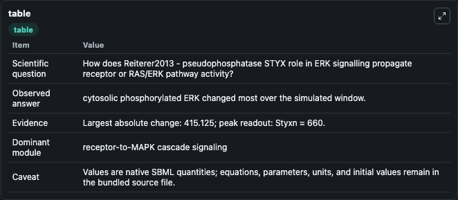
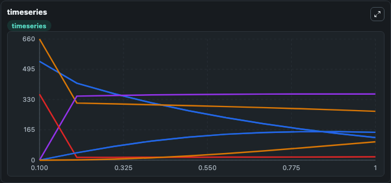
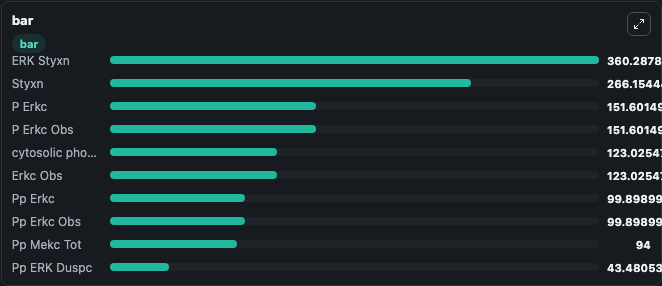

# Reiterer2013 - pseudophosphatase STYX role in ERK signalling

This Biosimulant lab wraps `Reiterer2013 - pseudophosphatase STYX role in ERK signalling` as a runnable signaling model with a companion visualization module.
Clean Biosimulant lab for MAPK/ERK receptor signaling. It can be used to explore second-messenger and pathway-signaling dynamics and compare scenario outcomes across configurations.

## What You'll See

The lab asks: How does Reiterer2013 - pseudophosphatase STYX role in ERK signalling propagate receptor or RAS/ERK pathway activity? It runs for 1.0 time units with a communication step of 0.1. The run uses the model defaults declared by the curated SBML wrapper. The generated visualizations focus on cytosolic phosphorylated ERK, P Erkc, Pp Erkc, ERK Pp Mekc, P ERK Pp Mekc, and Duspc, and related outputs, combining trajectory, endpoint-comparison, and summary-table views from one completed dark-mode run.

In this captured run, **cytosolic phosphorylated ERK** moved from 538.1 to 123.0 across 1.0 simulation windows.

<!-- BIOSIMULANT_VISUALS_START -->
### Output Visualizations



*Summary table for Reiterer2013 - pseudophosphatase STYX role in ERK signalling, reporting the scientific question, observed answer, dominant module, and caveat.*



*Trajectories of cytosolic phosphorylated ERK, Erkc Obs, Styxn, ERK Styxn, nuclear phosphorylated ERK, and P Erkc across the 1.0 simulation. In this run **ERK Styxn** climbed from 0 to 360.3 and **cytosolic phosphorylated ERK** fell from 538.1 to 123.0 — the largest movements among the focused observables.*



*Largest-excursion ranking of the focused observables — the absolute movement magnitude during the run. Top 3: **ERK Styxn** = 360.3, **Styxn** = 266.2, **P Erkc** = 151.6, with 7 more observables below.*

<!-- BIOSIMULANT_VISUALS_END -->

## Model Context

- Core model: `models/core`
- Visualization model: `models/visualisation`
- Standard: `other`
- Upstream source: `biomodels_ebi:BIOMD0000000557`
- License: `CC0`
- Visual scope: receptor-to-MAPK cascade signaling
- Caveat: Values are native SBML quantities; equations, parameters, units, and initial values remain in the bundled source file.

## Inputs

| Input | Maps To | Default | Notes |
|---|---|---|---|
| Initial cytosolic phosphorylated ERK | `signaling_sbml_reiterer2013_pseudophosphatase_styx_role_in_erk_biomd0000000557_model.initial_cytosolic_phosphorylated_erk` |  | Initial level of cytosolic phosphorylated ERK. Maps to SBML symbol `ERKc`; exposed as a traceable initial-condition perturbation. |

## Outputs

| Output | Maps To | Role |
|---|---|---|
| `cytosolic_phosphorylated_erk` | `signaling_sbml_reiterer2013_pseudophosphatase_styx_role_in_erk_biomd0000000557_model.cytosolic_phosphorylated_erk` | cytosolic phosphorylated ERK. |
| `p_erkc` | `signaling_sbml_reiterer2013_pseudophosphatase_styx_role_in_erk_biomd0000000557_model.p_erkc` | P Erkc. |
| `pp_erkc` | `signaling_sbml_reiterer2013_pseudophosphatase_styx_role_in_erk_biomd0000000557_model.pp_erkc` | Pp Erkc. |
| `state` | `signaling_sbml_reiterer2013_pseudophosphatase_styx_role_in_erk_biomd0000000557_model.state` | Available to the visualization model and downstream workflows. |
| `summary` | `signaling_sbml_reiterer2013_pseudophosphatase_styx_role_in_erk_biomd0000000557_model.summary` | Available to the visualization model and downstream workflows. |
| `species_labels` | `signaling_sbml_reiterer2013_pseudophosphatase_styx_role_in_erk_biomd0000000557_model.species_labels` | Available to the visualization model and downstream workflows. |

## Runtime

- Duration: `1.0`
- Communication step: `0.1`

## Running Locally

```bash
biosimulant labs serve .
```
