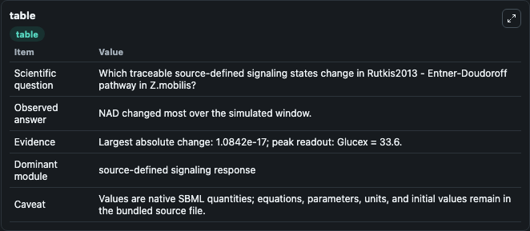
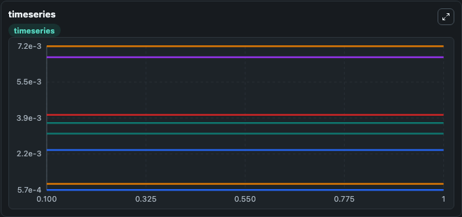
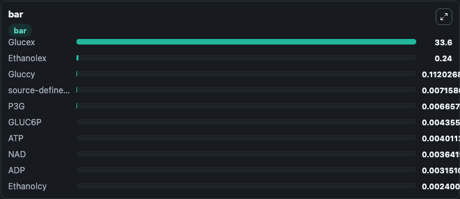

# Rutkis2013 - Entner-Doudoroff pathway in Z.mobilis

This Biosimulant lab wraps `Rutkis2013 - Entner-Doudoroff pathway in Z.mobilis` as a runnable signaling model with a companion visualization module.
Clean Biosimulant lab for systems signaling model: Rutkis2013 - Entner-Doudoroff pathway in Z.mobilis. It can be used to explore second-messenger and pathway-signaling dynamics and compare scenario outcomes across configurations.

## What You'll See

The lab asks: How does Rutkis2013 - Entner-Doudoroff pathway in Z.mobilis shift hormone-linked signaling readouts? It runs for 1.0 time units with a communication step of 0.1. The run uses the model defaults declared by the curated SBML wrapper. The generated visualizations focus on Ethanolex, Glucex, Gluccy, GLUC6P, source-defined BPG state, and P3G, and related outputs, combining trajectory, endpoint-comparison, and summary-table views from one completed dark-mode run.

In this captured run, **Ethanolcy** moved from 0.0024 to 0.0024 across 1.0 simulation windows.

<!-- BIOSIMULANT_VISUALS_START -->
### Output Visualizations



*Summary table for Rutkis2013 - Entner-Doudoroff pathway in Z.mobilis, reporting the scientific question, observed answer, dominant module, and caveat.*



*Trajectories of NAD, Ethanolcy, source-defined NADH state, P3G, ATP, and ADP across the 1.0 simulation. In this run **source-defined NADH state** climbed from 0.00716 to 0.00716 and **Ethanolcy** fell from 0.0024 to 0.0024 — the largest movements among the focused observables.*



*Largest-excursion ranking of the focused observables — the absolute movement magnitude during the run. Top 3: **Glucex** = 33.600, **Ethanolex** = 0.2400, **Gluccy** = 0.1120, with 7 more observables below.*

<!-- BIOSIMULANT_VISUALS_END -->

## Model Context

- Core model: `models/core`
- Visualization model: `models/visualisation`
- Standard: `other`
- Upstream source: `biomodels_ebi:MODEL1409050000`
- License: `CC0`
- Visual scope: metabolic and hormone signaling response
- Caveat: Values are native SBML quantities; equations, parameters, units, and initial values remain in the bundled source file.

## Inputs

| Input | Maps To | Default | Notes |
|---|---|---|---|
| Initial source-defined CO2 state | `signaling_sbml_rutkis2013_entner_doudoroff_pathway_in_z_mobilis_model1409050000_model.initial_source_defined_co2_state` |  | Initial level of source-defined CO2 state. Maps to SBML symbol `CO2`; exposed as a traceable initial-condition perturbation. |
| Initial Ethanolex | `signaling_sbml_rutkis2013_entner_doudoroff_pathway_in_z_mobilis_model1409050000_model.initial_ethanolex` |  | Initial level of Ethanolex. Maps to SBML symbol `species_1`; exposed as a traceable initial-condition perturbation. |
| Initial Glucex | `signaling_sbml_rutkis2013_entner_doudoroff_pathway_in_z_mobilis_model1409050000_model.initial_glucex` |  | Initial level of Glucex. Maps to SBML symbol `GLCo`; exposed as a traceable initial-condition perturbation. |

## Outputs

| Output | Maps To | Role |
|---|---|---|
| `ethanolex` | `signaling_sbml_rutkis2013_entner_doudoroff_pathway_in_z_mobilis_model1409050000_model.ethanolex` | Ethanolex. |
| `glucex` | `signaling_sbml_rutkis2013_entner_doudoroff_pathway_in_z_mobilis_model1409050000_model.glucex` | Glucex. |
| `gluccy` | `signaling_sbml_rutkis2013_entner_doudoroff_pathway_in_z_mobilis_model1409050000_model.gluccy` | Gluccy. |
| `state` | `signaling_sbml_rutkis2013_entner_doudoroff_pathway_in_z_mobilis_model1409050000_model.state` | Available to the visualization model and downstream workflows. |
| `summary` | `signaling_sbml_rutkis2013_entner_doudoroff_pathway_in_z_mobilis_model1409050000_model.summary` | Available to the visualization model and downstream workflows. |
| `species_labels` | `signaling_sbml_rutkis2013_entner_doudoroff_pathway_in_z_mobilis_model1409050000_model.species_labels` | Available to the visualization model and downstream workflows. |

## Runtime

- Duration: `1.0`
- Communication step: `0.1`

## Running Locally

```bash
biosimulant labs serve .
```
