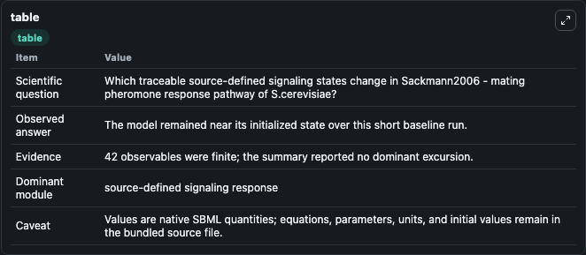
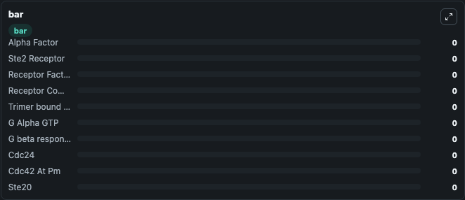

# Sackmann2006 - mating pheromone response pathway of S.cerevisiae

This Biosimulant lab wraps `Sackmann2006 - mating pheromone response pathway of S.cerevisiae` as a runnable signaling model with a companion visualization module.
Clean Biosimulant lab for systems signaling model: Sackmann2006 - mating pheromone response pathway of S.cerevisiae. It can be used to explore second-messenger and pathway-signaling dynamics and compare scenario outcomes across configurations.

## What You'll See

The lab asks: How does Sackmann2006 - mating pheromone response pathway of S.cerevisiae shift hormone-linked signaling readouts? It runs for 1.0 time units with a communication step of 0.1. The run uses the model defaults declared by the curated SBML wrapper. The generated visualizations focus on Alpha Factor, Ste2 Receptor, Receptor Factor Complex, Receptor Complex, Trimer bound To Receptor, and G Alpha GTP, and related outputs, combining trajectory, endpoint-comparison, and summary-table views from one completed dark-mode run.

In this captured run, **Alpha Factor** moved from 0 to 0 across 1.0 simulation windows.

<!-- BIOSIMULANT_VISUALS_START -->
### Output Visualizations



*Summary table for Sackmann2006 - mating pheromone response pathway of S.cerevisiae, reporting the scientific question, observed answer, dominant module, and caveat.*


*Trajectories of Alpha Factor, Ste2 Receptor, Receptor Factor Complex, Receptor Complex, Trimer bound To Receptor, and G Alpha GTP across the 1.0 simulation. In this run Alpha Factor, Ste2 Receptor, Receptor Factor Complex, Receptor Complex stayed near their initial values — no observable moved appreciably.*



*Largest-excursion ranking of the focused observables — the absolute movement magnitude during the run. Top 3: **Alpha Factor** = 0, **Ste2 Receptor** = 0, **Receptor Factor Complex** = 0, with 7 more observables below.*

<!-- BIOSIMULANT_VISUALS_END -->

## Model Context

- Core model: `models/core`
- Visualization model: `models/visualisation`
- Standard: `other`
- Upstream source: `biomodels_ebi:MODEL1403040000`
- License: `CC0`
- Visual scope: metabolic and hormone signaling response
- Caveat: Values are native SBML quantities; equations, parameters, units, and initial values remain in the bundled source file.

## Inputs

| Input | Maps To | Default | Notes |
|---|---|---|---|
| Initial Alpha Factor | `signaling_sbml_sackmann2006_mating_pheromone_response_pathway_o_model1403040000_model.initial_alpha_factor` |  | Initial level of Alpha Factor. Maps to SBML symbol `P0`; exposed as a traceable initial-condition perturbation. |
| Initial Receptor Factor Complex | `signaling_sbml_sackmann2006_mating_pheromone_response_pathway_o_model1403040000_model.initial_receptor_factor_complex` |  | Initial level of Receptor Factor Complex. Maps to SBML symbol `P2`; exposed as a traceable initial-condition perturbation. |

## Outputs

| Output | Maps To | Role |
|---|---|---|
| `ste2_receptor` | `signaling_sbml_sackmann2006_mating_pheromone_response_pathway_o_model1403040000_model.ste2_receptor` | Ste2 Receptor. |
| `receptor_factor_complex` | `signaling_sbml_sackmann2006_mating_pheromone_response_pathway_o_model1403040000_model.receptor_factor_complex` | Receptor Factor Complex. |
| `receptor_complex` | `signaling_sbml_sackmann2006_mating_pheromone_response_pathway_o_model1403040000_model.receptor_complex` | Receptor Complex. |
| `state` | `signaling_sbml_sackmann2006_mating_pheromone_response_pathway_o_model1403040000_model.state` | Available to the visualization model and downstream workflows. |
| `summary` | `signaling_sbml_sackmann2006_mating_pheromone_response_pathway_o_model1403040000_model.summary` | Available to the visualization model and downstream workflows. |
| `species_labels` | `signaling_sbml_sackmann2006_mating_pheromone_response_pathway_o_model1403040000_model.species_labels` | Available to the visualization model and downstream workflows. |

## Runtime

- Duration: `1.0`
- Communication step: `0.1`

## Running Locally

```bash
biosimulant labs serve .
```
