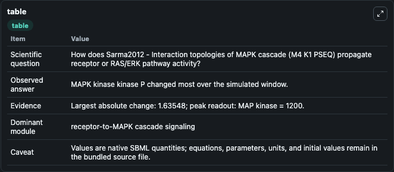
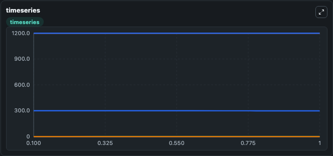
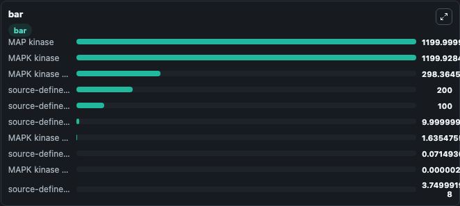

# Sarma2012 - Interaction topologies of MAPK cascade (M4_K1_PSEQ)

This Biosimulant lab wraps `Sarma2012 - Interaction topologies of MAPK cascade (M4_K1_PSEQ)` as a runnable signaling model with a companion visualization module.
Clean Biosimulant lab for MAPK/ERK receptor signaling. It can be used to explore second-messenger and pathway-signaling dynamics and compare scenario outcomes across configurations.

## What You'll See

The lab asks: How does Sarma2012 - Interaction topologies of MAPK cascade (M4 K1 PSEQ) propagate receptor or RAS/ERK pathway activity? It runs for 1.0 time units with a communication step of 0.1. The run uses the model defaults declared by the curated SBML wrapper. The generated visualizations focus on MAPK kinase kinase, MAPK kinase kinase P, MAPK kinase, source-defined MKK_P state, MAPK kinase PP, and MAP kinase, and related outputs, combining trajectory, endpoint-comparison, and summary-table views from one completed dark-mode run.

In this captured run, **MAPK kinase kinase P** moved from 0 to 1.635 across 1.0 simulation windows.

<!-- BIOSIMULANT_VISUALS_START -->
### Output Visualizations



*Summary table for Sarma2012 - Interaction topologies of MAPK cascade (M4_K1_PSEQ), reporting the scientific question, observed answer, dominant module, and caveat.*



*Trajectories of MAPK kinase kinase P, MAPK kinase kinase, MAPK kinase, source-defined MKK_P state, MAPK kinase PP, and source-defined MK_P state across the 1.0 simulation. In this run **MAPK kinase kinase P** climbed from 0 to 1.635 and **MAPK kinase kinase** fell from 300.0 to 298.4 — the largest movements among the focused observables.*



*Largest-excursion ranking of the focused observables — the absolute movement magnitude during the run. Top 3: **MAP kinase** = 1200.0, **MAPK kinase** = 1199.9, **MAPK kinase kinase** = 298.4, with 7 more observables below.*

<!-- BIOSIMULANT_VISUALS_END -->

## Model Context

- Core model: `models/core`
- Visualization model: `models/visualisation`
- Standard: `other`
- Upstream source: `biomodels_ebi:MODEL1204280008`
- License: `CC0`
- Visual scope: receptor-to-MAPK cascade signaling
- Caveat: Values are native SBML quantities; equations, parameters, units, and initial values remain in the bundled source file.

## Inputs

| Input | Maps To | Default | Notes |
|---|---|---|---|
| Initial MAPK kinase kinase | `signaling_sbml_sarma2012_interaction_topologies_of_mapk_cascade_model1204280008_model.initial_mapk_kinase_kinase` |  | Initial level of MAPK kinase kinase. Maps to SBML symbol `species_1`; exposed as a traceable initial-condition perturbation. |

## Outputs

| Output | Maps To | Role |
|---|---|---|
| `mapk_kinase_kinase` | `signaling_sbml_sarma2012_interaction_topologies_of_mapk_cascade_model1204280008_model.mapk_kinase_kinase` | MAPK kinase kinase. |
| `mapk_kinase_kinase_p` | `signaling_sbml_sarma2012_interaction_topologies_of_mapk_cascade_model1204280008_model.mapk_kinase_kinase_p` | MAPK kinase kinase P. |
| `mapk_kinase` | `signaling_sbml_sarma2012_interaction_topologies_of_mapk_cascade_model1204280008_model.mapk_kinase` | MAPK kinase. |
| `state` | `signaling_sbml_sarma2012_interaction_topologies_of_mapk_cascade_model1204280008_model.state` | Available to the visualization model and downstream workflows. |
| `summary` | `signaling_sbml_sarma2012_interaction_topologies_of_mapk_cascade_model1204280008_model.summary` | Available to the visualization model and downstream workflows. |
| `species_labels` | `signaling_sbml_sarma2012_interaction_topologies_of_mapk_cascade_model1204280008_model.species_labels` | Available to the visualization model and downstream workflows. |

## Runtime

- Duration: `1.0`
- Communication step: `0.1`

## Running Locally

```bash
biosimulant labs serve .
```
