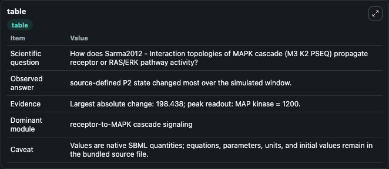
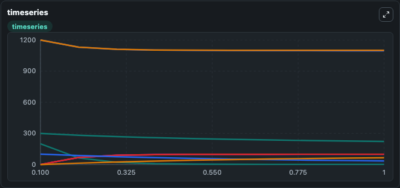
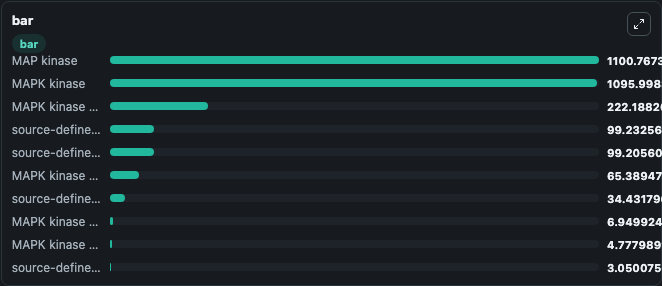

# Sarma2012 - Interaction topologies of MAPK cascade (M3_K2_PSEQ)

This Biosimulant lab wraps `Sarma2012 - Interaction topologies of MAPK cascade (M3_K2_PSEQ)` as a runnable signaling model with a companion visualization module.
Clean Biosimulant lab for MAPK/ERK receptor signaling. It can be used to explore second-messenger and pathway-signaling dynamics and compare scenario outcomes across configurations.

## What You'll See

The lab asks: How does Sarma2012 - Interaction topologies of MAPK cascade (M3 K2 PSEQ) propagate receptor or RAS/ERK pathway activity? It runs for 1.0 time units with a communication step of 0.1. The run uses the model defaults declared by the curated SBML wrapper. The generated visualizations focus on MAP kinase, MAPK kinase PP, MAP kinase MAPK kinase PP, source-defined MK-P state, MAP kinase P MAPK kinase PP, and source-defined MK-PP state, and related outputs, combining trajectory, endpoint-comparison, and summary-table views from one completed dark-mode run.

In this captured run, **source-defined P2 state** moved from 200.0 to 1.562 across 1.0 simulation windows.

<!-- BIOSIMULANT_VISUALS_START -->
### Output Visualizations



*Summary table for Sarma2012 - Interaction topologies of MAPK cascade (M3_K2_PSEQ), reporting the scientific question, observed answer, dominant module, and caveat.*



*Trajectories of source-defined P2 state, MAPK kinase, MAP kinase, source-defined MK_P2 state, source-defined MKK_P2 state, and MAPK kinase kinase across the 1.0 simulation. In this run **source-defined MK_P2 state** climbed from 0 to 99.233 and **source-defined P2 state** fell from 200.0 to 1.562 — the largest movements among the focused observables.*



*Largest-excursion ranking of the focused observables — the absolute movement magnitude during the run. Top 3: **MAP kinase** = 1100.8, **MAPK kinase** = 1096.0, **MAPK kinase kinase** = 222.2, with 7 more observables below.*

<!-- BIOSIMULANT_VISUALS_END -->

## Model Context

- Core model: `models/core`
- Visualization model: `models/visualisation`
- Standard: `other`
- Upstream source: `biomodels_ebi:MODEL1204280023`
- License: `CC0`
- Visual scope: receptor-to-MAPK cascade signaling
- Caveat: Values are native SBML quantities; equations, parameters, units, and initial values remain in the bundled source file.

## Inputs

| Input | Maps To | Default | Notes |
|---|---|---|---|
| Initial MAP kinase | `signaling_sbml_sarma2012_interaction_topologies_of_mapk_cascade_model1204280023_model.initial_map_kinase` |  | Initial level of MAP kinase. Maps to SBML symbol `species_1`; exposed as a traceable initial-condition perturbation. |

## Outputs

| Output | Maps To | Role |
|---|---|---|
| `mapk_kinase_pp` | `signaling_sbml_sarma2012_interaction_topologies_of_mapk_cascade_model1204280023_model.mapk_kinase_pp` | MAPK kinase PP. |
| `map_kinase_mapk_kinase_pp` | `signaling_sbml_sarma2012_interaction_topologies_of_mapk_cascade_model1204280023_model.map_kinase_mapk_kinase_pp` | MAP kinase MAPK kinase PP. |
| `source_defined_mk_p_state` | `signaling_sbml_sarma2012_interaction_topologies_of_mapk_cascade_model1204280023_model.source_defined_mk_p_state` | source-defined MK-P state. |
| `state` | `signaling_sbml_sarma2012_interaction_topologies_of_mapk_cascade_model1204280023_model.state` | Available to the visualization model and downstream workflows. |
| `summary` | `signaling_sbml_sarma2012_interaction_topologies_of_mapk_cascade_model1204280023_model.summary` | Available to the visualization model and downstream workflows. |
| `species_labels` | `signaling_sbml_sarma2012_interaction_topologies_of_mapk_cascade_model1204280023_model.species_labels` | Available to the visualization model and downstream workflows. |

## Runtime

- Duration: `1.0`
- Communication step: `0.1`

## Running Locally

```bash
biosimulant labs serve .
```
