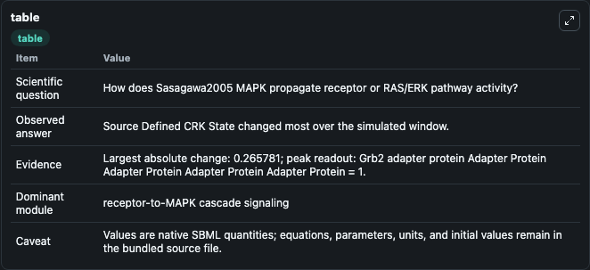
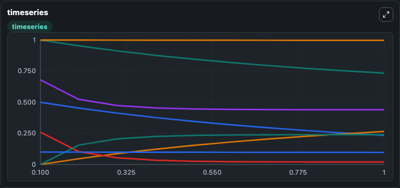
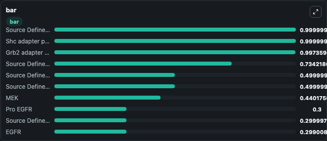

# Sasagawa2005_MAPK

This Biosimulant lab wraps `Sasagawa2005_MAPK` as a runnable signaling model with a companion visualization module.
Clean Biosimulant lab for MAPK/ERK receptor signaling. It can be used to explore second-messenger and pathway-signaling dynamics and compare scenario outcomes across configurations.

## What You'll See

The lab asks: How does Sasagawa2005 MAPK propagate receptor or RAS/ERK pathway activity? It runs for 1.0 time units with a communication step of 0.1. The run uses the model defaults declared by the curated SBML wrapper. The generated visualizations focus on EGFR, L EGFR, L EGFR Dimer, Source Defined SOS guanine-nucleotide exchange factor Guanine Nucleotide Exchange Factor Guanine Nucleotide Exchange Factor Guanine Nucleotide Exchange Factor Guanine Nucleotide Exchange Factor State, L Dp EGFR, and Phospho SOS guanine-nucleotide exchange factor Guanine Nucleotide Exchange Factor Guanine Nucleotide Exchange Factor Guanine Nucleotide Exchange Factor Guanine Nucleotide Exchange Factor, and related outputs, combining trajectory, endpoint-comparison, and summary-table views from one completed dark-mode run.

In this captured run, **Source Defined CRK State** moved from 1.000 to 0.7342 across 1.0 simulation windows.

<!-- BIOSIMULANT_VISUALS_START -->
### Output Visualizations



*Summary table for Sasagawa2005_MAPK, reporting the scientific question, observed answer, dominant module, and caveat.*



*Trajectories of Source Defined CRK State, C3G, Crk C3G, MEK, ERK, and MEK ERK across the 1.0 simulation. In this run **Crk C3G** climbed from 0 to 0.2658 and **Source Defined CRK State** fell from 1.000 to 0.7342 — the largest movements among the focused observables.*



*Largest-excursion ranking of the focused observables — the absolute movement magnitude during the run. Top 3: **Source Defined FRS2 State** = 1.0000, **Shc adapter protein Adapter Protein Adapter Protein Adapter Protein Adapter Protein** = 1.0000, **Grb2 adapter protein Adapter Protein Adapter Protein Adapter Protein Adapter Protein** = 0.9974, with 7 more observables below.*

<!-- BIOSIMULANT_VISUALS_END -->

## Model Context

- Core model: `models/core`
- Visualization model: `models/visualisation`
- Standard: `other`
- Upstream source: `biomodels_ebi:BIOMD0000000049`
- License: `CC0`
- Visual scope: receptor-to-MAPK cascade signaling
- Caveat: Values are native SBML quantities; equations, parameters, units, and initial values remain in the bundled source file.

## Inputs

| Input | Maps To | Default | Notes |
|---|---|---|---|
| Initial Degradation | `signaling_sbml_sasagawa2005_mapk_biomd0000000049_model.initial_degradation` |  | Initial level of Degradation. Maps to SBML symbol `degradation`; exposed as a traceable initial-condition perturbation. |
| Initial EGF | `signaling_sbml_sasagawa2005_mapk_biomd0000000049_model.initial_egf` |  | Initial level of EGF. Maps to SBML symbol `EGF`; exposed as a traceable initial-condition perturbation. |
| Initial nerve growth factor | `signaling_sbml_sasagawa2005_mapk_biomd0000000049_model.initial_nerve_growth_factor` |  | Initial level of nerve growth factor. Maps to SBML symbol `NGF`; exposed as a traceable initial-condition perturbation. |

## Outputs

| Output | Maps To | Role |
|---|---|---|
| `ras_gap` | `signaling_sbml_sasagawa2005_mapk_biomd0000000049_model.ras_gap` | RAS GAP. |
| `erk` | `signaling_sbml_sasagawa2005_mapk_biomd0000000049_model.erk` | ERK. |
| `ras_gdp` | `signaling_sbml_sasagawa2005_mapk_biomd0000000049_model.ras_gdp` | RAS GDP. |
| `state` | `signaling_sbml_sasagawa2005_mapk_biomd0000000049_model.state` | Available to the visualization model and downstream workflows. |
| `summary` | `signaling_sbml_sasagawa2005_mapk_biomd0000000049_model.summary` | Available to the visualization model and downstream workflows. |
| `species_labels` | `signaling_sbml_sasagawa2005_mapk_biomd0000000049_model.species_labels` | Available to the visualization model and downstream workflows. |

## Runtime

- Duration: `1.0`
- Communication step: `0.1`

## Running Locally

```bash
biosimulant labs serve .
```
