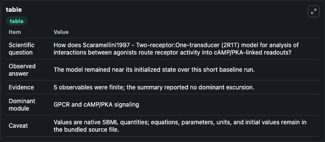
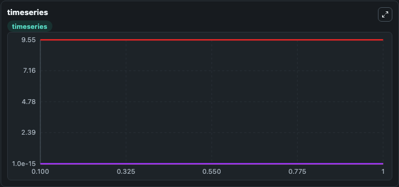
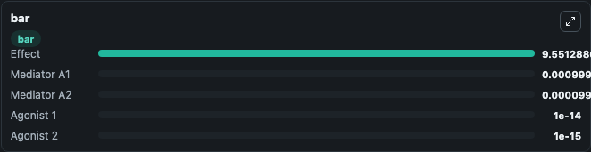

# Scaramellini1997 - Two-receptor:One-transducer (2R1T) model for analysis of interactions between agonists

This Biosimulant lab wraps `Scaramellini1997 - Two-receptor:One-transducer (2R1T) model for analysis of interactions between agonists` as a runnable signaling model with a companion visualization module.
Clean Biosimulant lab for systems signaling model: Scaramellini1997 - Two-receptor:One-transducer (2R1T) model for analysis of interactions between agonists. It can be used to explore second-messenger and pathway-signaling dynamics and compare scenario outcomes across configurations.

## What You'll See

The lab asks: How does Scaramellini1997 - Two-receptor:One-transducer (2R1T) model for analysis of interactions between agonists route receptor activity into cAMP/PKA-linked readouts? It runs for 1.0 time units with a communication step of 0.1. The run uses the model defaults declared by the curated SBML wrapper. The generated visualizations focus on Mediator A1, Mediator A2, Agonist 1, Agonist 2, and Effect, combining trajectory, endpoint-comparison, and summary-table views from one completed dark-mode run.

In this captured run, **Mediator A1** moved from 0.001 to 0.001 across 1.0 simulation windows.

<!-- BIOSIMULANT_VISUALS_START -->
### Output Visualizations



*Summary table for Scaramellini1997 - Two-receptor:One-transducer (2R1T) model for analysis of interactions between agonists, reporting the scientific question, observed answer, dominant module, and caveat.*



*Trajectories of Mediator A1, Mediator A2, Agonist 1, Agonist 2, and Effect across the 1.0 simulation. In this run Mediator A1, Mediator A2, Agonist 1, Agonist 2 stayed near their initial values — no observable moved appreciably.*



*Largest-excursion ranking of the focused observables — the absolute movement magnitude during the run. Top 3: **Effect** = 9.551, **Mediator A1** = 0.001, **Mediator A2** = 0.0001, with 2 more observables below.*

<!-- BIOSIMULANT_VISUALS_END -->

## Model Context

- Core model: `models/core`
- Visualization model: `models/visualisation`
- Standard: `other`
- Upstream source: `biomodels_ebi:BIOMD0000001008`
- License: `CC0`
- Visual scope: GPCR and cAMP/PKA signaling
- Caveat: Values are native SBML quantities; equations, parameters, units, and initial values remain in the bundled source file.

## Inputs

| Input | Maps To | Default | Notes |
|---|---|---|---|
| Initial Effect | `signaling_sbml_scaramellini1997_two_receptor_one_transducer_2r1_biomd0000001008_model.initial_effect` |  | Initial level of Effect. Maps to SBML symbol `Effect`; exposed as a traceable initial-condition perturbation. |
| Initial Mediator A1 | `signaling_sbml_scaramellini1997_two_receptor_one_transducer_2r1_biomd0000001008_model.initial_mediator_a1` |  | Initial level of Mediator A1. Maps to SBML symbol `Mediator_A1`; exposed as a traceable initial-condition perturbation. |
| Initial Mediator A2 | `signaling_sbml_scaramellini1997_two_receptor_one_transducer_2r1_biomd0000001008_model.initial_mediator_a2` |  | Initial level of Mediator A2. Maps to SBML symbol `Mediator_A2`; exposed as a traceable initial-condition perturbation. |

## Outputs

| Output | Maps To | Role |
|---|---|---|
| `mediator_a1` | `signaling_sbml_scaramellini1997_two_receptor_one_transducer_2r1_biomd0000001008_model.mediator_a1` | Mediator A1. |
| `mediator_a2` | `signaling_sbml_scaramellini1997_two_receptor_one_transducer_2r1_biomd0000001008_model.mediator_a2` | Mediator A2. |
| `agonist_1` | `signaling_sbml_scaramellini1997_two_receptor_one_transducer_2r1_biomd0000001008_model.agonist_1` | Agonist 1. |
| `state` | `signaling_sbml_scaramellini1997_two_receptor_one_transducer_2r1_biomd0000001008_model.state` | Available to the visualization model and downstream workflows. |
| `summary` | `signaling_sbml_scaramellini1997_two_receptor_one_transducer_2r1_biomd0000001008_model.summary` | Available to the visualization model and downstream workflows. |
| `species_labels` | `signaling_sbml_scaramellini1997_two_receptor_one_transducer_2r1_biomd0000001008_model.species_labels` | Available to the visualization model and downstream workflows. |

## Runtime

- Duration: `1.0`
- Communication step: `0.1`

## Running Locally

```bash
biosimulant labs serve .
```
