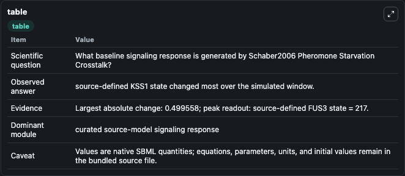
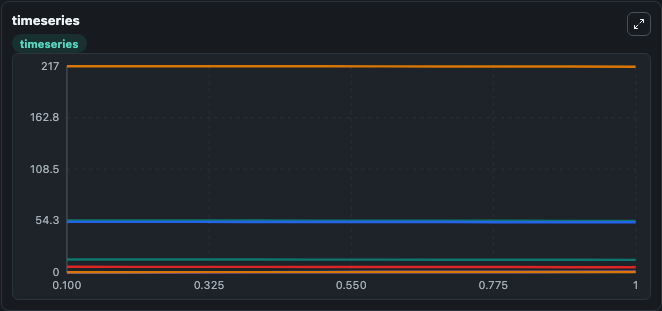
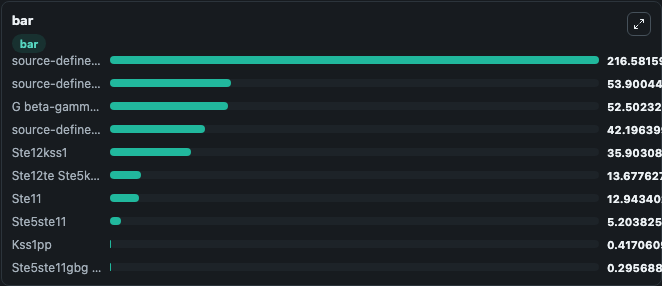

# Schaber2006_Pheromone_Starvation_Crosstalk

This Biosimulant lab wraps `Schaber2006_Pheromone_Starvation_Crosstalk` as a runnable signaling model with a companion visualization module.
Clean Biosimulant lab for systems signaling model: Schaber2006_Pheromone_Starvation_Crosstalk. It can be used to explore second-messenger and pathway-signaling dynamics and compare scenario outcomes across configurations.

## What You'll See

The lab asks: What baseline signaling response is generated by Schaber2006 Pheromone Starvation Crosstalk? It runs for 1.0 time units with a communication step of 0.1. The run uses the model defaults declared by the curated SBML wrapper. The generated visualizations focus on source-defined STE5 state, Ste11, Ste5ste11, G beta-gamma complex, Ste5ste11gbg, and source-defined FUS3 state, and related outputs, combining trajectory, endpoint-comparison, and summary-table views from one completed dark-mode run.

In this captured run, **source-defined KSS1 state** moved from 54.400 to 53.900 across 1.0 simulation windows.

<!-- BIOSIMULANT_VISUALS_START -->
### Output Visualizations



*Summary table for Schaber2006_Pheromone_Starvation_Crosstalk, reporting the scientific question, observed answer, dominant module, and caveat.*



*Trajectories of source-defined KSS1 state, G beta-gamma complex, source-defined FUS3 state, Kss1pp, Ste5ste11, and Ste11 across the 1.0 simulation. In this run **Kss1pp** climbed from 0 to 0.4171 and **source-defined KSS1 state** fell from 54.400 to 53.900 — the largest movements among the focused observables.*



*Largest-excursion ranking of the focused observables — the absolute movement magnitude during the run. Top 3: **source-defined FUS3 state** = 216.6, **source-defined KSS1 state** = 53.900, **G beta-gamma complex** = 52.502, with 7 more observables below.*

<!-- BIOSIMULANT_VISUALS_END -->

## Model Context

- Core model: `models/core`
- Visualization model: `models/visualisation`
- Standard: `other`
- Upstream source: `biomodels_ebi:BIOMD0000000237`
- License: `CC0`
- Visual scope: curated source-model signaling response
- Caveat: Values are native SBML quantities; equations, parameters, units, and initial values remain in the bundled source file.

## Inputs

| Input | Maps To | Default | Notes |
|---|---|---|---|
| Initial source-defined P state | `signaling_sbml_schaber2006_pheromone_starvation_crosstalk_biomd0000000237_model.initial_source_defined_p_state` |  | Initial level of source-defined P state. Maps to SBML symbol `p`; exposed as a traceable initial-condition perturbation. |
| Initial source-defined S state | `signaling_sbml_schaber2006_pheromone_starvation_crosstalk_biomd0000000237_model.initial_source_defined_s_state` |  | Initial level of source-defined S state. Maps to SBML symbol `s`; exposed as a traceable initial-condition perturbation. |

## Outputs

| Output | Maps To | Role |
|---|---|---|
| `source_defined_ste5_state` | `signaling_sbml_schaber2006_pheromone_starvation_crosstalk_biomd0000000237_model.source_defined_ste5_state` | source-defined STE5 state. |
| `ste11` | `signaling_sbml_schaber2006_pheromone_starvation_crosstalk_biomd0000000237_model.ste11` | Ste11. |
| `ste5ste11` | `signaling_sbml_schaber2006_pheromone_starvation_crosstalk_biomd0000000237_model.ste5ste11` | Ste5ste11. |
| `state` | `signaling_sbml_schaber2006_pheromone_starvation_crosstalk_biomd0000000237_model.state` | Available to the visualization model and downstream workflows. |
| `summary` | `signaling_sbml_schaber2006_pheromone_starvation_crosstalk_biomd0000000237_model.summary` | Available to the visualization model and downstream workflows. |
| `species_labels` | `signaling_sbml_schaber2006_pheromone_starvation_crosstalk_biomd0000000237_model.species_labels` | Available to the visualization model and downstream workflows. |

## Runtime

- Duration: `1.0`
- Communication step: `0.1`

## Running Locally

```bash
biosimulant labs serve .
```
