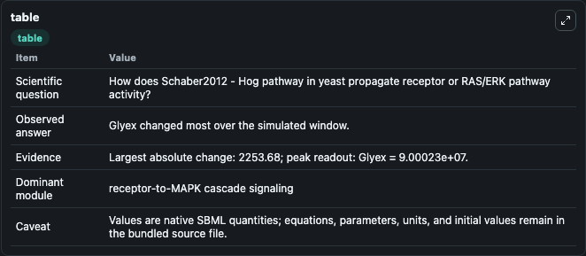
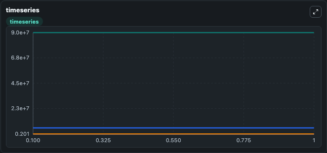
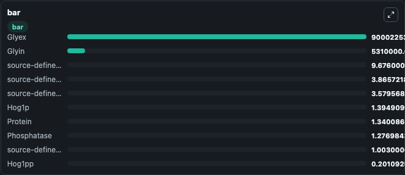

# Schaber2012 - Hog pathway in yeast

This Biosimulant lab wraps `Schaber2012 - Hog pathway in yeast` as a runnable signaling model with a companion visualization module.
Clean Biosimulant lab for MAPK/ERK receptor signaling. It can be used to explore second-messenger and pathway-signaling dynamics and compare scenario outcomes across configurations.

## What You'll See

The lab asks: How does Schaber2012 - Hog pathway in yeast propagate receptor or RAS/ERK pathway activity? It runs for 1.0 time units with a communication step of 0.1. The run uses the model defaults declared by the curated SBML wrapper. The generated visualizations focus on Glyin, source-defined HOG1 state, Hog1pp, source-defined PBS2 state, Pbs2p, and Phosphatase, and related outputs, combining trajectory, endpoint-comparison, and summary-table views from one completed dark-mode run.

In this captured run, **Glyex** moved from 9e+07 to 9e+07 across 1.0 simulation windows.

<!-- BIOSIMULANT_VISUALS_START -->
### Output Visualizations



*Summary table for Schaber2012 - Hog pathway in yeast, reporting the scientific question, observed answer, dominant module, and caveat.*



*Trajectories of Glyex, Glyin, source-defined HOG1 state, Hog1p, source-defined RNA state, and Hog1pp across the 1.0 simulation. In this run **Glyex** climbed from 9e+07 to 9e+07 and **source-defined HOG1 state** fell from 9.676 to 9.676 — the largest movements among the focused observables.*



*Largest-excursion ranking of the focused observables — the absolute movement magnitude during the run. Top 3: **Glyex** = 9e+07, **Glyin** = 5.31e+06, **source-defined HOG1 state** = 9.676, with 7 more observables below.*

<!-- BIOSIMULANT_VISUALS_END -->

## Model Context

- Core model: `models/core`
- Visualization model: `models/visualisation`
- Standard: `other`
- Upstream source: `biomodels_ebi:BIOMD0000000429`
- License: `CC0`
- Visual scope: receptor-to-MAPK cascade signaling
- Caveat: Values are native SBML quantities; equations, parameters, units, and initial values remain in the bundled source file.

## Inputs

| Input | Maps To | Default | Notes |
|---|---|---|---|
| Initial Hog1ppactive | `signaling_sbml_schaber2012_hog_pathway_in_yeast_biomd0000000429_model.initial_hog1ppactive` |  | Initial level of Hog1ppactive. Maps to SBML symbol `species_12`; exposed as a traceable initial-condition perturbation. |

## Outputs

| Output | Maps To | Role |
|---|---|---|
| `phosphatase` | `signaling_sbml_schaber2012_hog_pathway_in_yeast_biomd0000000429_model.phosphatase` | Phosphatase. |
| `hog1ppactive` | `signaling_sbml_schaber2012_hog_pathway_in_yeast_biomd0000000429_model.hog1ppactive` | Hog1ppactive. |
| `glyin` | `signaling_sbml_schaber2012_hog_pathway_in_yeast_biomd0000000429_model.glyin` | Glyin. |
| `state` | `signaling_sbml_schaber2012_hog_pathway_in_yeast_biomd0000000429_model.state` | Available to the visualization model and downstream workflows. |
| `summary` | `signaling_sbml_schaber2012_hog_pathway_in_yeast_biomd0000000429_model.summary` | Available to the visualization model and downstream workflows. |
| `species_labels` | `signaling_sbml_schaber2012_hog_pathway_in_yeast_biomd0000000429_model.species_labels` | Available to the visualization model and downstream workflows. |

## Runtime

- Duration: `1.0`
- Communication step: `0.1`

## Running Locally

```bash
biosimulant labs serve .
```
