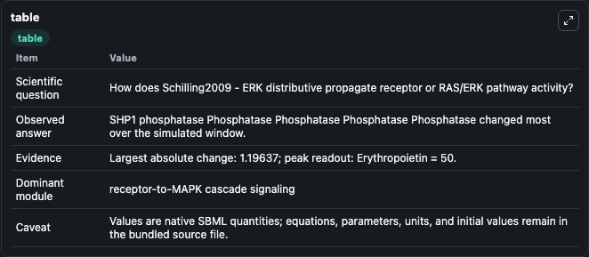
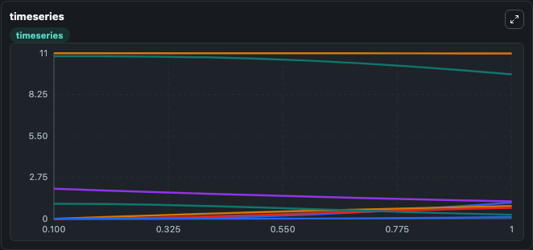
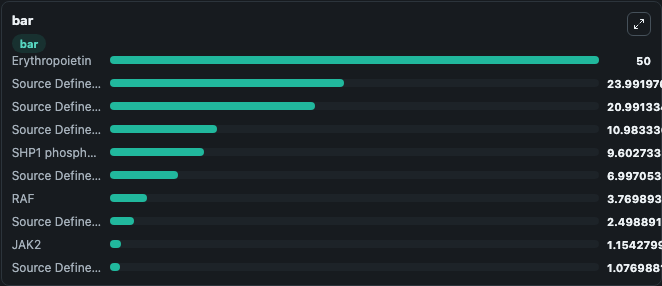

# Schilling2009 - ERK distributive

This Biosimulant lab wraps `Schilling2009 - ERK distributive` as a runnable signaling model with a companion visualization module.
Clean Biosimulant lab for MAPK/ERK receptor signaling. It can be used to explore second-messenger and pathway-signaling dynamics and compare scenario outcomes across configurations.

## What You'll See

The lab asks: How does Schilling2009 - ERK distributive propagate receptor or RAS/ERK pathway activity? It runs for 1.0 time units with a communication step of 0.1. The run uses the model defaults declared by the curated SBML wrapper. The generated visualizations focus on JAK2, Erythropoietin Receptor, SHP1 phosphatase Phosphatase Phosphatase Phosphatase Phosphatase Phosphatase, Source Defined SOS guanine-nucleotide exchange factor Guanine Nucleotide Exchange Factor Guanine Nucleotide Exchange Factor Guanine Nucleotide Exchange Factor Guanine Nucleotide Exchange Factor State, RAF, and Source Defined MEK2 State, and related outputs, combining trajectory, endpoint-comparison, and summary-table views from one completed dark-mode run.

In this captured run, **SHP1 phosphatase Phosphatase Phosphatase Phosphatase Phosphatase** moved from 10.799 to 9.603 across 1.0 simulation windows.

<!-- BIOSIMULANT_VISUALS_START -->
### Output Visualizations



*Summary table for Schilling2009 - ERK distributive, reporting the scientific question, observed answer, dominant module, and caveat.*



*Trajectories of SHP1 phosphatase Phosphatase Phosphatase Phosphatase Phosphatase, Source Defined MSHP1 State, Source Defined Phosphorylated JAK2 State, JAK2, Phospho Erythropoietin R, and Erythropoietin Receptor across the 1.0 simulation. In this run **Source Defined MSHP1 State** climbed from 0 to 1.077 and **SHP1 phosphatase Phosphatase Phosphatase Phosphatase Phosphatase** fell from 10.799 to 9.603 — the largest movements among the focused observables.*



*Largest-excursion ranking of the focused observables — the absolute movement magnitude during the run. Top 3: **Erythropoietin** = 50.000, **Source Defined MEK1 State** = 23.992, **Source Defined ERK2 State** = 20.991, with 7 more observables below.*

<!-- BIOSIMULANT_VISUALS_END -->

## Model Context

- Core model: `models/core`
- Visualization model: `models/visualisation`
- Standard: `other`
- Upstream source: `biomodels_ebi:BIOMD0000000270`
- License: `CC0`
- Visual scope: receptor-to-MAPK cascade signaling
- Caveat: Values are native SBML quantities; equations, parameters, units, and initial values remain in the bundled source file.

## Inputs

| Input | Maps To | Default | Notes |
|---|---|---|---|
| Initial JAK2 | `signaling_sbml_schilling2009_erk_distributive_biomd0000000270_model.initial_jak2` |  | Initial level of JAK2. Maps to SBML symbol `JAK2`; exposed as a traceable initial-condition perturbation. |

## Outputs

| Output | Maps To | Role |
|---|---|---|
| `source_defined_erk1_state` | `signaling_sbml_schilling2009_erk_distributive_biomd0000000270_model.source_defined_erk1_state` | Source Defined ERK1 State. |
| `source_defined_erk2_state` | `signaling_sbml_schilling2009_erk_distributive_biomd0000000270_model.source_defined_erk2_state` | Source Defined ERK2 State. |
| `pperk1` | `signaling_sbml_schilling2009_erk_distributive_biomd0000000270_model.pperk1` | PPERK1. |
| `state` | `signaling_sbml_schilling2009_erk_distributive_biomd0000000270_model.state` | Available to the visualization model and downstream workflows. |
| `summary` | `signaling_sbml_schilling2009_erk_distributive_biomd0000000270_model.summary` | Available to the visualization model and downstream workflows. |
| `species_labels` | `signaling_sbml_schilling2009_erk_distributive_biomd0000000270_model.species_labels` | Available to the visualization model and downstream workflows. |

## Runtime

- Duration: `1.0`
- Communication step: `0.1`

## Running Locally

```bash
biosimulant labs serve .
```
