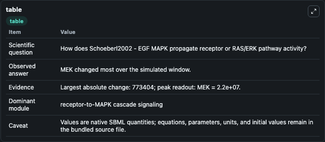
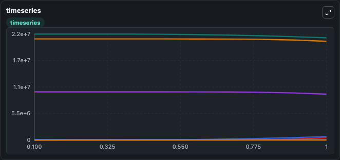
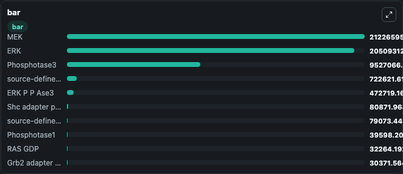

# Schoeberl2002 - EGF MAPK

This Biosimulant lab wraps `Schoeberl2002 - EGF MAPK` as a runnable signaling model with a companion visualization module.
Clean Biosimulant lab for MAPK/ERK receptor signaling. It can be used to explore second-messenger and pathway-signaling dynamics and compare scenario outcomes across configurations.

## What You'll See

The lab asks: How does Schoeberl2002 - EGF MAPK propagate receptor or RAS/ERK pathway activity? It runs for 1.0 time units with a communication step of 0.1. The run uses the model defaults declared by the curated SBML wrapper. The generated visualizations focus on EGF, EGFR, EGF EGFR, EGF EGFR 2, Egfri, and EGF EGFR 2 GAP Grb2 adapter protein Prot, and related outputs, combining trajectory, endpoint-comparison, and summary-table views from one completed dark-mode run.

In this captured run, **MEK** moved from 2.2e+07 to 2.12e+07 across 1.0 simulation windows.

<!-- BIOSIMULANT_VISUALS_START -->
### Output Visualizations



*Summary table for Schoeberl2002 - EGF MAPK, reporting the scientific question, observed answer, dominant module, and caveat.*



*Trajectories of MEK, source-defined MEK-P state, ERK, Phosphotase3, ERK P P Ase3, and EGFR across the 1.0 simulation. In this run **source-defined MEK-P state** climbed from 0 to 7.23e+05 and **MEK** fell from 2.2e+07 to 2.12e+07 — the largest movements among the focused observables.*



*Largest-excursion ranking of the focused observables — the absolute movement magnitude during the run. Top 3: **MEK** = 2.12e+07, **ERK** = 2.05e+07, **Phosphotase3** = 9.53e+06, with 7 more observables below.*

<!-- BIOSIMULANT_VISUALS_END -->

## Model Context

- Core model: `models/core`
- Visualization model: `models/visualisation`
- Standard: `other`
- Upstream source: `biomodels_ebi:BIOMD0000000019`
- License: `CC0`
- Visual scope: receptor-to-MAPK cascade signaling
- Caveat: Values are native SBML quantities; equations, parameters, units, and initial values remain in the bundled source file.

## Inputs

| Input | Maps To | Default | Notes |
|---|---|---|---|
| Initial EGF | `signaling_sbml_schoeberl2002_egf_mapk_biomd0000000019_model.initial_egf` |  | Initial level of EGF. Maps to SBML symbol `x1`; exposed as a traceable initial-condition perturbation. |
| Initial T EGF EGFR | `signaling_sbml_schoeberl2002_egf_mapk_biomd0000000019_model.initial_t_egf_egfr` |  | Initial level of T EGF EGFR. Maps to SBML symbol `EGF_EGFR_act`; exposed as a traceable initial-condition perturbation. |
| Initial T ERK PP | `signaling_sbml_schoeberl2002_egf_mapk_biomd0000000019_model.initial_t_erk_pp` |  | Initial level of T ERK PP. Maps to SBML symbol `ERK_PP`; exposed as a traceable initial-condition perturbation. |

## Outputs

| Output | Maps To | Role |
|---|---|---|
| `egf_egfri_2_gap_grb2_adapter_protein_sos_guanine_nucleotide_exchange_factor_ras_gdp` | `signaling_sbml_schoeberl2002_egf_mapk_biomd0000000019_model.egf_egfri_2_gap_grb2_adapter_protein_sos_guanine_nucleotide_exchange_factor_ras_gdp` | EGF Egfri 2 GAP Grb2 adapter protein SOS guanine-nucleotide exchange factor RAS GDP. |
| `egf_egfri_2_gap_grb2_adapter_protein_sos_guanine_nucleotide_exchange_factor_ras_gtp` | `signaling_sbml_schoeberl2002_egf_mapk_biomd0000000019_model.egf_egfri_2_gap_grb2_adapter_protein_sos_guanine_nucleotide_exchange_factor_ras_gtp` | EGF Egfri 2 GAP Grb2 adapter protein SOS guanine-nucleotide exchange factor RAS GTP. |
| `ras_gdp` | `signaling_sbml_schoeberl2002_egf_mapk_biomd0000000019_model.ras_gdp` | RAS GDP. |
| `state` | `signaling_sbml_schoeberl2002_egf_mapk_biomd0000000019_model.state` | Available to the visualization model and downstream workflows. |
| `summary` | `signaling_sbml_schoeberl2002_egf_mapk_biomd0000000019_model.summary` | Available to the visualization model and downstream workflows. |
| `species_labels` | `signaling_sbml_schoeberl2002_egf_mapk_biomd0000000019_model.species_labels` | Available to the visualization model and downstream workflows. |

## Runtime

- Duration: `1.0`
- Communication step: `0.1`

## Running Locally

```bash
biosimulant labs serve .
```
