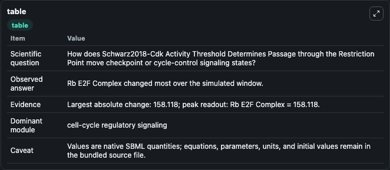
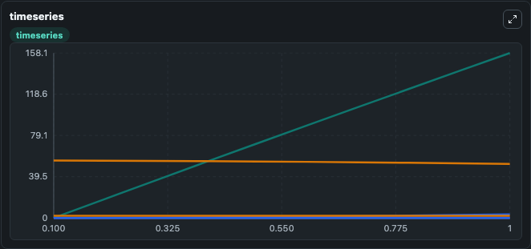
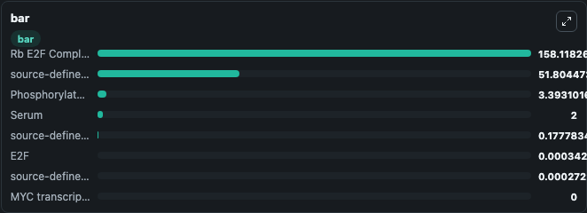

# Schwarz2018-Cdk Activity Threshold Determines Passage through the Restriction Point

This Biosimulant lab wraps `Schwarz2018-Cdk Activity Threshold Determines Passage through the Restriction Point` as a runnable signaling model with a companion visualization module.
Clean Biosimulant lab for cell-cycle regulatory signaling. It can be used to explore second-messenger and pathway-signaling dynamics and compare scenario outcomes across configurations.

## What You'll See

The lab asks: How does Schwarz2018-Cdk Activity Threshold Determines Passage through the Restriction Point move checkpoint or cycle-control signaling states? It runs for 1.0 time units with a communication step of 0.1. The run uses the model defaults declared by the curated SBML wrapper. The generated visualizations focus on MYC transcription factor, E2F, source-defined CYCD state, source-defined CYCE state, source-defined RB state, and Phosphorylated Rb, and related outputs, combining trajectory, endpoint-comparison, and summary-table views from one completed dark-mode run.

In this captured run, **Rb E2F Complex** moved from 0 to 158.1 across 1.0 simulation windows.

<!-- BIOSIMULANT_VISUALS_START -->
### Output Visualizations



*Summary table for Schwarz2018-Cdk Activity Threshold Determines Passage through the Restriction Point, reporting the scientific question, observed answer, dominant module, and caveat.*



*Trajectories of Rb E2F Complex, Phosphorylated Rb, source-defined RB state, source-defined CYCD state, E2F, and source-defined CYCE state across the 1.0 simulation. In this run **Rb E2F Complex** climbed from 0 to 158.1 and **source-defined RB state** fell from 55.000 to 51.804 — the largest movements among the focused observables.*



*Largest-excursion ranking of the focused observables — the absolute movement magnitude during the run. Top 3: **Rb E2F Complex** = 158.1, **source-defined RB state** = 51.804, **Phosphorylated Rb** = 3.393, with 5 more observables below.*

<!-- BIOSIMULANT_VISUALS_END -->

## Model Context

- Core model: `models/core`
- Visualization model: `models/visualisation`
- Standard: `other`
- Upstream source: `biomodels_ebi:BIOMD0000000918`
- License: `CC0`
- Visual scope: cell-cycle regulatory signaling
- Caveat: Values are native SBML quantities; equations, parameters, units, and initial values remain in the bundled source file.

## Inputs

| Input | Maps To | Default | Notes |
|---|---|---|---|
| Initial MYC transcription factor | `signaling_sbml_schwarz2018_cdk_activity_threshold_determines_pa_biomd0000000918_model.initial_myc_transcription_factor` |  | Initial level of MYC transcription factor. Maps to SBML symbol `Myc`; exposed as a traceable initial-condition perturbation. |

## Outputs

| Output | Maps To | Role |
|---|---|---|
| `phosphorylated_rb` | `signaling_sbml_schwarz2018_cdk_activity_threshold_determines_pa_biomd0000000918_model.phosphorylated_rb` | Phosphorylated Rb. |
| `rb_e2f_complex` | `signaling_sbml_schwarz2018_cdk_activity_threshold_determines_pa_biomd0000000918_model.rb_e2f_complex` | Rb E2F Complex. |
| `myc_transcription_factor` | `signaling_sbml_schwarz2018_cdk_activity_threshold_determines_pa_biomd0000000918_model.myc_transcription_factor` | MYC transcription factor. |
| `state` | `signaling_sbml_schwarz2018_cdk_activity_threshold_determines_pa_biomd0000000918_model.state` | Available to the visualization model and downstream workflows. |
| `summary` | `signaling_sbml_schwarz2018_cdk_activity_threshold_determines_pa_biomd0000000918_model.summary` | Available to the visualization model and downstream workflows. |
| `species_labels` | `signaling_sbml_schwarz2018_cdk_activity_threshold_determines_pa_biomd0000000918_model.species_labels` | Available to the visualization model and downstream workflows. |

## Runtime

- Duration: `1.0`
- Communication step: `0.1`

## Running Locally

```bash
biosimulant labs serve .
```
