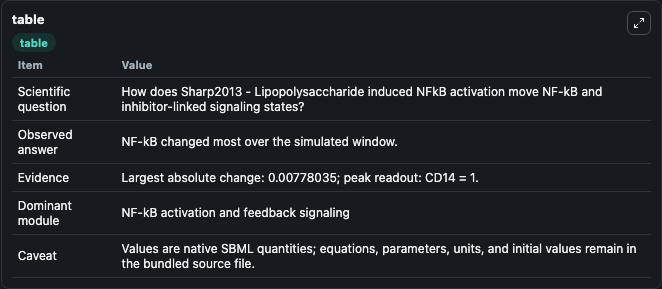
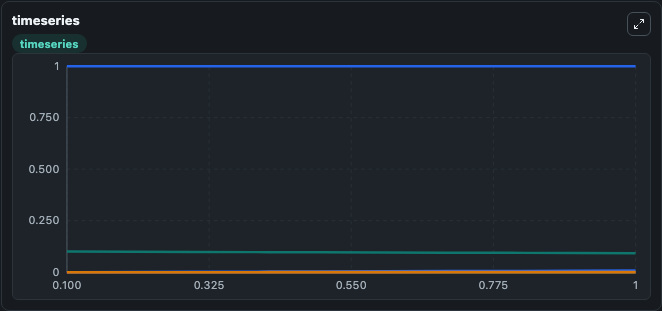
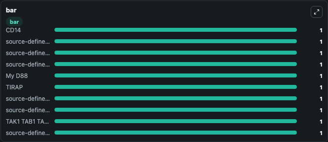

# Sharp2013 - Lipopolysaccharide induced NFkB activation

This Biosimulant lab wraps `Sharp2013 - Lipopolysaccharide induced NFkB activation` as a runnable signaling model with a companion visualization module.
Clean Biosimulant lab for NF-kB pathway signaling. It can be used to explore second-messenger and pathway-signaling dynamics and compare scenario outcomes across configurations.

## What You'll See

The lab asks: How does Sharp2013 - Lipopolysaccharide induced NFkB activation move NF-kB and inhibitor-linked signaling states? It runs for 1.0 time units with a communication step of 0.1. The run uses the model defaults declared by the curated SBML wrapper. The generated visualizations focus on CD14, source-defined IRAK4 state, source-defined LBP state, source-defined LPS state, LPS LBP CD14 TLR4 TIRAP My D88 IRAK4, and My D88, and related outputs, combining trajectory, endpoint-comparison, and summary-table views from one completed dark-mode run.

In this captured run, **NF-kB** moved from 0.1000 to 0.0922 across 1.0 simulation windows.

<!-- BIOSIMULANT_VISUALS_START -->
### Output Visualizations



*Summary table for Sharp2013 - Lipopolysaccharide induced NFkB activation, reporting the scientific question, observed answer, dominant module, and caveat.*



*Trajectories of NF-kB, Nfk B Nuc, source-defined TNFA state, LPS LBP CD14 TLR4 TIRAP My D88 IRAK4, LPS LBP CD14 TLR4 RIP1 TRAM TRIF TBK Ikke, and Tnfa TNF receptor 1 TRAF2 TRADD RIP1 across the 1.0 simulation. In this run **Nfk B Nuc** climbed from 0 to 0.00778 and **NF-kB** fell from 0.1000 to 0.0922 — the largest movements among the focused observables.*



*Largest-excursion ranking of the focused observables — the absolute movement magnitude during the run. Top 3: **CD14** = 1.000, **source-defined IRAK4 state** = 1.000, **source-defined LBP state** = 1.000, with 7 more observables below.*

<!-- BIOSIMULANT_VISUALS_END -->

## Model Context

- Core model: `models/core`
- Visualization model: `models/visualisation`
- Standard: `other`
- Upstream source: `biomodels_ebi:BIOMD0000000489`
- License: `CC0`
- Visual scope: NF-kB activation and feedback signaling
- Caveat: Values are native SBML quantities; equations, parameters, units, and initial values remain in the bundled source file.

## Inputs

| Input | Maps To | Default | Notes |
|---|---|---|---|
| Initial CD14 | `signaling_sbml_sharp2013_lipopolysaccharide_induced_nfkb_activa_biomd0000000489_model.initial_cd14` |  | Initial level of CD14. Maps to SBML symbol `species_1`; exposed as a traceable initial-condition perturbation. |
| Initial source-defined IRAK4 state | `signaling_sbml_sharp2013_lipopolysaccharide_induced_nfkb_activa_biomd0000000489_model.initial_source_defined_irak4_state` |  | Initial level of source-defined IRAK4 state. Maps to SBML symbol `species_2`; exposed as a traceable initial-condition perturbation. |
| Initial source-defined LBP state | `signaling_sbml_sharp2013_lipopolysaccharide_induced_nfkb_activa_biomd0000000489_model.initial_source_defined_lbp_state` |  | Initial level of source-defined LBP state. Maps to SBML symbol `species_3`; exposed as a traceable initial-condition perturbation. |

## Outputs

| Output | Maps To | Role |
|---|---|---|
| `source_defined_tnfa_state` | `signaling_sbml_sharp2013_lipopolysaccharide_induced_nfkb_activa_biomd0000000489_model.source_defined_tnfa_state` | source-defined TNFA state. |
| `tnf_receptor_1` | `signaling_sbml_sharp2013_lipopolysaccharide_induced_nfkb_activa_biomd0000000489_model.tnf_receptor_1` | TNF receptor 1. |
| `tnfa_tnf_receptor_1_traf2_tradd_rip1` | `signaling_sbml_sharp2013_lipopolysaccharide_induced_nfkb_activa_biomd0000000489_model.tnfa_tnf_receptor_1_traf2_tradd_rip1` | Tnfa TNF receptor 1 TRAF2 TRADD RIP1. |
| `state` | `signaling_sbml_sharp2013_lipopolysaccharide_induced_nfkb_activa_biomd0000000489_model.state` | Available to the visualization model and downstream workflows. |
| `summary` | `signaling_sbml_sharp2013_lipopolysaccharide_induced_nfkb_activa_biomd0000000489_model.summary` | Available to the visualization model and downstream workflows. |
| `species_labels` | `signaling_sbml_sharp2013_lipopolysaccharide_induced_nfkb_activa_biomd0000000489_model.species_labels` | Available to the visualization model and downstream workflows. |

## Runtime

- Duration: `1.0`
- Communication step: `0.1`

## Running Locally

```bash
biosimulant labs serve .
```
