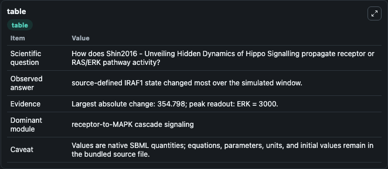
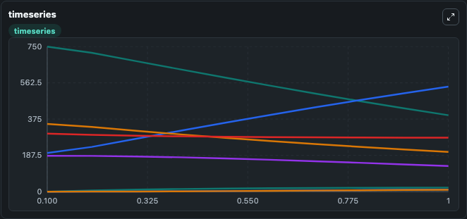
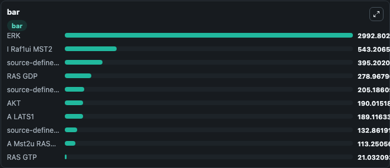

# Shin2016 - Unveiling Hidden Dynamics of Hippo Signalling

This Biosimulant lab wraps `Shin2016 - Unveiling Hidden Dynamics of Hippo Signalling` as a runnable signaling model with a companion visualization module.
Clean Biosimulant lab for MAPK/ERK receptor signaling. It can be used to explore second-messenger and pathway-signaling dynamics and compare scenario outcomes across configurations.

## What You'll See

The lab asks: How does Shin2016 - Unveiling Hidden Dynamics of Hippo Signalling propagate receptor or RAS/ERK pathway activity? It runs for 1.0 time units with a communication step of 0.1. The run uses the model defaults declared by the curated SBML wrapper. The generated visualizations focus on AKT, RASSF1A, source-defined MST2 state, source-defined DMST2 state, source-defined AMST2 state, and A Mst2u RASSF1A, and related outputs, combining trajectory, endpoint-comparison, and summary-table views from one completed dark-mode run.

In this captured run, **source-defined IRAF1 state** moved from 750.0 to 395.2 across 1.0 simulation windows.

<!-- BIOSIMULANT_VISUALS_START -->
### Output Visualizations



*Summary table for Shin2016 - Unveiling Hidden Dynamics of Hippo Signalling, reporting the scientific question, observed answer, dominant module, and caveat.*



*Trajectories of source-defined IRAF1 state, I Raf1ui MST2, source-defined DMST2 state, source-defined AMST2 state, RAS GDP, and RAS GTP across the 1.0 simulation. In this run **I Raf1ui MST2** climbed from 200.0 to 543.2 and **source-defined IRAF1 state** fell from 750.0 to 395.2 — the largest movements among the focused observables.*



*Largest-excursion ranking of the focused observables — the absolute movement magnitude during the run. Top 3: **ERK** = 2992.8, **I Raf1ui MST2** = 543.2, **source-defined IRAF1 state** = 395.2, with 7 more observables below.*

<!-- BIOSIMULANT_VISUALS_END -->

## Model Context

- Core model: `models/core`
- Visualization model: `models/visualisation`
- Standard: `other`
- Upstream source: `biomodels_ebi:BIOMD0000000832`
- License: `CC0`
- Visual scope: receptor-to-MAPK cascade signaling
- Caveat: Values are native SBML quantities; equations, parameters, units, and initial values remain in the bundled source file.

## Inputs

| Input | Maps To | Default | Notes |
|---|---|---|---|
| A EGFR | `signaling_sbml_shin2016_unveiling_hidden_dynamics_of_hippo_sign_biomd0000000832_model.initial_a_egfr_level` |  | A EGFR source parameter. Maps to SBML symbol `aEGFR` and preserves the bundled default. |

## Outputs

| Output | Maps To | Role |
|---|---|---|
| `akt` | `signaling_sbml_shin2016_unveiling_hidden_dynamics_of_hippo_sign_biomd0000000832_model.akt` | AKT. |
| `rassf1a` | `signaling_sbml_shin2016_unveiling_hidden_dynamics_of_hippo_sign_biomd0000000832_model.rassf1a` | RASSF1A. |
| `a_mst2u_rassf1a` | `signaling_sbml_shin2016_unveiling_hidden_dynamics_of_hippo_sign_biomd0000000832_model.a_mst2u_rassf1a` | A Mst2u RASSF1A. |
| `state` | `signaling_sbml_shin2016_unveiling_hidden_dynamics_of_hippo_sign_biomd0000000832_model.state` | Available to the visualization model and downstream workflows. |
| `summary` | `signaling_sbml_shin2016_unveiling_hidden_dynamics_of_hippo_sign_biomd0000000832_model.summary` | Available to the visualization model and downstream workflows. |
| `species_labels` | `signaling_sbml_shin2016_unveiling_hidden_dynamics_of_hippo_sign_biomd0000000832_model.species_labels` | Available to the visualization model and downstream workflows. |

## Runtime

- Duration: `1.0`
- Communication step: `0.1`

## Running Locally

```bash
biosimulant labs serve .
```
