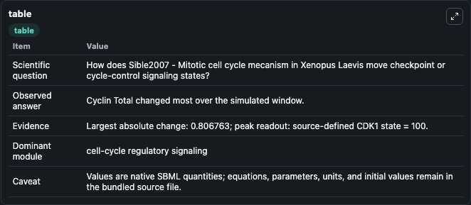
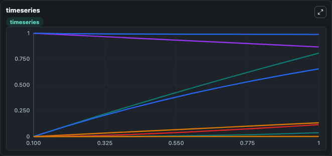
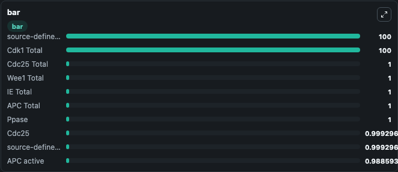

# Sible2007 - Mitotic cell cycle mecanism in Xenopus Laevis

This Biosimulant lab wraps `Sible2007 - Mitotic cell cycle mecanism in Xenopus Laevis` as a runnable signaling model with a companion visualization module.
Clean Biosimulant lab for cell-cycle regulatory signaling. It can be used to explore second-messenger and pathway-signaling dynamics and compare scenario outcomes across configurations.

## What You'll See

The lab asks: How does Sible2007 - Mitotic cell cycle mecanism in Xenopus Laevis move checkpoint or cycle-control signaling states? It runs for 1.0 time units with a communication step of 0.1. The run uses the model defaults declared by the curated SBML wrapper. The generated visualizations focus on Cdc25, Cdc25 Phosphorylated, Cyclin Cdk1 MPF, Cyclin Cdk1 Pre MPF, source-defined WEE1 state, and Wee1 Phosphorylated, and related outputs, combining trajectory, endpoint-comparison, and summary-table views from one completed dark-mode run.

In this captured run, **Cyclin Total** moved from 0 to 0.8068 across 1.0 simulation windows.

<!-- BIOSIMULANT_VISUALS_START -->
### Output Visualizations



*Summary table for Sible2007 - Mitotic cell cycle mecanism in Xenopus Laevis, reporting the scientific question, observed answer, dominant module, and caveat.*



*Trajectories of Cyclin Total, Cyclin, source-defined IE state, IE Phosphorylated, Cyclin Cdk1 MPF, and Cyclin Cdk1 Pre MPF across the 1.0 simulation. In this run **Cyclin Total** climbed from 0 to 0.8068 and **IE Phosphorylated** fell from 1.000 to 0.8671 — the largest movements among the focused observables.*



*Largest-excursion ranking of the focused observables — the absolute movement magnitude during the run. Top 3: **source-defined CDK1 state** = 100.0, **Cdk1 Total** = 100.0, **Cdc25 Total** = 1.000, with 7 more observables below.*

<!-- BIOSIMULANT_VISUALS_END -->

## Model Context

- Core model: `models/core`
- Visualization model: `models/visualisation`
- Standard: `other`
- Upstream source: `biomodels_ebi:BIOMD0000000942`
- License: `CC0`
- Visual scope: cell-cycle regulatory signaling
- Caveat: Values are native SBML quantities; equations, parameters, units, and initial values remain in the bundled source file.

## Inputs

| Input | Maps To | Default | Notes |
|---|---|---|---|
| Initial APC Total | `signaling_sbml_sible2007_mitotic_cell_cycle_mecanism_in_xenopus_biomd0000000942_model.initial_apc_total` |  | Initial level of APC Total. Maps to SBML symbol `APC_total`; exposed as a traceable initial-condition perturbation. |
| Initial Cdc25 | `signaling_sbml_sible2007_mitotic_cell_cycle_mecanism_in_xenopus_biomd0000000942_model.initial_cdc25` |  | Initial level of Cdc25. Maps to SBML symbol `Cdc25`; exposed as a traceable initial-condition perturbation. |
| Initial Cdc25 Total | `signaling_sbml_sible2007_mitotic_cell_cycle_mecanism_in_xenopus_biomd0000000942_model.initial_cdc25_total` |  | Initial level of Cdc25 Total. Maps to SBML symbol `Cdc25_total`; exposed as a traceable initial-condition perturbation. |

## Outputs

| Output | Maps To | Role |
|---|---|---|
| `cdc25_phosphorylated` | `signaling_sbml_sible2007_mitotic_cell_cycle_mecanism_in_xenopus_biomd0000000942_model.cdc25_phosphorylated` | Cdc25 Phosphorylated. |
| `wee1_phosphorylated` | `signaling_sbml_sible2007_mitotic_cell_cycle_mecanism_in_xenopus_biomd0000000942_model.wee1_phosphorylated` | Wee1 Phosphorylated. |
| `ie_phosphorylated` | `signaling_sbml_sible2007_mitotic_cell_cycle_mecanism_in_xenopus_biomd0000000942_model.ie_phosphorylated` | IE Phosphorylated. |
| `state` | `signaling_sbml_sible2007_mitotic_cell_cycle_mecanism_in_xenopus_biomd0000000942_model.state` | Available to the visualization model and downstream workflows. |
| `summary` | `signaling_sbml_sible2007_mitotic_cell_cycle_mecanism_in_xenopus_biomd0000000942_model.summary` | Available to the visualization model and downstream workflows. |
| `species_labels` | `signaling_sbml_sible2007_mitotic_cell_cycle_mecanism_in_xenopus_biomd0000000942_model.species_labels` | Available to the visualization model and downstream workflows. |

## Runtime

- Duration: `1.0`
- Communication step: `0.1`

## Running Locally

```bash
biosimulant labs serve .
```
