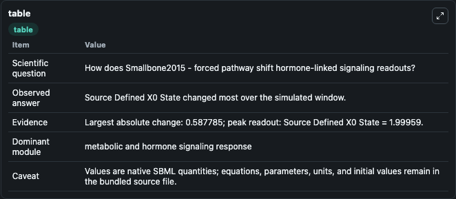
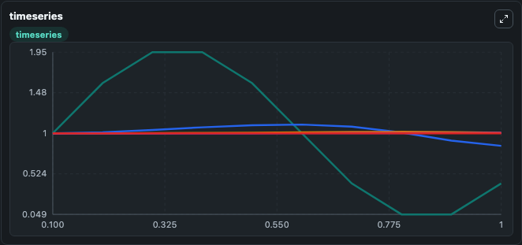
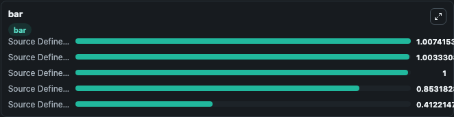

# Smallbone2015 - forced pathway

This Biosimulant lab wraps `Smallbone2015 - forced pathway` as a runnable signaling model with a companion visualization module.
Clean Biosimulant lab for systems signaling model: Smallbone2015 - forced pathway. It can be used to explore second-messenger and pathway-signaling dynamics and compare scenario outcomes across configurations.

## What You'll See

The lab asks: How does Smallbone2015 - forced pathway shift hormone-linked signaling readouts? It runs for 1.0 time units with a communication step of 0.1. The run uses the model defaults declared by the curated SBML wrapper. The generated visualizations focus on Source Defined X0 State, Source Defined X1 State, Source Defined X2 State, Source Defined X3 State, and Source Defined X4 State, combining trajectory, endpoint-comparison, and summary-table views from one completed dark-mode run.

In this captured run, **Source Defined X0 State** moved from 1.000 to 0.4122 across 1.0 simulation windows.

<!-- BIOSIMULANT_VISUALS_START -->
### Output Visualizations



*Summary table for Smallbone2015 - forced pathway, reporting the scientific question, observed answer, dominant module, and caveat.*



*Trajectories of Source Defined X0 State, Source Defined X1 State, Source Defined X2 State, Source Defined X3 State, and Source Defined X4 State across the 1.0 simulation. In this run **Source Defined X2 State** climbed from 1.000 to 1.007 and **Source Defined X0 State** fell from 1.000 to 0.4122 — the largest movements among the focused observables.*



*Largest-excursion ranking of the focused observables — the absolute movement magnitude during the run. Top 3: **Source Defined X2 State** = 1.007, **Source Defined X3 State** = 1.003, **Source Defined X4 State** = 1.000, with 2 more observables below.*

<!-- BIOSIMULANT_VISUALS_END -->

## Model Context

- Core model: `models/core`
- Visualization model: `models/visualisation`
- Standard: `other`
- Upstream source: `biomodels_ebi:MODEL1503180004`
- License: `CC0`
- Visual scope: metabolic and hormone signaling response
- Caveat: Values are native SBML quantities; equations, parameters, units, and initial values remain in the bundled source file.

## Inputs

| Input | Maps To | Default | Notes |
|---|---|---|---|
| Initial source-defined X0 state | `signaling_sbml_smallbone2015_forced_pathway_model1503180004_model.initial_source_defined_x0_state` |  | Initial level of source-defined X0 state. Maps to SBML symbol `X0`; exposed as a traceable initial-condition perturbation. |
| Initial source-defined X4 state | `signaling_sbml_smallbone2015_forced_pathway_model1503180004_model.initial_source_defined_x4_state` |  | Initial level of source-defined X4 state. Maps to SBML symbol `X4`; exposed as a traceable initial-condition perturbation. |

## Outputs

| Output | Maps To | Role |
|---|---|---|
| `source_defined_x0_state` | `signaling_sbml_smallbone2015_forced_pathway_model1503180004_model.source_defined_x0_state` | Source Defined X0 State. |
| `source_defined_x1_state` | `signaling_sbml_smallbone2015_forced_pathway_model1503180004_model.source_defined_x1_state` | Source Defined X1 State. |
| `source_defined_x2_state` | `signaling_sbml_smallbone2015_forced_pathway_model1503180004_model.source_defined_x2_state` | Source Defined X2 State. |
| `state` | `signaling_sbml_smallbone2015_forced_pathway_model1503180004_model.state` | Available to the visualization model and downstream workflows. |
| `summary` | `signaling_sbml_smallbone2015_forced_pathway_model1503180004_model.summary` | Available to the visualization model and downstream workflows. |
| `species_labels` | `signaling_sbml_smallbone2015_forced_pathway_model1503180004_model.species_labels` | Available to the visualization model and downstream workflows. |

## Runtime

- Duration: `1.0`
- Communication step: `0.1`

## Running Locally

```bash
biosimulant labs serve .
```
