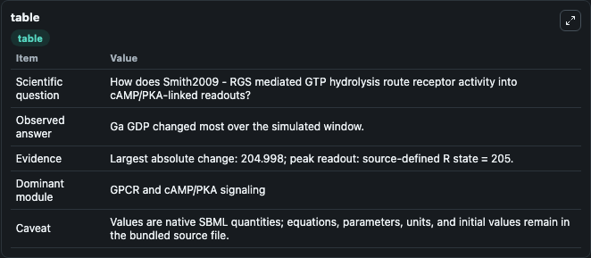
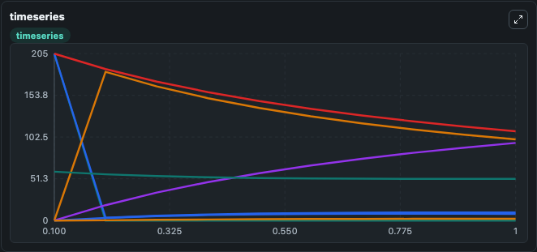
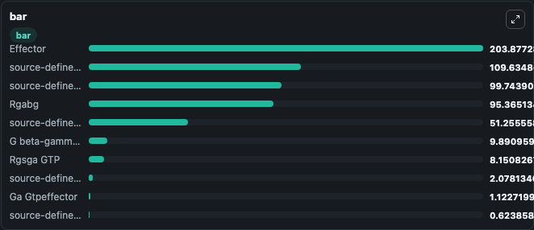

# Smith2009 - RGS mediated GTP hydrolysis

This Biosimulant lab wraps `Smith2009 - RGS mediated GTP hydrolysis` as a runnable signaling model with a companion visualization module.
Clean Biosimulant lab for systems signaling model: Smith2009 - RGS mediated GTP hydrolysis. It can be used to explore second-messenger and pathway-signaling dynamics and compare scenario outcomes across configurations.

## What You'll See

The lab asks: How does Smith2009 - RGS mediated GTP hydrolysis route receptor activity into cAMP/PKA-linked readouts? It runs for 1.0 time units with a communication step of 0.1. The run uses the model defaults declared by the curated SBML wrapper. The generated visualizations focus on source-defined R state, source-defined L state, source-defined RL state, source-defined GABG state, Rgabg, and Rgabg L, and related outputs, combining trajectory, endpoint-comparison, and summary-table views from one completed dark-mode run.

In this captured run, **Ga GDP** moved from 205.0 to 0.00208 across 1.0 simulation windows.

<!-- BIOSIMULANT_VISUALS_START -->
### Output Visualizations



*Summary table for Smith2009 - RGS mediated GTP hydrolysis, reporting the scientific question, observed answer, dominant module, and caveat.*



*Trajectories of Ga GDP, G beta-gamma complex, source-defined GABG state, Rgabg, source-defined R state, and source-defined RGS state across the 1.0 simulation. In this run **source-defined GABG state** climbed from 0 to 99.744 and **Ga GDP** fell from 205.0 to 0.00208 — the largest movements among the focused observables.*



*Largest-excursion ranking of the focused observables — the absolute movement magnitude during the run. Top 3: **Effector** = 203.9, **source-defined R state** = 109.6, **source-defined GABG state** = 99.744, with 7 more observables below.*

<!-- BIOSIMULANT_VISUALS_END -->

## Model Context

- Core model: `models/core`
- Visualization model: `models/visualisation`
- Standard: `other`
- Upstream source: `biomodels_ebi:BIOMD0000000439`
- License: `CC0`
- Visual scope: GPCR and cAMP/PKA signaling
- Caveat: Values are native SBML quantities; equations, parameters, units, and initial values remain in the bundled source file.

## Inputs

| Input | Maps To | Default | Notes |
|---|---|---|---|
| Ligand Conc | `signaling_sbml_smith2009_rgs_mediated_gtp_hydrolysis_biomd0000000439_model.initial_ligand_conc_level` |  | Ligand Conc source parameter. Maps to SBML symbol `Ligand_conc` and preserves the bundled default. |

## Outputs

| Output | Maps To | Role |
|---|---|---|
| `source_defined_gabg_state` | `signaling_sbml_smith2009_rgs_mediated_gtp_hydrolysis_biomd0000000439_model.source_defined_gabg_state` | source-defined GABG state. |
| `rgabg` | `signaling_sbml_smith2009_rgs_mediated_gtp_hydrolysis_biomd0000000439_model.rgabg` | Rgabg. |
| `rgabg_l` | `signaling_sbml_smith2009_rgs_mediated_gtp_hydrolysis_biomd0000000439_model.rgabg_l` | Rgabg L. |
| `state` | `signaling_sbml_smith2009_rgs_mediated_gtp_hydrolysis_biomd0000000439_model.state` | Available to the visualization model and downstream workflows. |
| `summary` | `signaling_sbml_smith2009_rgs_mediated_gtp_hydrolysis_biomd0000000439_model.summary` | Available to the visualization model and downstream workflows. |
| `species_labels` | `signaling_sbml_smith2009_rgs_mediated_gtp_hydrolysis_biomd0000000439_model.species_labels` | Available to the visualization model and downstream workflows. |

## Runtime

- Duration: `1.0`
- Communication step: `0.1`

## Running Locally

```bash
biosimulant labs serve .
```
