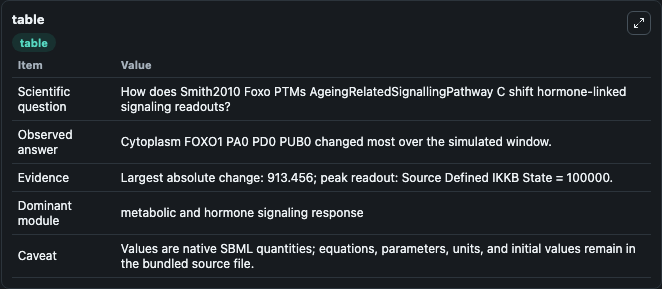
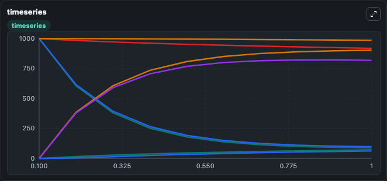
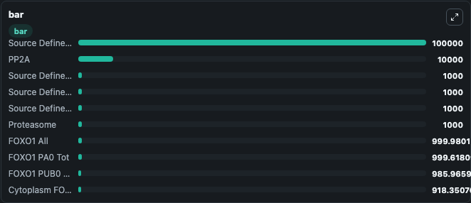

# Smith2010_Foxo_PTMs_AgeingRelatedSignallingPathway_C

This Biosimulant lab wraps `Smith2010_Foxo_PTMs_AgeingRelatedSignallingPathway_C` as a runnable signaling model with a companion visualization module.
Clean Biosimulant lab for systems signaling model: Smith2010_Foxo_PTMs_AgeingRelatedSignallingPathway_C. It can be used to explore second-messenger and pathway-signaling dynamics and compare scenario outcomes across configurations.

## What You'll See

The lab asks: How does Smith2010 Foxo PTMs AgeingRelatedSignallingPathway C shift hormone-linked signaling readouts? It runs for 1.0 time units with a communication step of 0.1. The run uses the model defaults declared by the curated SBML wrapper. The generated visualizations focus on Source Defined NULL State, Degr FOXO1, Cytoplasm FOXO1 PA0 PD0 PUB0, Nucleus FOXO1 PA0 PD0 PUB0, Dnabound FOXO1 PA0 PD0 PUB0, and Cytoplasm FOXO1 PA0 PD0 PUB1, and related outputs, combining trajectory, endpoint-comparison, and summary-table views from one completed dark-mode run.

In this captured run, **Cytoplasm FOXO1 PA0 PD0 PUB0** moved from 1000.0 to 86.544 across 1.0 simulation windows.

<!-- BIOSIMULANT_VISUALS_START -->
### Output Visualizations



*Summary table for Smith2010_Foxo_PTMs_AgeingRelatedSignallingPathway_C, reporting the scientific question, observed answer, dominant module, and caveat.*



*Trajectories of Cytoplasm FOXO1 PA0 PD0 PUB0, FOXO1 PD0 Tot, FOXO1 PD1 Tot, Cytoplasm FOXO1 PA0 PD1 PUB0, Cytoplasm FOXO1 Tot, and Nucleus FOXO1 Tot across the 1.0 simulation. In this run **FOXO1 PD1 Tot** climbed from 0 to 902.5 and **Cytoplasm FOXO1 PA0 PD0 PUB0** fell from 1000.0 to 86.544 — the largest movements among the focused observables.*



*Largest-excursion ranking of the focused observables — the absolute movement magnitude during the run. Top 3: **Source Defined IKKB State** = 1e+05, **PP2A** = 1e+04, **Source Defined SIRT1 State** = 1000.0, with 7 more observables below.*

<!-- BIOSIMULANT_VISUALS_END -->

## Model Context

- Core model: `models/core`
- Visualization model: `models/visualisation`
- Standard: `other`
- Upstream source: `biomodels_ebi:MODEL1112260002`
- License: `CC0`
- Visual scope: metabolic and hormone signaling response
- Caveat: Values are native SBML quantities; equations, parameters, units, and initial values remain in the bundled source file.

## Inputs

| Input | Maps To | Default | Notes |
|---|---|---|---|
| Initial Degr Foxo1 | `signaling_sbml_smith2010_foxo_ptms_ageingrelatedsignallingpathw_model1112260002_model.initial_degr_foxo1` |  | Initial level of Degr Foxo1. Maps to SBML symbol `degr_Foxo1`; exposed as a traceable initial-condition perturbation. |
| Initial source-defined NULL state | `signaling_sbml_smith2010_foxo_ptms_ageingrelatedsignallingpathw_model1112260002_model.initial_source_defined_null_state` |  | Initial level of source-defined NULL state. Maps to SBML symbol `null`; exposed as a traceable initial-condition perturbation. |

## Outputs

| Output | Maps To | Role |
|---|---|---|
| `akt` | `signaling_sbml_smith2010_foxo_ptms_ageingrelatedsignallingpathw_model1112260002_model.akt` | AKT. |
| `source_defined_null_state` | `signaling_sbml_smith2010_foxo_ptms_ageingrelatedsignallingpathw_model1112260002_model.source_defined_null_state` | Source Defined NULL State. |
| `degr_foxo1` | `signaling_sbml_smith2010_foxo_ptms_ageingrelatedsignallingpathw_model1112260002_model.degr_foxo1` | Degr FOXO1. |
| `state` | `signaling_sbml_smith2010_foxo_ptms_ageingrelatedsignallingpathw_model1112260002_model.state` | Available to the visualization model and downstream workflows. |
| `summary` | `signaling_sbml_smith2010_foxo_ptms_ageingrelatedsignallingpathw_model1112260002_model.summary` | Available to the visualization model and downstream workflows. |
| `species_labels` | `signaling_sbml_smith2010_foxo_ptms_ageingrelatedsignallingpathw_model1112260002_model.species_labels` | Available to the visualization model and downstream workflows. |

## Runtime

- Duration: `1.0`
- Communication step: `0.1`

## Running Locally

```bash
biosimulant labs serve .
```
