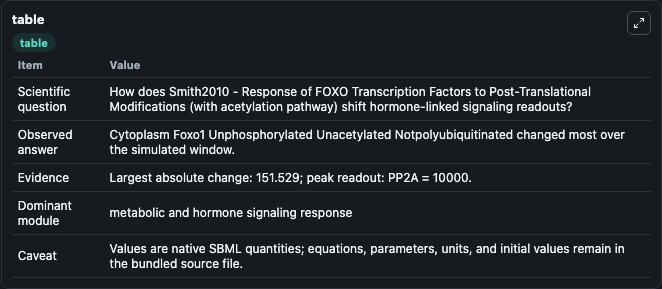
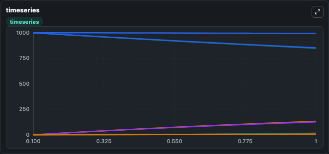
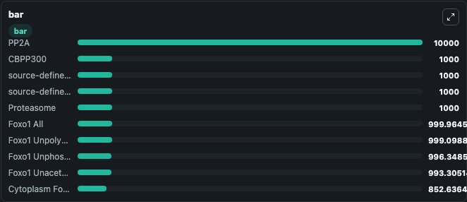

# Smith2010 - Response of FOXO Transcription Factors to Post-Translational Modifications (with acetylation pathway)

This Biosimulant lab wraps `Smith2010 - Response of FOXO Transcription Factors to Post-Translational Modifications (with acetylation pathway)` as a runnable signaling model with a companion visualization module.
Clean Biosimulant lab for systems signaling model: Smith2010 - Response of FOXO Transcription Factors to Post-Translational Modifications (with acetylation pathway). It can be used to explore second-messenger and pathway-signaling dynamics and compare scenario outcomes across configurations.

## What You'll See

The lab asks: How does Smith2010 - Response of FOXO Transcription Factors to Post-Translational Modifications (with acetylation pathway) shift hormone-linked signaling readouts? It runs for 1.0 time units with a communication step of 0.1. The run uses the model defaults declared by the curated SBML wrapper. The generated visualizations focus on source-defined NULL state, Degr Foxo1, Cytoplasm Foxo1 Unphosphorylated Unacetylated Notpolyubiquitinated, Nucleus Foxo1 Unphosphorylated Unacetylated Notpolyubiquitinated, Dnabound Foxo1 Unphosphorylated Unacetylated Notpolyubiquitinated, and Cytoplasm Foxo1 Unphosphorylated Unacetylated Polyubiquitinated, and related outputs, combining trajectory, endpoint-comparison, and summary-table views from one completed dark-mode run.

In this captured run, **Cytoplasm Foxo1 Unphosphorylated Unacetylated Notpolyubiquitinated** moved from 1000.0 to 848.5 across 1.0 simulation windows.

<!-- BIOSIMULANT_VISUALS_START -->
### Output Visualizations



*Summary table for Smith2010 - Response of FOXO Transcription Factors to Post-Translational Modifications (with acetylation pathway), reporting the scientific question, observed answer, dominant module, and caveat.*



*Trajectories of Cytoplasm Foxo1 Unphosphorylated Unacetylated Notpolyubiquitinated, Cytoplasm Foxo1 Tot, Nucleus Foxo1 Tot, Nucleus Foxo1 Unphosphorylated Unacetylated Notpolyubiquitinated, Dnabound Foxo1 Tot, and Dnabound Foxo1 Unphosphorylated Unacetylated Notpolyubiquitinated across the 1.0 simulation. In this run **Nucleus Foxo1 Tot** climbed from 0 to 132.2 and **Cytoplasm Foxo1 Unphosphorylated Unacetylated Notpolyubiquitinated** fell from 1000.0 to 848.5 — the largest movements among the focused observables.*



*Largest-excursion ranking of the focused observables — the absolute movement magnitude during the run. Top 3: **PP2A** = 1e+04, **CBPP300** = 1000.0, **source-defined USP7 state** = 1000.0, with 7 more observables below.*

<!-- BIOSIMULANT_VISUALS_END -->

## Model Context

- Core model: `models/core`
- Visualization model: `models/visualisation`
- Standard: `other`
- Upstream source: `biomodels_ebi:BIOMD0000000706`
- License: `CC0`
- Visual scope: metabolic and hormone signaling response
- Caveat: Values are native SBML quantities; equations, parameters, units, and initial values remain in the bundled source file.

## Inputs

| Input | Maps To | Default | Notes |
|---|---|---|---|
| Initial Cytoplasm Foxo1 Tot | `signaling_sbml_smith2010_response_of_foxo_transcription_factors_biomd0000000706_model.initial_cytoplasm_foxo1_tot` |  | Initial level of Cytoplasm Foxo1 Tot. Maps to SBML symbol `cytoplasm_Foxo1_tot`; exposed as a traceable initial-condition perturbation. |
| Initial Dnabound Foxo1 Tot | `signaling_sbml_smith2010_response_of_foxo_transcription_factors_biomd0000000706_model.initial_dnabound_foxo1_tot` |  | Initial level of Dnabound Foxo1 Tot. Maps to SBML symbol `dnabound_Foxo1_tot`; exposed as a traceable initial-condition perturbation. |
| Initial Foxo1 Acetylated Tot | `signaling_sbml_smith2010_response_of_foxo_transcription_factors_biomd0000000706_model.initial_foxo1_acetylated_tot` |  | Initial level of Foxo1 Acetylated Tot. Maps to SBML symbol `Foxo1_Ac1_tot`; exposed as a traceable initial-condition perturbation. |

## Outputs

| Output | Maps To | Role |
|---|---|---|
| `cytoplasm_foxo1_unphosphorylated_unacetylated_notpolyubiquitinated` | `signaling_sbml_smith2010_response_of_foxo_transcription_factors_biomd0000000706_model.cytoplasm_foxo1_unphosphorylated_unacetylated_notpolyubiquitinated` | Cytoplasm Foxo1 Unphosphorylated Unacetylated Notpolyubiquitinated. |
| `nucleus_foxo1_unphosphorylated_unacetylated_notpolyubiquitinated` | `signaling_sbml_smith2010_response_of_foxo_transcription_factors_biomd0000000706_model.nucleus_foxo1_unphosphorylated_unacetylated_notpolyubiquitinated` | Nucleus Foxo1 Unphosphorylated Unacetylated Notpolyubiquitinated. |
| `dnabound_foxo1_unphosphorylated_unacetylated_notpolyubiquitinated` | `signaling_sbml_smith2010_response_of_foxo_transcription_factors_biomd0000000706_model.dnabound_foxo1_unphosphorylated_unacetylated_notpolyubiquitinated` | Dnabound Foxo1 Unphosphorylated Unacetylated Notpolyubiquitinated. |
| `state` | `signaling_sbml_smith2010_response_of_foxo_transcription_factors_biomd0000000706_model.state` | Available to the visualization model and downstream workflows. |
| `summary` | `signaling_sbml_smith2010_response_of_foxo_transcription_factors_biomd0000000706_model.summary` | Available to the visualization model and downstream workflows. |
| `species_labels` | `signaling_sbml_smith2010_response_of_foxo_transcription_factors_biomd0000000706_model.species_labels` | Available to the visualization model and downstream workflows. |

## Runtime

- Duration: `1.0`
- Communication step: `0.1`

## Running Locally

```bash
biosimulant labs serve .
```
