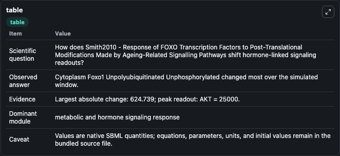
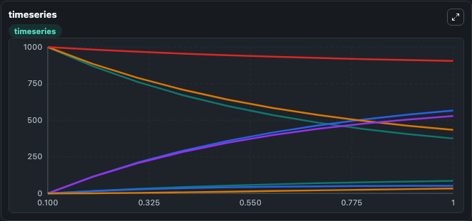
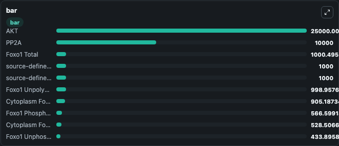

# Smith2010 - Response of FOXO Transcription Factors to Post-Translational Modifications Made by Ageing-Related Signalling Pathways

This Biosimulant lab wraps `Smith2010 - Response of FOXO Transcription Factors to Post-Translational Modifications Made by Ageing-Related Signalling Pathways` as a runnable signaling model with a companion visualization module.
Clean Biosimulant lab for systems signaling model: Smith2010 - Response of FOXO Transcription Factors to Post-Translational Modifications Made by Ageing-Related Signalling Pathways. It can be used to explore second-messenger and pathway-signaling dynamics and compare scenario outcomes across configurations.

## What You'll See

The lab asks: How does Smith2010 - Response of FOXO Transcription Factors to Post-Translational Modifications Made by Ageing-Related Signalling Pathways shift hormone-linked signaling readouts? It runs for 1.0 time units with a communication step of 0.1. The run uses the model defaults declared by the curated SBML wrapper. The generated visualizations focus on source-defined NULL state, Degr Foxo1, Cytoplasm Foxo1 Unpolyubiquitinated Unphosphorylated, Nucleus Foxo1 Unpolyubiquitinated Unphosphorylated, Dnabound Foxo1 Unpolyubiquitinated Unphosphorylated, and Cytoplasm Foxo1 Polyubiquitinated, and related outputs, combining trajectory, endpoint-comparison, and summary-table views from one completed dark-mode run.

In this captured run, **Cytoplasm Foxo1 Unpolyubiquitinated Unphosphorylated** moved from 1000.0 to 375.3 across 1.0 simulation windows.

<!-- BIOSIMULANT_VISUALS_START -->
### Output Visualizations



*Summary table for Smith2010 - Response of FOXO Transcription Factors to Post-Translational Modifications Made by Ageing-Related Signalling Pathways, reporting the scientific question, observed answer, dominant module, and caveat.*



*Trajectories of Cytoplasm Foxo1 Unpolyubiquitinated Unphosphorylated, Foxo1 Phosphorylated Total, Foxo1 Unphosphorylated Total, Cytoplasm Foxo1 Phosphorylated, Cytoplasm Foxo1 Total, and Nucleus Foxo1 Total across the 1.0 simulation. In this run **Foxo1 Phosphorylated Total** climbed from 0 to 566.6 and **Cytoplasm Foxo1 Unpolyubiquitinated Unphosphorylated** fell from 1000.0 to 375.3 — the largest movements among the focused observables.*



*Largest-excursion ranking of the focused observables — the absolute movement magnitude during the run. Top 3: **AKT** = 2.5e+04, **PP2A** = 1e+04, **Foxo1 Total** = 1000.5, with 7 more observables below.*

<!-- BIOSIMULANT_VISUALS_END -->

## Model Context

- Core model: `models/core`
- Visualization model: `models/visualisation`
- Standard: `other`
- Upstream source: `biomodels_ebi:BIOMD0000000705`
- License: `CC0`
- Visual scope: metabolic and hormone signaling response
- Caveat: Values are native SBML quantities; equations, parameters, units, and initial values remain in the bundled source file.

## Inputs

| Input | Maps To | Default | Notes |
|---|---|---|---|
| Initial Cytoplasm Foxo1 Total | `signaling_sbml_smith2010_response_of_foxo_transcription_factors_biomd0000000705_model.initial_cytoplasm_foxo1_total` |  | Initial level of Cytoplasm Foxo1 Total. Maps to SBML symbol `cytoplasm_Foxo1_tot`; exposed as a traceable initial-condition perturbation. |
| Initial Degr Foxo1 | `signaling_sbml_smith2010_response_of_foxo_transcription_factors_biomd0000000705_model.initial_degr_foxo1` |  | Initial level of Degr Foxo1. Maps to SBML symbol `degr_Foxo1`; exposed as a traceable initial-condition perturbation. |
| Initial Dnabound Foxo1 Total | `signaling_sbml_smith2010_response_of_foxo_transcription_factors_biomd0000000705_model.initial_dnabound_foxo1_total` |  | Initial level of Dnabound Foxo1 Total. Maps to SBML symbol `dnabound_Foxo1_tot`; exposed as a traceable initial-condition perturbation. |

## Outputs

| Output | Maps To | Role |
|---|---|---|
| `cytoplasm_foxo1_unpolyubiquitinated_unphosphorylated` | `signaling_sbml_smith2010_response_of_foxo_transcription_factors_biomd0000000705_model.cytoplasm_foxo1_unpolyubiquitinated_unphosphorylated` | Cytoplasm Foxo1 Unpolyubiquitinated Unphosphorylated. |
| `nucleus_foxo1_unpolyubiquitinated_unphosphorylated` | `signaling_sbml_smith2010_response_of_foxo_transcription_factors_biomd0000000705_model.nucleus_foxo1_unpolyubiquitinated_unphosphorylated` | Nucleus Foxo1 Unpolyubiquitinated Unphosphorylated. |
| `dnabound_foxo1_unpolyubiquitinated_unphosphorylated` | `signaling_sbml_smith2010_response_of_foxo_transcription_factors_biomd0000000705_model.dnabound_foxo1_unpolyubiquitinated_unphosphorylated` | Dnabound Foxo1 Unpolyubiquitinated Unphosphorylated. |
| `state` | `signaling_sbml_smith2010_response_of_foxo_transcription_factors_biomd0000000705_model.state` | Available to the visualization model and downstream workflows. |
| `summary` | `signaling_sbml_smith2010_response_of_foxo_transcription_factors_biomd0000000705_model.summary` | Available to the visualization model and downstream workflows. |
| `species_labels` | `signaling_sbml_smith2010_response_of_foxo_transcription_factors_biomd0000000705_model.species_labels` | Available to the visualization model and downstream workflows. |

## Runtime

- Duration: `1.0`
- Communication step: `0.1`

## Running Locally

```bash
biosimulant labs serve .
```
