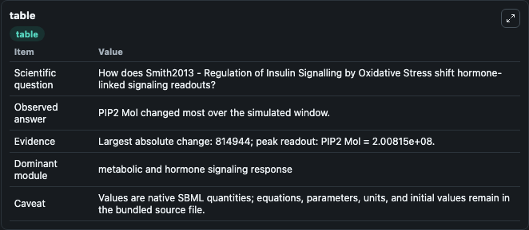
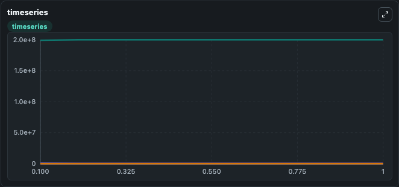
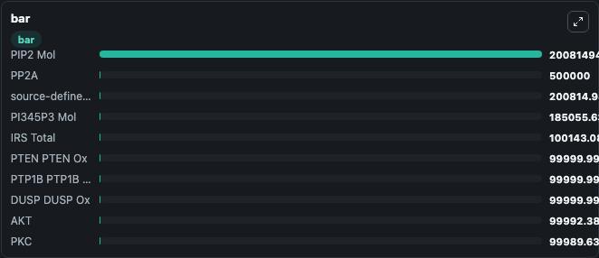

# Smith2013 - Regulation of Insulin Signalling by Oxidative Stress

This Biosimulant lab wraps `Smith2013 - Regulation of Insulin Signalling by Oxidative Stress` as a runnable signaling model with a companion visualization module.
Clean Biosimulant lab for metabolic and hormone-linked signaling. It can be used to explore second-messenger and pathway-signaling dynamics and compare scenario outcomes across configurations.

## What You'll See

The lab asks: How does Smith2013 - Regulation of Insulin Signalling by Oxidative Stress shift hormone-linked signaling readouts? It runs for 1.0 time units with a communication step of 0.1. The run uses the model defaults declared by the curated SBML wrapper. The generated visualizations focus on source-defined INS state, source-defined INR state, Ins In R, Ins In R P, Ins 2 In R P, and Cytoplasm In R, and related outputs, combining trajectory, endpoint-comparison, and summary-table views from one completed dark-mode run.

In this captured run, **PIP2 Mol** moved from 2e+08 to 2.01e+08 across 1.0 simulation windows.

<!-- BIOSIMULANT_VISUALS_START -->
### Output Visualizations



*Summary table for Smith2013 - Regulation of Insulin Signalling by Oxidative Stress, reporting the scientific question, observed answer, dominant module, and caveat.*



*Trajectories of PIP2 Mol, PI345P3 Mol, PTP1B, PTP1B Ox, source-defined PIP2 state, and PI345P3 across the 1.0 simulation. In this run **PIP2 Mol** climbed from 2e+08 to 2.01e+08 and **PI345P3 Mol** fell from 1e+06 to 1.85e+05 — the largest movements among the focused observables.*



*Largest-excursion ranking of the focused observables — the absolute movement magnitude during the run. Top 3: **PIP2 Mol** = 2.01e+08, **PP2A** = 5e+05, **source-defined PIP2 state** = 2.01e+05, with 7 more observables below.*

<!-- BIOSIMULANT_VISUALS_END -->

## Model Context

- Core model: `models/core`
- Visualization model: `models/visualisation`
- Standard: `other`
- Upstream source: `biomodels_ebi:BIOMD0000000474`
- License: `CC0`
- Visual scope: metabolic and hormone signaling response
- Caveat: Values are native SBML quantities; equations, parameters, units, and initial values remain in the bundled source file.

## Inputs

| Input | Maps To | Default | Notes |
|---|---|---|---|
| Initial Cytoplasm Foxo1 Tot | `signaling_sbml_smith2013_regulation_of_insulin_signalling_by_ox_biomd0000000474_model.initial_cytoplasm_foxo1_tot` |  | Initial level of Cytoplasm Foxo1 Tot. Maps to SBML symbol `cytoplasm_Foxo1_tot`; exposed as a traceable initial-condition perturbation. |
| Initial Dnabound Foxo1 Tot | `signaling_sbml_smith2013_regulation_of_insulin_signalling_by_ox_biomd0000000474_model.initial_dnabound_foxo1_tot` |  | Initial level of Dnabound Foxo1 Tot. Maps to SBML symbol `dnabound_Foxo1_tot`; exposed as a traceable initial-condition perturbation. |
| Initial DUSP DUSP Ox | `signaling_sbml_smith2013_regulation_of_insulin_signalling_by_ox_biomd0000000474_model.initial_dusp_dusp_ox` |  | Initial level of DUSP DUSP Ox. Maps to SBML symbol `DUSP_plus_DUSP_ox`; exposed as a traceable initial-condition perturbation. |

## Outputs

| Output | Maps To | Role |
|---|---|---|
| `in_r_active` | `signaling_sbml_smith2013_regulation_of_insulin_signalling_by_ox_biomd0000000474_model.in_r_active` | In R active. |
| `akt` | `signaling_sbml_smith2013_regulation_of_insulin_signalling_by_ox_biomd0000000474_model.akt` | AKT. |
| `source_defined_akt_p2_state` | `signaling_sbml_smith2013_regulation_of_insulin_signalling_by_ox_biomd0000000474_model.source_defined_akt_p2_state` | source-defined AKT_P2 state. |
| `state` | `signaling_sbml_smith2013_regulation_of_insulin_signalling_by_ox_biomd0000000474_model.state` | Available to the visualization model and downstream workflows. |
| `summary` | `signaling_sbml_smith2013_regulation_of_insulin_signalling_by_ox_biomd0000000474_model.summary` | Available to the visualization model and downstream workflows. |
| `species_labels` | `signaling_sbml_smith2013_regulation_of_insulin_signalling_by_ox_biomd0000000474_model.species_labels` | Available to the visualization model and downstream workflows. |

## Runtime

- Duration: `1.0`
- Communication step: `0.1`

## Running Locally

```bash
biosimulant labs serve .
```
