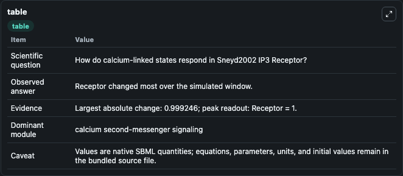
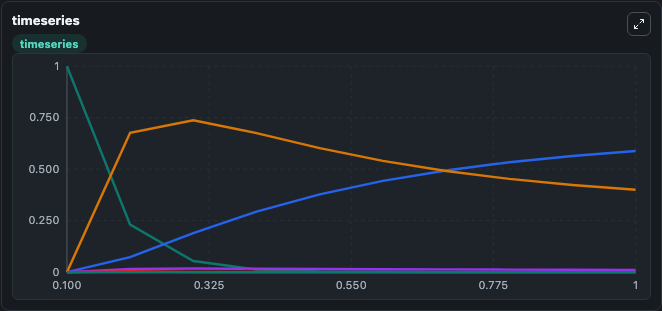
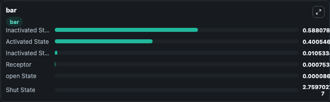

# Sneyd2002_IP3_Receptor

This Biosimulant lab wraps `Sneyd2002_IP3_Receptor` as a runnable signaling model with a companion visualization module.
Clean Biosimulant lab for systems signaling model: Sneyd2002_IP3_Receptor. It can be used to explore second-messenger and pathway-signaling dynamics and compare scenario outcomes across configurations.

## What You'll See

The lab asks: How do calcium-linked states respond in Sneyd2002 IP3 Receptor? It runs for 1.0 time units with a communication step of 0.1. The run uses the model defaults declared by the curated SBML wrapper. The generated visualizations focus on Receptor, open State, Inactivated State 1, Shut State, Activated State, and Inactivated State 2, combining trajectory, endpoint-comparison, and summary-table views from one completed dark-mode run.

In this captured run, **Receptor** moved from 1.000 to 0.000754 across 1.0 simulation windows.

<!-- BIOSIMULANT_VISUALS_START -->
### Output Visualizations



*Summary table for Sneyd2002_IP3_Receptor, reporting the scientific question, observed answer, dominant module, and caveat.*



*Trajectories of Receptor, Inactivated State 2, Activated State, Inactivated State 1, open State, and Shut State across the 1.0 simulation. In this run **Inactivated State 2** climbed from 0 to 0.5881 and **Receptor** fell from 1.000 to 0.000754 — the largest movements among the focused observables.*



*Largest-excursion ranking of the focused observables — the absolute movement magnitude during the run. Top 3: **Inactivated State 2** = 0.5881, **Activated State** = 0.4005, **Inactivated State 1** = 0.0105, with 3 more observables below.*

<!-- BIOSIMULANT_VISUALS_END -->

## Model Context

- Core model: `models/core`
- Visualization model: `models/visualisation`
- Standard: `other`
- Upstream source: `biomodels_ebi:BIOMD0000000057`
- License: `CC0`
- Visual scope: calcium second-messenger signaling
- Caveat: Values are native SBML quantities; equations, parameters, units, and initial values remain in the bundled source file.

## Inputs

| Input | Maps To | Default | Notes |
|---|---|---|---|
| Initial Receptor | `signaling_sbml_sneyd2002_ip3_receptor_biomd0000000057_model.initial_receptor` |  | Initial level of Receptor. Maps to SBML symbol `R`; exposed as a traceable initial-condition perturbation. |

## Outputs

| Output | Maps To | Role |
|---|---|---|
| `receptor` | `signaling_sbml_sneyd2002_ip3_receptor_biomd0000000057_model.receptor` | Receptor. |
| `open_state` | `signaling_sbml_sneyd2002_ip3_receptor_biomd0000000057_model.open_state` | open State. |
| `inactivated_state_1` | `signaling_sbml_sneyd2002_ip3_receptor_biomd0000000057_model.inactivated_state_1` | Inactivated State 1. |
| `state` | `signaling_sbml_sneyd2002_ip3_receptor_biomd0000000057_model.state` | Available to the visualization model and downstream workflows. |
| `summary` | `signaling_sbml_sneyd2002_ip3_receptor_biomd0000000057_model.summary` | Available to the visualization model and downstream workflows. |
| `species_labels` | `signaling_sbml_sneyd2002_ip3_receptor_biomd0000000057_model.species_labels` | Available to the visualization model and downstream workflows. |

## Runtime

- Duration: `1.0`
- Communication step: `0.1`

## Running Locally

```bash
biosimulant labs serve .
```
