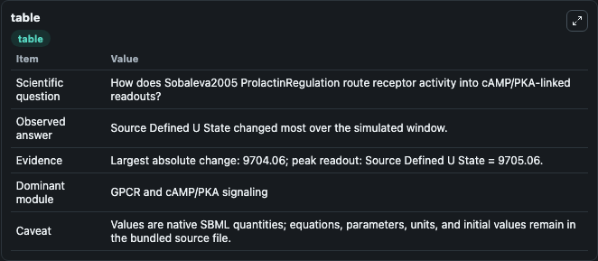
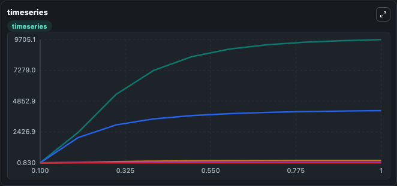
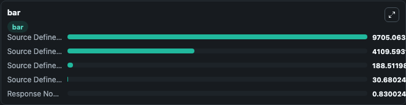

# Sobaleva2005_ProlactinRegulation

This Biosimulant lab wraps `Sobaleva2005_ProlactinRegulation` as a runnable signaling model with a companion visualization module.
Clean Biosimulant lab for systems signaling model: Sobaleva2005_ProlactinRegulation. It can be used to explore second-messenger and pathway-signaling dynamics and compare scenario outcomes across configurations.

## What You'll See

The lab asks: How does Sobaleva2005 ProlactinRegulation route receptor activity into cAMP/PKA-linked readouts? It runs for 1.0 time units with a communication step of 0.1. The run uses the model defaults declared by the curated SBML wrapper. The generated visualizations focus on Source Defined R State, Source Defined U State, Source Defined B1 State, Source Defined B2 State, and Response Node X, combining trajectory, endpoint-comparison, and summary-table views from one completed dark-mode run.

In this captured run, **Source Defined U State** moved from 1.000 to 9705.1 across 1.0 simulation windows.

<!-- BIOSIMULANT_VISUALS_START -->
### Output Visualizations



*Summary table for Sobaleva2005_ProlactinRegulation, reporting the scientific question, observed answer, dominant module, and caveat.*



*Trajectories of Source Defined U State, Source Defined R State, Source Defined B2 State, Source Defined B1 State, and Response Node X across the 1.0 simulation. In this run **Source Defined U State** climbed from 1.000 to 9705.1 and **Response Node X** fell from 1.000 to 0.8300 — the largest movements among the focused observables.*



*Largest-excursion ranking of the focused observables — the absolute movement magnitude during the run. Top 3: **Source Defined U State** = 9705.1, **Source Defined R State** = 4109.6, **Source Defined B2 State** = 188.5, with 2 more observables below.*

<!-- BIOSIMULANT_VISUALS_END -->

## Model Context

- Core model: `models/core`
- Visualization model: `models/visualisation`
- Standard: `other`
- Upstream source: `biomodels_ebi:MODEL7896869925`
- License: `CC0`
- Visual scope: GPCR and cAMP/PKA signaling
- Caveat: Values are native SBML quantities; equations, parameters, units, and initial values remain in the bundled source file.

## Inputs

| Input | Maps To | Default | Notes |
|---|---|---|---|
| Initial source-defined R state | `signaling_sbml_sobaleva2005_prolactinregulation_model7896869925_model.initial_source_defined_r_state` |  | Initial level of source-defined R state. Maps to SBML symbol `R`; exposed as a traceable initial-condition perturbation. |

## Outputs

| Output | Maps To | Role |
|---|---|---|
| `source_defined_r_state` | `signaling_sbml_sobaleva2005_prolactinregulation_model7896869925_model.source_defined_r_state` | source-defined R state. |
| `source_defined_u_state` | `signaling_sbml_sobaleva2005_prolactinregulation_model7896869925_model.source_defined_u_state` | source-defined U state. |
| `source_defined_b1_state` | `signaling_sbml_sobaleva2005_prolactinregulation_model7896869925_model.source_defined_b1_state` | source-defined B1 state. |
| `state` | `signaling_sbml_sobaleva2005_prolactinregulation_model7896869925_model.state` | Available to the visualization model and downstream workflows. |
| `summary` | `signaling_sbml_sobaleva2005_prolactinregulation_model7896869925_model.summary` | Available to the visualization model and downstream workflows. |
| `species_labels` | `signaling_sbml_sobaleva2005_prolactinregulation_model7896869925_model.species_labels` | Available to the visualization model and downstream workflows. |

## Runtime

- Duration: `1.0`
- Communication step: `0.1`

## Running Locally

```bash
biosimulant labs serve .
```
