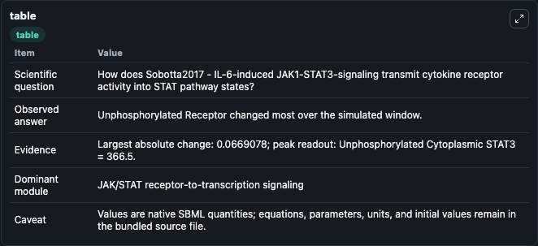
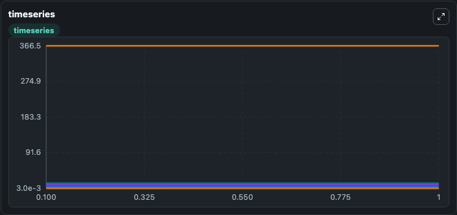
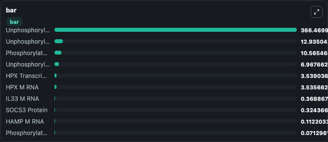

# Sobotta2017 - IL-6-induced JAK1-STAT3-signaling

This Biosimulant lab wraps `Sobotta2017 - IL-6-induced JAK1-STAT3-signaling` as a runnable signaling model with a companion visualization module.
Clean Biosimulant lab for JAK/STAT cytokine signaling. It can be used to explore second-messenger and pathway-signaling dynamics and compare scenario outcomes across configurations.

## What You'll See

The lab asks: How does Sobotta2017 - IL-6-induced JAK1-STAT3-signaling transmit cytokine receptor activity into STAT pathway states? It runs for 1.0 time units with a communication step of 0.1. The run uses the model defaults declared by the curated SBML wrapper. The generated visualizations focus on Unphosphorylated Receptor, Phosphorylated JAK1 Receptor, active Receptor, Unphosphorylated Cytoplasmic STAT3, Phosphorylated STAT3, and Unphosphorylated nuclear STAT3, and related outputs, combining trajectory, endpoint-comparison, and summary-table views from one completed dark-mode run.

In this captured run, **Unphosphorylated Receptor** moved from 7.035 to 6.968 across 1.0 simulation windows.

<!-- BIOSIMULANT_VISUALS_START -->
### Output Visualizations



*Summary table for Sobotta2017 - IL-6-induced JAK1-STAT3-signaling, reporting the scientific question, observed answer, dominant module, and caveat.*



*Trajectories of Unphosphorylated Receptor, Phosphorylated JAK1 Receptor, Unphosphorylated Cytoplasmic STAT3, Phosphorylated STAT3, active Receptor, and Unphosphorylated nuclear STAT3 across the 1.0 simulation. In this run **Phosphorylated JAK1 Receptor** climbed from 0.00618 to 0.0713 and **Unphosphorylated Receptor** fell from 7.035 to 6.968 — the largest movements among the focused observables.*



*Largest-excursion ranking of the focused observables — the absolute movement magnitude during the run. Top 3: **Unphosphorylated Cytoplasmic STAT3** = 366.5, **Unphosphorylated nuclear STAT3** = 12.935, **Phosphorylated STAT3** = 10.565, with 7 more observables below.*

<!-- BIOSIMULANT_VISUALS_END -->

## Model Context

- Core model: `models/core`
- Visualization model: `models/visualisation`
- Standard: `other`
- Upstream source: `biomodels_ebi:MODEL2307050001`
- License: `CC0`
- Visual scope: JAK/STAT receptor-to-transcription signaling
- Caveat: Values are native SBML quantities; equations, parameters, units, and initial values remain in the bundled source file.

## Inputs

| Input | Maps To | Default | Notes |
|---|---|---|---|
| Input Rux1 | `signaling_sbml_sobotta2017_il_6_induced_jak1_stat3_signaling_model2307050001_model.initial_input_rux1_level` |  | Input Rux1 source parameter. Maps to SBML symbol `input_rux1` and preserves the bundled default. |
| Input Rux2 | `signaling_sbml_sobotta2017_il_6_induced_jak1_stat3_signaling_model2307050001_model.initial_input_rux2_level` |  | Input Rux2 source parameter. Maps to SBML symbol `input_rux2` and preserves the bundled default. |
| Input Rux3 | `signaling_sbml_sobotta2017_il_6_induced_jak1_stat3_signaling_model2307050001_model.initial_input_rux3_level` |  | Input Rux3 source parameter. Maps to SBML symbol `input_rux3` and preserves the bundled default. |

## Outputs

| Output | Maps To | Role |
|---|---|---|
| `unphosphorylated_receptor` | `signaling_sbml_sobotta2017_il_6_induced_jak1_stat3_signaling_model2307050001_model.unphosphorylated_receptor` | Unphosphorylated Receptor. |
| `phosphorylated_jak1_receptor` | `signaling_sbml_sobotta2017_il_6_induced_jak1_stat3_signaling_model2307050001_model.phosphorylated_jak1_receptor` | Phosphorylated JAK1 Receptor. |
| `active_receptor` | `signaling_sbml_sobotta2017_il_6_induced_jak1_stat3_signaling_model2307050001_model.active_receptor` | active Receptor. |
| `state` | `signaling_sbml_sobotta2017_il_6_induced_jak1_stat3_signaling_model2307050001_model.state` | Available to the visualization model and downstream workflows. |
| `summary` | `signaling_sbml_sobotta2017_il_6_induced_jak1_stat3_signaling_model2307050001_model.summary` | Available to the visualization model and downstream workflows. |
| `species_labels` | `signaling_sbml_sobotta2017_il_6_induced_jak1_stat3_signaling_model2307050001_model.species_labels` | Available to the visualization model and downstream workflows. |

## Runtime

- Duration: `1.0`
- Communication step: `0.1`

## Running Locally

```bash
biosimulant labs serve .
```
