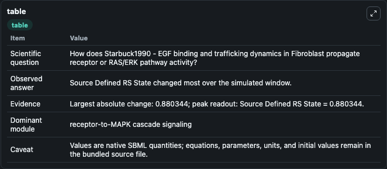
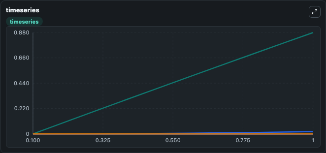
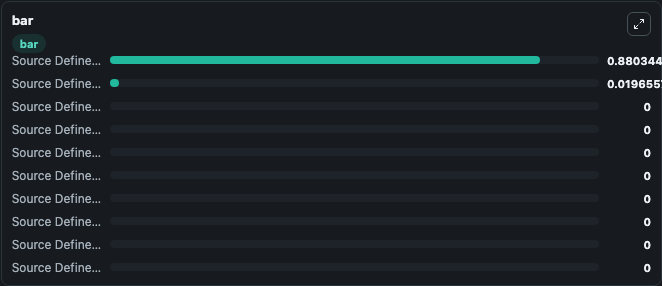

# Starbuck1990 - EGF binding and trafficking dynamics in Fibroblast

This Biosimulant lab wraps `Starbuck1990 - EGF binding and trafficking dynamics in Fibroblast` as a runnable signaling model with a companion visualization module.
Clean Biosimulant lab for MAPK/ERK receptor signaling. It can be used to explore second-messenger and pathway-signaling dynamics and compare scenario outcomes across configurations.

## What You'll See

The lab asks: How does Starbuck1990 - EGF binding and trafficking dynamics in Fibroblast propagate receptor or RAS/ERK pathway activity? It runs for 1.0 time units with a communication step of 0.1. The run uses the model defaults declared by the curated SBML wrapper. The generated visualizations focus on Source Defined LO State, Source Defined RS State, Source Defined RII State, Source Defined RIC State, Source Defined TS State, and Source Defined TI State, and related outputs, combining trajectory, endpoint-comparison, and summary-table views from one completed dark-mode run.

In this captured run, **Source Defined RS State** moved from 0 to 0.8803 across 1.0 simulation windows.

<!-- BIOSIMULANT_VISUALS_START -->
### Output Visualizations



*Summary table for Starbuck1990 - EGF binding and trafficking dynamics in Fibroblast, reporting the scientific question, observed answer, dominant module, and caveat.*



*Trajectories of Source Defined RS State, Source Defined RIC State, Source Defined LO State, Source Defined RII State, Source Defined TS State, and Source Defined TI State across the 1.0 simulation. In this run **Source Defined RS State** climbed from 0 to 0.8803 — the largest movements among the focused observables.*



*Largest-excursion ranking of the focused observables — the absolute movement magnitude during the run. Top 3: **Source Defined RS State** = 0.8803, **Source Defined RIC State** = 0.0197, **Source Defined LO State** = 0, with 7 more observables below.*

<!-- BIOSIMULANT_VISUALS_END -->

## Model Context

- Core model: `models/core`
- Visualization model: `models/visualisation`
- Standard: `other`
- Upstream source: `biomodels_ebi:MODEL2003190005`
- License: `CC0`
- Visual scope: receptor-to-MAPK cascade signaling
- Caveat: Values are native SBML quantities; equations, parameters, units, and initial values remain in the bundled source file.

## Inputs

| Input | Maps To | Default | Notes |
|---|---|---|---|
| Initial source-defined LO state | `signaling_sbml_starbuck1990_egf_binding_and_trafficking_dynamic_model2003190005_model.initial_source_defined_lo_state` |  | Initial level of source-defined LO state. Maps to SBML symbol `Lo`; exposed as a traceable initial-condition perturbation. |

## Outputs

| Output | Maps To | Role |
|---|---|---|
| `source_defined_rii_state` | `signaling_sbml_starbuck1990_egf_binding_and_trafficking_dynamic_model2003190005_model.source_defined_rii_state` | source-defined RII state. |
| `source_defined_ric_state` | `signaling_sbml_starbuck1990_egf_binding_and_trafficking_dynamic_model2003190005_model.source_defined_ric_state` | source-defined RIC state. |
| `source_defined_lii_state` | `signaling_sbml_starbuck1990_egf_binding_and_trafficking_dynamic_model2003190005_model.source_defined_lii_state` | source-defined LII state. |
| `state` | `signaling_sbml_starbuck1990_egf_binding_and_trafficking_dynamic_model2003190005_model.state` | Available to the visualization model and downstream workflows. |
| `summary` | `signaling_sbml_starbuck1990_egf_binding_and_trafficking_dynamic_model2003190005_model.summary` | Available to the visualization model and downstream workflows. |
| `species_labels` | `signaling_sbml_starbuck1990_egf_binding_and_trafficking_dynamic_model2003190005_model.species_labels` | Available to the visualization model and downstream workflows. |

## Runtime

- Duration: `1.0`
- Communication step: `0.1`

## Running Locally

```bash
biosimulant labs serve .
```
