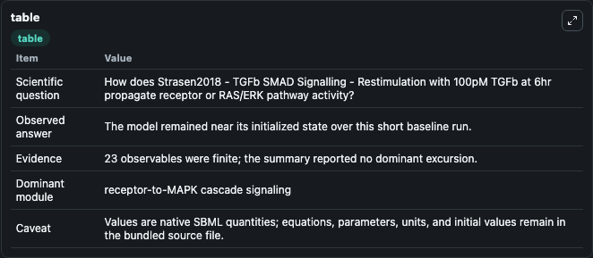
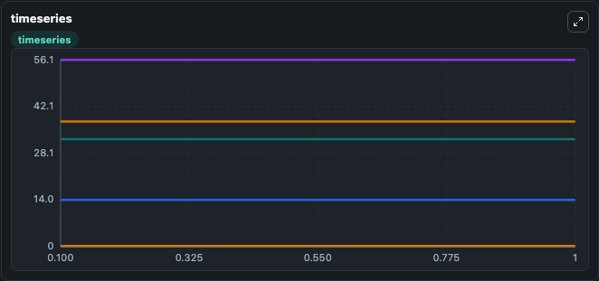
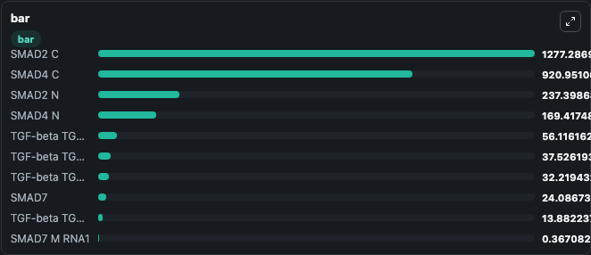

# Strasen2018 - TGFb SMAD Signalling - Restimulation with 100pM TGFb at 6hr

This Biosimulant lab wraps `Strasen2018 - TGFb SMAD Signalling - Restimulation with 100pM TGFb at 6hr` as a runnable signaling model with a companion visualization module.
Clean Biosimulant lab for developmental and growth-control signaling. It can be used to explore second-messenger and pathway-signaling dynamics and compare scenario outcomes across configurations.

## What You'll See

The lab asks: How does Strasen2018 - TGFb SMAD Signalling - Restimulation with 100pM TGFb at 6hr propagate receptor or RAS/ERK pathway activity? It runs for 1.0 time units with a communication step of 0.1. The run uses the model defaults declared by the curated SBML wrapper. The generated visualizations focus on TGF-beta TGFR1 Surface, TGF-beta TGFR2 Surface, TGF-beta TGFR1 Endo, TGF-beta TGFR2 Endo, TGF-beta, and TGF-beta In, and related outputs, combining trajectory, endpoint-comparison, and summary-table views from one completed dark-mode run.

In this captured run, **TGF-beta TGFR1 Surface** moved from 32.219 to 32.219 across 1.0 simulation windows.

<!-- BIOSIMULANT_VISUALS_START -->
### Output Visualizations



*Summary table for Strasen2018 - TGFb SMAD Signalling - Restimulation with 100pM TGFb at 6hr, reporting the scientific question, observed answer, dominant module, and caveat.*



*Trajectories of TGF-beta TGFR1 Surface, TGF-beta TGFR2 Surface, TGF-beta TGFR1 Endo, TGF-beta TGFR2 Endo, TGF-beta, and TGF-beta In across the 1.0 simulation. In this run TGF-beta TGFR1 Surface, TGF-beta TGFR2 Surface, TGF-beta TGFR1 Endo, TGF-beta TGFR2 Endo stayed near their initial values — no observable moved appreciably.*



*Largest-excursion ranking of the focused observables — the absolute movement magnitude during the run. Top 3: **SMAD2 C** = 1277.3, **SMAD4 C** = 921.0, **SMAD2 N** = 237.4, with 7 more observables below.*

<!-- BIOSIMULANT_VISUALS_END -->

## Model Context

- Core model: `models/core`
- Visualization model: `models/visualisation`
- Standard: `other`
- Upstream source: `biomodels_ebi:BIOMD0000000996`
- License: `CC0`
- Visual scope: receptor-to-MAPK cascade signaling
- Caveat: Values are native SBML quantities; equations, parameters, units, and initial values remain in the bundled source file.

## Inputs

| Input | Maps To | Default | Notes |
|---|---|---|---|
| Index Induced Ligand Deg | `signaling_sbml_strasen2018_tgfb_smad_signalling_restimulation_w_biomd0000000996_model.initial_index_induced_ligand_deg_level` |  | Index Induced Ligand Deg source parameter. Maps to SBML symbol `index_induced_ligand_deg` and preserves the bundled default. |
| Kin Deg Ligand | `signaling_sbml_strasen2018_tgfb_smad_signalling_restimulation_w_biomd0000000996_model.initial_kin_deg_ligand_level` |  | Kin Deg Ligand source parameter. Maps to SBML symbol `kin_deg_Ligand` and preserves the bundled default. |
| WASH LIGAND | `signaling_sbml_strasen2018_tgfb_smad_signalling_restimulation_w_biomd0000000996_model.initial_wash_ligand_level` |  | WASH LIGAND source parameter. Maps to SBML symbol `WASH_LIGAND` and preserves the bundled default. |

## Outputs

| Output | Maps To | Role |
|---|---|---|
| `active_tgfr2` | `signaling_sbml_strasen2018_tgfb_smad_signalling_restimulation_w_biomd0000000996_model.active_tgfr2` | active TGFR2. |
| `active_tgf_beta_tgfr1_tgfr2` | `signaling_sbml_strasen2018_tgfb_smad_signalling_restimulation_w_biomd0000000996_model.active_tgf_beta_tgfr1_tgfr2` | active TGF-beta TGFR1 TGFR2. |
| `active_tgf_beta_tgfr1_tgfr2_endo` | `signaling_sbml_strasen2018_tgfb_smad_signalling_restimulation_w_biomd0000000996_model.active_tgf_beta_tgfr1_tgfr2_endo` | active TGF-beta TGFR1 TGFR2 Endo. |
| `state` | `signaling_sbml_strasen2018_tgfb_smad_signalling_restimulation_w_biomd0000000996_model.state` | Available to the visualization model and downstream workflows. |
| `summary` | `signaling_sbml_strasen2018_tgfb_smad_signalling_restimulation_w_biomd0000000996_model.summary` | Available to the visualization model and downstream workflows. |
| `species_labels` | `signaling_sbml_strasen2018_tgfb_smad_signalling_restimulation_w_biomd0000000996_model.species_labels` | Available to the visualization model and downstream workflows. |

## Runtime

- Duration: `1.0`
- Communication step: `0.1`

## Running Locally

```bash
biosimulant labs serve .
```
