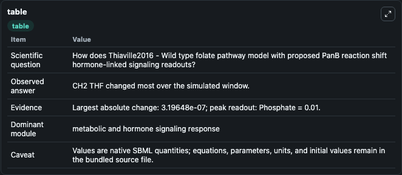
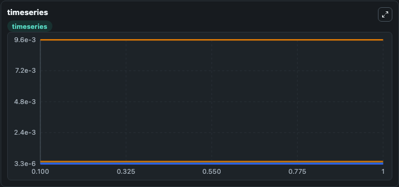
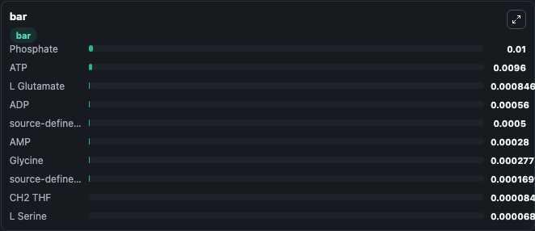

# Thiaville2016 - Wild type folate pathway model with proposed PanB reaction

This Biosimulant lab wraps `Thiaville2016 - Wild type folate pathway model with proposed PanB reaction` as a runnable signaling model with a companion visualization module.
Clean Biosimulant lab for systems signaling model: Thiaville2016 - Wild type folate pathway model with proposed PanB reaction. It can be used to explore second-messenger and pathway-signaling dynamics and compare scenario outcomes across configurations.

## What You'll See

The lab asks: How does Thiaville2016 - Wild type folate pathway model with proposed PanB reaction shift hormone-linked signaling readouts? It runs for 1.0 time units with a communication step of 0.1. The run uses the model defaults declared by the curated SBML wrapper. The generated visualizations focus on H2 Hmpt, ATP, H2 Hmpterin PP, AMP, source-defined P-ABA state, and source-defined PPI state, and related outputs, combining trajectory, endpoint-comparison, and summary-table views from one completed dark-mode run.

In this captured run, **CH2 THF** moved from 8.47e-05 to 8.44e-05 across 1.0 simulation windows.

<!-- BIOSIMULANT_VISUALS_START -->
### Output Visualizations



*Summary table for Thiaville2016 - Wild type folate pathway model with proposed PanB reaction, reporting the scientific question, observed answer, dominant module, and caveat.*



*Trajectories of CH2 THF, source-defined DHF state, source-defined THF state, source-defined P-ABA state, H2 Hmpterin PP, and H2 Pteroate across the 1.0 simulation. In this run **source-defined DHF state** climbed from 1e-05 to 1.02e-05 and **CH2 THF** fell from 8.47e-05 to 8.44e-05 — the largest movements among the focused observables.*



*Largest-excursion ranking of the focused observables — the absolute movement magnitude during the run. Top 3: **Phosphate** = 0.0100, **ATP** = 0.0096, **L Glutamate** = 0.000846, with 7 more observables below.*

<!-- BIOSIMULANT_VISUALS_END -->

## Model Context

- Core model: `models/core`
- Visualization model: `models/visualisation`
- Standard: `other`
- Upstream source: `biomodels_ebi:BIOMD0000000639`
- License: `CC0`
- Visual scope: metabolic and hormone signaling response
- Caveat: Values are native SBML quantities; equations, parameters, units, and initial values remain in the bundled source file.

## Inputs

| Input | Maps To | Default | Notes |
|---|---|---|---|
| Initial ADP | `signaling_sbml_thiaville2016_wild_type_folate_pathway_model_wit_biomd0000000639_model.initial_adp` |  | Initial level of ADP. Maps to SBML symbol `ADP`; exposed as a traceable initial-condition perturbation. |
| Initial AMP | `signaling_sbml_thiaville2016_wild_type_folate_pathway_model_wit_biomd0000000639_model.initial_amp` |  | Initial level of AMP. Maps to SBML symbol `AMP`; exposed as a traceable initial-condition perturbation. |
| Initial ATP | `signaling_sbml_thiaville2016_wild_type_folate_pathway_model_wit_biomd0000000639_model.initial_atp` |  | Initial level of ATP. Maps to SBML symbol `ATP`; exposed as a traceable initial-condition perturbation. |

## Outputs

| Output | Maps To | Role |
|---|---|---|
| `phosphate` | `signaling_sbml_thiaville2016_wild_type_folate_pathway_model_wit_biomd0000000639_model.phosphate` | Phosphate. |
| `h2_hmpt` | `signaling_sbml_thiaville2016_wild_type_folate_pathway_model_wit_biomd0000000639_model.h2_hmpt` | H2 Hmpt. |
| `atp` | `signaling_sbml_thiaville2016_wild_type_folate_pathway_model_wit_biomd0000000639_model.atp` | ATP. |
| `state` | `signaling_sbml_thiaville2016_wild_type_folate_pathway_model_wit_biomd0000000639_model.state` | Available to the visualization model and downstream workflows. |
| `summary` | `signaling_sbml_thiaville2016_wild_type_folate_pathway_model_wit_biomd0000000639_model.summary` | Available to the visualization model and downstream workflows. |
| `species_labels` | `signaling_sbml_thiaville2016_wild_type_folate_pathway_model_wit_biomd0000000639_model.species_labels` | Available to the visualization model and downstream workflows. |

## Runtime

- Duration: `1.0`
- Communication step: `0.1`

## Running Locally

```bash
biosimulant labs serve .
```
