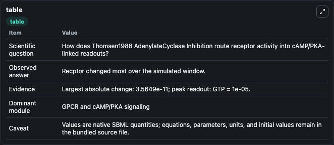
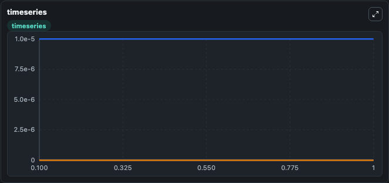
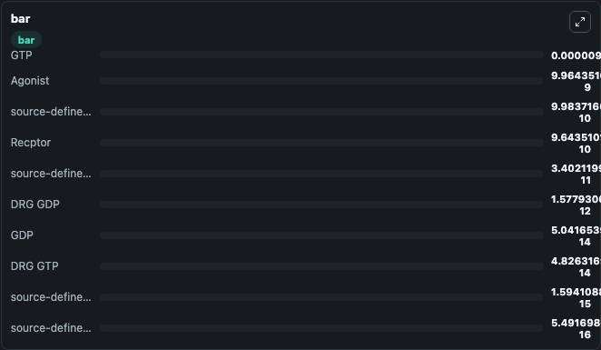

# Thomsen1988_AdenylateCyclase_Inhibition

This Biosimulant lab wraps `Thomsen1988_AdenylateCyclase_Inhibition` as a runnable signaling model with a companion visualization module.
Clean Biosimulant lab for systems signaling model: Thomsen1988_AdenylateCyclase_Inhibition. It can be used to explore second-messenger and pathway-signaling dynamics and compare scenario outcomes across configurations.

## What You'll See

The lab asks: How does Thomsen1988 AdenylateCyclase Inhibition route receptor activity into cAMP/PKA-linked readouts? It runs for 1.0 time units with a communication step of 0.1. The run uses the model defaults declared by the curated SBML wrapper. The generated visualizations focus on Agonist, source-defined DR state, DRG GDP, source-defined DRG state, GDP, and DRG GTP, and related outputs, combining trajectory, endpoint-comparison, and summary-table views from one completed dark-mode run.

In this captured run, **Recptor** moved from 1e-09 to 9.64e-10 across 1.0 simulation windows.

<!-- BIOSIMULANT_VISUALS_START -->
### Output Visualizations



*Summary table for Thomsen1988_AdenylateCyclase_Inhibition, reporting the scientific question, observed answer, dominant module, and caveat.*



*Trajectories of Recptor, Agonist, source-defined DR state, source-defined G_GDP state, DRG GDP, and GDP across the 1.0 simulation. In this run **source-defined DR state** climbed from 0 to 3.4e-11 and **Recptor** fell from 1e-09 to 9.64e-10 — the largest movements among the focused observables.*



*Largest-excursion ranking of the focused observables — the absolute movement magnitude during the run. Top 3: **GTP** = 1e-05, **Agonist** = 9.96e-09, **source-defined G_GDP state** = 9.98e-10, with 7 more observables below.*

<!-- BIOSIMULANT_VISUALS_END -->

## Model Context

- Core model: `models/core`
- Visualization model: `models/visualisation`
- Standard: `other`
- Upstream source: `biomodels_ebi:BIOMD0000000082`
- License: `CC0`
- Visual scope: GPCR and cAMP/PKA signaling
- Caveat: Values are native SBML quantities; equations, parameters, units, and initial values remain in the bundled source file.

## Inputs

| Input | Maps To | Default | Notes |
|---|---|---|---|
| Initial Agonist | `signaling_sbml_thomsen1988_adenylatecyclase_inhibition_biomd0000000082_model.initial_agonist` |  | Initial level of Agonist. Maps to SBML symbol `agonist`; exposed as a traceable initial-condition perturbation. |

## Outputs

| Output | Maps To | Role |
|---|---|---|
| `drg_gdp` | `signaling_sbml_thomsen1988_adenylatecyclase_inhibition_biomd0000000082_model.drg_gdp` | DRG GDP. |
| `source_defined_drg_state` | `signaling_sbml_thomsen1988_adenylatecyclase_inhibition_biomd0000000082_model.source_defined_drg_state` | source-defined DRG state. |
| `gdp` | `signaling_sbml_thomsen1988_adenylatecyclase_inhibition_biomd0000000082_model.gdp` | GDP. |
| `state` | `signaling_sbml_thomsen1988_adenylatecyclase_inhibition_biomd0000000082_model.state` | Available to the visualization model and downstream workflows. |
| `summary` | `signaling_sbml_thomsen1988_adenylatecyclase_inhibition_biomd0000000082_model.summary` | Available to the visualization model and downstream workflows. |
| `species_labels` | `signaling_sbml_thomsen1988_adenylatecyclase_inhibition_biomd0000000082_model.species_labels` | Available to the visualization model and downstream workflows. |

## Runtime

- Duration: `1.0`
- Communication step: `0.1`

## Running Locally

```bash
biosimulant labs serve .
```
