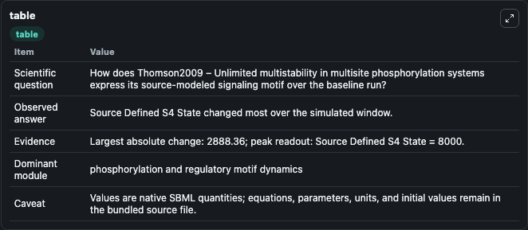
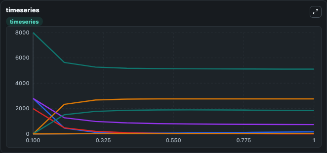
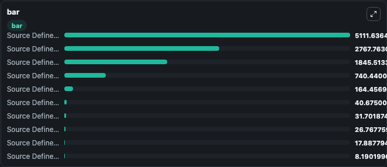

# Thomson2009 – Unlimited multistability in multisite phosphorylation systems

This Biosimulant lab wraps `Thomson2009 – Unlimited multistability in multisite phosphorylation systems` as a runnable signaling model with a companion visualization module.
Clean Biosimulant lab for systems signaling model: Thomson2009 – Unlimited multistability in multisite phosphorylation systems. It can be used to explore second-messenger and pathway-signaling dynamics and compare scenario outcomes across configurations.

## What You'll See

The lab asks: How does Thomson2009 – Unlimited multistability in multisite phosphorylation systems express its source-modeled signaling motif over the baseline run? It runs for 1.0 time units with a communication step of 0.1. The run uses the model defaults declared by the curated SBML wrapper. The generated visualizations focus on Source Defined E State, Source Defined S0 State, Source Defined ES0 State, Source Defined S1 State, Source Defined ES1 State, and Source Defined S2 State, and related outputs, combining trajectory, endpoint-comparison, and summary-table views from one completed dark-mode run.

In this captured run, **Source Defined S4 State** moved from 8000.0 to 5111.6 across 1.0 simulation windows.

<!-- BIOSIMULANT_VISUALS_START -->
### Output Visualizations



*Summary table for Thomson2009 – Unlimited multistability in multisite phosphorylation systems, reporting the scientific question, observed answer, dominant module, and caveat.*



*Trajectories of Source Defined S4 State, Source Defined F State, Source Defined FS4 State, Source Defined E State, Source Defined S0 State, and Source Defined ES0 State across the 1.0 simulation. In this run **Source Defined FS4 State** climbed from 0 to 2767.8 and **Source Defined S4 State** fell from 8000.0 to 5111.6 — the largest movements among the focused observables.*



*Largest-excursion ranking of the focused observables — the absolute movement magnitude during the run. Top 3: **Source Defined S4 State** = 5111.6, **Source Defined FS4 State** = 2767.8, **Source Defined ES0 State** = 1845.5, with 7 more observables below.*

<!-- BIOSIMULANT_VISUALS_END -->

## Model Context

- Core model: `models/core`
- Visualization model: `models/visualisation`
- Standard: `other`
- Upstream source: `biomodels_ebi:MODEL2002110001`
- License: `CC0`
- Visual scope: phosphorylation and regulatory motif dynamics
- Caveat: Values are native SBML quantities; equations, parameters, units, and initial values remain in the bundled source file.

## Inputs

| Input | Maps To | Default | Notes |
|---|---|---|---|
| Initial source-defined E state | `signaling_sbml_thomson2009_unlimited_multistability_in_multisit_model2002110001_model.initial_source_defined_e_state` |  | Initial level of source-defined E state. Maps to SBML symbol `E`; exposed as a traceable initial-condition perturbation. |

## Outputs

| Output | Maps To | Role |
|---|---|---|
| `source_defined_es0_state` | `signaling_sbml_thomson2009_unlimited_multistability_in_multisit_model2002110001_model.source_defined_es0_state` | Source Defined ES0 State. |
| `source_defined_es1_state` | `signaling_sbml_thomson2009_unlimited_multistability_in_multisit_model2002110001_model.source_defined_es1_state` | Source Defined ES1 State. |
| `source_defined_es2_state` | `signaling_sbml_thomson2009_unlimited_multistability_in_multisit_model2002110001_model.source_defined_es2_state` | Source Defined ES2 State. |
| `state` | `signaling_sbml_thomson2009_unlimited_multistability_in_multisit_model2002110001_model.state` | Available to the visualization model and downstream workflows. |
| `summary` | `signaling_sbml_thomson2009_unlimited_multistability_in_multisit_model2002110001_model.summary` | Available to the visualization model and downstream workflows. |
| `species_labels` | `signaling_sbml_thomson2009_unlimited_multistability_in_multisit_model2002110001_model.species_labels` | Available to the visualization model and downstream workflows. |

## Runtime

- Duration: `1.0`
- Communication step: `0.1`

## Running Locally

```bash
biosimulant labs serve .
```
