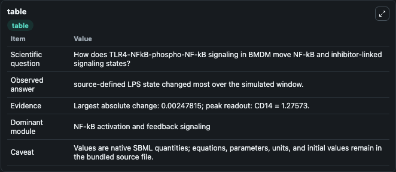
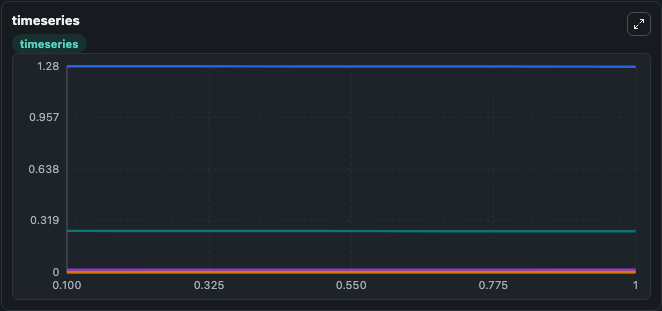
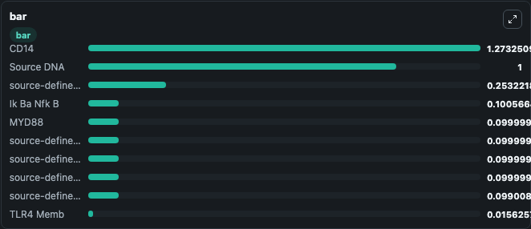

# TLR4-NFkB-phospho-NF-kB signaling in BMDM

This Biosimulant lab wraps `TLR4-NFkB-phospho-NF-kB signaling in BMDM` as a runnable signaling model with a companion visualization module.
Clean Biosimulant lab for NF-kB pathway signaling. It can be used to explore second-messenger and pathway-signaling dynamics and compare scenario outcomes across configurations.

## What You'll See

The lab asks: How does TLR4-NFkB-phospho-NF-kB signaling in BMDM move NF-kB and inhibitor-linked signaling states? It runs for 1.0 time units with a communication step of 0.1. The run uses the model defaults declared by the curated SBML wrapper. The generated visualizations focus on CD14, source-defined TRAF6 state, source-defined IKK state, source-defined IKK[P] state, Source DNA, and sink species, and related outputs, combining trajectory, endpoint-comparison, and summary-table views from one completed dark-mode run.

In this captured run, **source-defined LPS state** moved from 0.2557 to 0.2532 across 1.0 simulation windows.

<!-- BIOSIMULANT_VISUALS_START -->
### Output Visualizations



*Summary table for TLR4-NFkB-phospho-NF-kB signaling in BMDM, reporting the scientific question, observed answer, dominant module, and caveat.*



*Trajectories of source-defined LPS state, CD14, CD14LPS, TLR4 Memb, TLR4LPS Memb, and CD14LPS Endo across the 1.0 simulation. In this run **CD14LPS** climbed from 0 to 0.00232 and **source-defined LPS state** fell from 0.2557 to 0.2532 — the largest movements among the focused observables.*



*Largest-excursion ranking of the focused observables — the absolute movement magnitude during the run. Top 3: **CD14** = 1.273, **Source DNA** = 1.000, **source-defined LPS state** = 0.2532, with 7 more observables below.*

<!-- BIOSIMULANT_VISUALS_END -->

## Model Context

- Core model: `models/core`
- Visualization model: `models/visualisation`
- Standard: `other`
- Upstream source: `biomodels_ebi:MODEL1809230001`
- License: `CC0`
- Visual scope: NF-kB activation and feedback signaling
- Caveat: Values are native SBML quantities; equations, parameters, units, and initial values remain in the bundled source file.

## Inputs

| Input | Maps To | Default | Notes |
|---|---|---|---|
| Initial sink species | `signaling_sbml_tlr4_nfkb_phospho_nf_kb_signaling_in_bmdm_model1809230001_model.initial_sink_species` |  | Initial level of sink species. Maps to SBML symbol `species_23`; exposed as a traceable initial-condition perturbation. |
| Initial Source DNA | `signaling_sbml_tlr4_nfkb_phospho_nf_kb_signaling_in_bmdm_model1809230001_model.initial_source_dna` |  | Initial level of Source DNA. Maps to SBML symbol `species_22`; exposed as a traceable initial-condition perturbation. |
| Initial CD14LPS | `signaling_sbml_tlr4_nfkb_phospho_nf_kb_signaling_in_bmdm_model1809230001_model.initial_cd14lps` |  | Initial level of CD14LPS. Maps to SBML symbol `CD14LPS`; exposed as a traceable initial-condition perturbation. |

## Outputs

| Output | Maps To | Role |
|---|---|---|
| `ik_ba_nfk_b` | `signaling_sbml_tlr4_nfkb_phospho_nf_kb_signaling_in_bmdm_model1809230001_model.ik_ba_nfk_b` | Ik Ba Nfk B. |
| `nfkb` | `signaling_sbml_tlr4_nfkb_phospho_nf_kb_signaling_in_bmdm_model1809230001_model.nfkb` | NF-kB. |
| `ikk_p_ik_ba_nfk_b` | `signaling_sbml_tlr4_nfkb_phospho_nf_kb_signaling_in_bmdm_model1809230001_model.ikk_p_ik_ba_nfk_b` | IKK P Ik Ba Nfk B. |
| `state` | `signaling_sbml_tlr4_nfkb_phospho_nf_kb_signaling_in_bmdm_model1809230001_model.state` | Available to the visualization model and downstream workflows. |
| `summary` | `signaling_sbml_tlr4_nfkb_phospho_nf_kb_signaling_in_bmdm_model1809230001_model.summary` | Available to the visualization model and downstream workflows. |
| `species_labels` | `signaling_sbml_tlr4_nfkb_phospho_nf_kb_signaling_in_bmdm_model1809230001_model.species_labels` | Available to the visualization model and downstream workflows. |

## Runtime

- Duration: `1.0`
- Communication step: `0.1`

## Running Locally

```bash
biosimulant labs serve .
```
