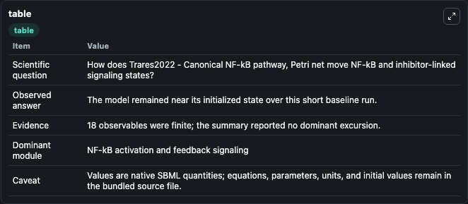
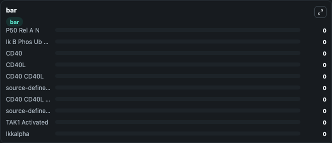

# Trares2022 - Canonical NF-kB pathway, Petri net

This Biosimulant lab wraps `Trares2022 - Canonical NF-kB pathway, Petri net` as a runnable signaling model with a companion visualization module.
Clean Biosimulant lab for NF-kB pathway signaling. It can be used to explore second-messenger and pathway-signaling dynamics and compare scenario outcomes across configurations.

## What You'll See

The lab asks: How does Trares2022 - Canonical NF-kB pathway, Petri net move NF-kB and inhibitor-linked signaling states? It runs for 1.0 time units with a communication step of 0.1. The run uses the model defaults declared by the curated SBML wrapper. The generated visualizations focus on P50 Rel A N, Ik B Phos Ub P50 Rel A, CD40, CD40L, CD40 CD40L, and source-defined TRAF6 state, and related outputs, combining trajectory, endpoint-comparison, and summary-table views from one completed dark-mode run.

In this captured run, **P50 Rel A N** moved from 0 to 0 across 1.0 simulation windows.

<!-- BIOSIMULANT_VISUALS_START -->
### Output Visualizations



*Summary table for Trares2022 - Canonical NF-kB pathway, Petri net, reporting the scientific question, observed answer, dominant module, and caveat.*


*Trajectories of P50 Rel A N, Ik B Phos Ub P50 Rel A, CD40, CD40L, CD40 CD40L, and source-defined TRAF6 state across the 1.0 simulation. In this run P50 Rel A N, Ik B Phos Ub P50 Rel A, CD40, CD40L stayed near their initial values — no observable moved appreciably.*



*Largest-excursion ranking of the focused observables — the absolute movement magnitude during the run. Top 3: **P50 Rel A N** = 0, **Ik B Phos Ub P50 Rel A** = 0, **CD40** = 0, with 7 more observables below.*

<!-- BIOSIMULANT_VISUALS_END -->

## Model Context

- Core model: `models/core`
- Visualization model: `models/visualisation`
- Standard: `other`
- Upstream source: `biomodels_ebi:MODEL2207210001`
- License: `CC0`
- Visual scope: NF-kB activation and feedback signaling
- Caveat: Values are native SBML quantities; equations, parameters, units, and initial values remain in the bundled source file.

## Inputs

| Input | Maps To | Default | Notes |
|---|---|---|---|
| Initial P50 Rel A N | `signaling_sbml_trares2022_canonical_nf_kb_pathway_petri_net_model2207210001_model.initial_p50_rel_a_n` |  | Initial level of P50 Rel A N. Maps to SBML symbol `P0`; exposed as a traceable initial-condition perturbation. |

## Outputs

| Output | Maps To | Role |
|---|---|---|
| `ikk_complex` | `signaling_sbml_trares2022_canonical_nf_kb_pathway_petri_net_model2207210001_model.ikk_complex` | IKK Complex. |
| `ikk_complex_activated` | `signaling_sbml_trares2022_canonical_nf_kb_pathway_petri_net_model2207210001_model.ikk_complex_activated` | IKK Complex Activated. |
| `p50_rel_a_n` | `signaling_sbml_trares2022_canonical_nf_kb_pathway_petri_net_model2207210001_model.p50_rel_a_n` | P50 Rel A N. |
| `state` | `signaling_sbml_trares2022_canonical_nf_kb_pathway_petri_net_model2207210001_model.state` | Available to the visualization model and downstream workflows. |
| `summary` | `signaling_sbml_trares2022_canonical_nf_kb_pathway_petri_net_model2207210001_model.summary` | Available to the visualization model and downstream workflows. |
| `species_labels` | `signaling_sbml_trares2022_canonical_nf_kb_pathway_petri_net_model2207210001_model.species_labels` | Available to the visualization model and downstream workflows. |

## Runtime

- Duration: `1.0`
- Communication step: `0.1`

## Running Locally

```bash
biosimulant labs serve .
```
