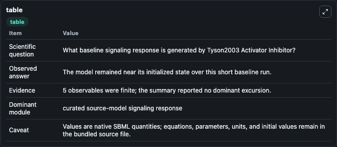
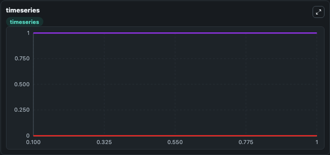
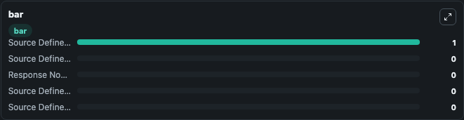

# Tyson2003_Activator_Inhibitor

This Biosimulant lab wraps `Tyson2003_Activator_Inhibitor` as a runnable signaling model with a companion visualization module.
Clean Biosimulant lab for systems signaling model: Tyson2003_Activator_Inhibitor. It can be used to explore second-messenger and pathway-signaling dynamics and compare scenario outcomes across configurations.

## What You'll See

The lab asks: What baseline signaling response is generated by Tyson2003 Activator Inhibitor? It runs for 1.0 time units with a communication step of 0.1. The run uses the model defaults declared by the curated SBML wrapper. The generated visualizations focus on Source Defined R State, Response Node X, Source Defined S State, Source Defined E State, and Source Defined EP State, combining trajectory, endpoint-comparison, and summary-table views from one completed dark-mode run.

In this captured run, **Source Defined R State** moved from 0 to 0 across 1.0 simulation windows.

<!-- BIOSIMULANT_VISUALS_START -->
### Output Visualizations



*Summary table for Tyson2003_Activator_Inhibitor, reporting the scientific question, observed answer, dominant module, and caveat.*



*Trajectories of Source Defined R State, Response Node X, Source Defined S State, Source Defined E State, and Source Defined EP State across the 1.0 simulation. In this run Source Defined R State, Response Node X, Source Defined S State, Source Defined E State stayed near their initial values — no observable moved appreciably.*



*Largest-excursion ranking of the focused observables — the absolute movement magnitude during the run. Top 3: **Source Defined E State** = 1.000, **Source Defined R State** = 0, **Response Node X** = 0, with 2 more observables below.*

<!-- BIOSIMULANT_VISUALS_END -->

## Model Context

- Core model: `models/core`
- Visualization model: `models/visualisation`
- Standard: `other`
- Upstream source: `biomodels_ebi:BIOMD0000000306`
- License: `CC0`
- Visual scope: curated source-model signaling response
- Caveat: Values are native SBML quantities; equations, parameters, units, and initial values remain in the bundled source file.

## Inputs

| Input | Maps To | Default | Notes |
|---|---|---|---|
| Initial source-defined E state | `signaling_sbml_tyson2003_activator_inhibitor_biomd0000000306_model.initial_source_defined_e_state` |  | Initial level of source-defined E state. Maps to SBML symbol `E`; exposed as a traceable initial-condition perturbation. |
| Initial source-defined EP state | `signaling_sbml_tyson2003_activator_inhibitor_biomd0000000306_model.initial_source_defined_ep_state` |  | Initial level of source-defined EP state. Maps to SBML symbol `Ep`; exposed as a traceable initial-condition perturbation. |
| Initial source-defined S state | `signaling_sbml_tyson2003_activator_inhibitor_biomd0000000306_model.initial_source_defined_s_state` |  | Initial level of source-defined S state. Maps to SBML symbol `S`; exposed as a traceable initial-condition perturbation. |

## Outputs

| Output | Maps To | Role |
|---|---|---|
| `source_defined_r_state` | `signaling_sbml_tyson2003_activator_inhibitor_biomd0000000306_model.source_defined_r_state` | Source Defined R State. |
| `response_node_x` | `signaling_sbml_tyson2003_activator_inhibitor_biomd0000000306_model.response_node_x` | Response Node X. |
| `source_defined_s_state` | `signaling_sbml_tyson2003_activator_inhibitor_biomd0000000306_model.source_defined_s_state` | Source Defined S State. |
| `state` | `signaling_sbml_tyson2003_activator_inhibitor_biomd0000000306_model.state` | Available to the visualization model and downstream workflows. |
| `summary` | `signaling_sbml_tyson2003_activator_inhibitor_biomd0000000306_model.summary` | Available to the visualization model and downstream workflows. |
| `species_labels` | `signaling_sbml_tyson2003_activator_inhibitor_biomd0000000306_model.species_labels` | Available to the visualization model and downstream workflows. |

## Runtime

- Duration: `1.0`
- Communication step: `0.1`

## Running Locally

```bash
biosimulant labs serve .
```
