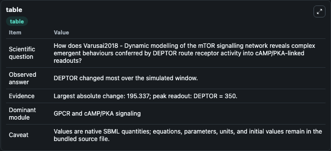
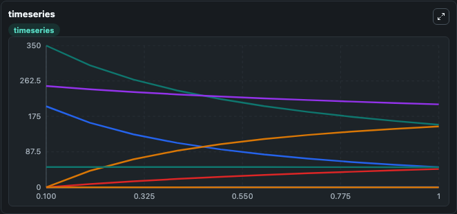
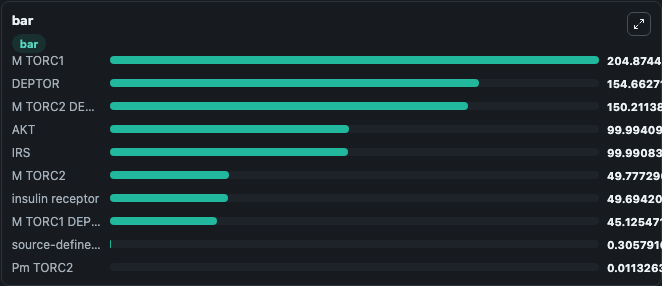

# Varusai2018 - Dynamic modelling of the mTOR signalling network reveals complex emergent behaviours conferred by DEPTOR

This Biosimulant lab wraps `Varusai2018 - Dynamic modelling of the mTOR signalling network reveals complex emergent behaviours conferred by DEPTOR` as a runnable signaling model with a companion visualization module.
Clean Biosimulant lab for systems signaling model: Varusai2018 - Dynamic modelling of the mTOR signalling network reveals complex emergent behaviours conferred by DEPTOR. It can be used to explore second-messenger and pathway-signaling dynamics and compare scenario outcomes across configurations.

## What You'll See

The lab asks: How does Varusai2018 - Dynamic modelling of the mTOR signalling network reveals complex emergent behaviours conferred by DEPTOR route receptor activity into cAMP/PKA-linked readouts? It runs for 1.0 time units with a communication step of 0.1. The run uses the model defaults declared by the curated SBML wrapper. The generated visualizations focus on insulin receptor, source-defined PIR state, IRS, source-defined PIRS state, source-defined IIRS state, and AKT, and related outputs, combining trajectory, endpoint-comparison, and summary-table views from one completed dark-mode run.

In this captured run, **DEPTOR** moved from 350.0 to 154.7 across 1.0 simulation windows.

<!-- BIOSIMULANT_VISUALS_START -->
### Output Visualizations



*Summary table for Varusai2018 - Dynamic modelling of the mTOR signalling network reveals complex emergent behaviours conferred by DEPTOR, reporting the scientific question, observed answer, dominant module, and caveat.*



*Trajectories of DEPTOR, M TORC2, M TORC2 DEPTOR, M TORC1, M TORC1 DEPTOR, and insulin receptor across the 1.0 simulation. In this run **M TORC2 DEPTOR** climbed from 0 to 150.2 and **DEPTOR** fell from 350.0 to 154.7 — the largest movements among the focused observables.*



*Largest-excursion ranking of the focused observables — the absolute movement magnitude during the run. Top 3: **M TORC1** = 204.9, **DEPTOR** = 154.7, **M TORC2 DEPTOR** = 150.2, with 7 more observables below.*

<!-- BIOSIMULANT_VISUALS_END -->

## Model Context

- Core model: `models/core`
- Visualization model: `models/visualisation`
- Standard: `other`
- Upstream source: `biomodels_ebi:BIOMD0000000823`
- License: `CC0`
- Visual scope: GPCR and cAMP/PKA signaling
- Caveat: Values are native SBML quantities; equations, parameters, units, and initial values remain in the bundled source file.

## Inputs

| Input | Maps To | Default | Notes |
|---|---|---|---|
| Initial insulin receptor | `signaling_sbml_varusai2018_dynamic_modelling_of_the_mtor_signal_biomd0000000823_model.initial_insulin_receptor` |  | Initial level of insulin receptor. Maps to SBML symbol `IR`; exposed as a traceable initial-condition perturbation. |

## Outputs

| Output | Maps To | Role |
|---|---|---|
| `akt` | `signaling_sbml_varusai2018_dynamic_modelling_of_the_mtor_signal_biomd0000000823_model.akt` | AKT. |
| `source_defined_pakt_state` | `signaling_sbml_varusai2018_dynamic_modelling_of_the_mtor_signal_biomd0000000823_model.source_defined_pakt_state` | source-defined PAKT state. |
| `source_defined_pir_state` | `signaling_sbml_varusai2018_dynamic_modelling_of_the_mtor_signal_biomd0000000823_model.source_defined_pir_state` | source-defined PIR state. |
| `state` | `signaling_sbml_varusai2018_dynamic_modelling_of_the_mtor_signal_biomd0000000823_model.state` | Available to the visualization model and downstream workflows. |
| `summary` | `signaling_sbml_varusai2018_dynamic_modelling_of_the_mtor_signal_biomd0000000823_model.summary` | Available to the visualization model and downstream workflows. |
| `species_labels` | `signaling_sbml_varusai2018_dynamic_modelling_of_the_mtor_signal_biomd0000000823_model.species_labels` | Available to the visualization model and downstream workflows. |

## Runtime

- Duration: `1.0`
- Communication step: `0.1`

## Running Locally

```bash
biosimulant labs serve .
```
