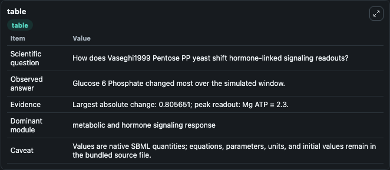
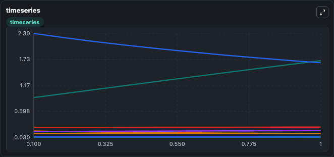
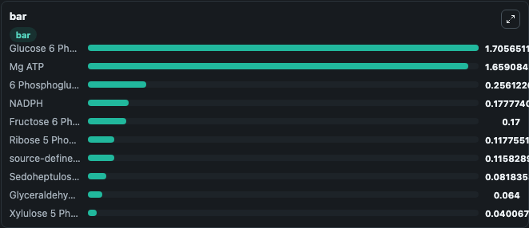

# Vaseghi1999_Pentose_PP_yeast

This Biosimulant lab wraps `Vaseghi1999_Pentose_PP_yeast` as a runnable signaling model with a companion visualization module.
Clean Biosimulant lab for systems signaling model: Vaseghi1999_Pentose_PP_yeast. It can be used to explore second-messenger and pathway-signaling dynamics and compare scenario outcomes across configurations.

## What You'll See

The lab asks: How does Vaseghi1999 Pentose PP yeast shift hormone-linked signaling readouts? It runs for 1.0 time units with a communication step of 0.1. The run uses the model defaults declared by the curated SBML wrapper. The generated visualizations focus on Glucose 6 Phosphate, 6 Phosphogluconate, Ribulose 5 Phosphate, Xylulose 5 Phosphate, Fructose 6 Phosphate, and Erythrose 4 Phosphate, and related outputs, combining trajectory, endpoint-comparison, and summary-table views from one completed dark-mode run.

In this captured run, **Glucose 6 Phosphate** moved from 0.9000 to 1.706 across 1.0 simulation windows.

<!-- BIOSIMULANT_VISUALS_START -->
### Output Visualizations



*Summary table for Vaseghi1999_Pentose_PP_yeast, reporting the scientific question, observed answer, dominant module, and caveat.*



*Trajectories of Glucose 6 Phosphate, Mg ATP, source-defined NADP+ state, NADPH, 6 Phosphogluconate, and Ribulose 5 Phosphate across the 1.0 simulation. In this run **Glucose 6 Phosphate** climbed from 0.9000 to 1.706 and **Mg ATP** fell from 2.300 to 1.659 — the largest movements among the focused observables.*



*Largest-excursion ranking of the focused observables — the absolute movement magnitude during the run. Top 3: **Glucose 6 Phosphate** = 1.706, **Mg ATP** = 1.659, **6 Phosphogluconate** = 0.2561, with 7 more observables below.*

<!-- BIOSIMULANT_VISUALS_END -->

## Model Context

- Core model: `models/core`
- Visualization model: `models/visualisation`
- Standard: `other`
- Upstream source: `biomodels_ebi:MODEL1004070001`
- License: `CC0`
- Visual scope: metabolic and hormone signaling response
- Caveat: Values are native SBML quantities; equations, parameters, units, and initial values remain in the bundled source file.

## Inputs

| Input | Maps To | Default | Notes |
|---|---|---|---|
| Initial Fructose 6 Phosphate | `signaling_sbml_vaseghi1999_pentose_pp_yeast_model1004070001_model.initial_fructose_6_phosphate` |  | Initial level of Fructose 6 Phosphate. Maps to SBML symbol `C_F6P`; exposed as a traceable initial-condition perturbation. |
| Initial Glucose 6 Phosphate | `signaling_sbml_vaseghi1999_pentose_pp_yeast_model1004070001_model.initial_glucose_6_phosphate` |  | Initial level of Glucose 6 Phosphate. Maps to SBML symbol `C_G6P`; exposed as a traceable initial-condition perturbation. |
| Initial Glyceraldehyde 3 Phosphate | `signaling_sbml_vaseghi1999_pentose_pp_yeast_model1004070001_model.initial_glyceraldehyde_3_phosphate` |  | Initial level of Glyceraldehyde 3 Phosphate. Maps to SBML symbol `C_GAP`; exposed as a traceable initial-condition perturbation. |

## Outputs

| Output | Maps To | Role |
|---|---|---|
| `glucose_6_phosphate` | `signaling_sbml_vaseghi1999_pentose_pp_yeast_model1004070001_model.glucose_6_phosphate` | Glucose 6 Phosphate. |
| `source_6_phosphogluconate` | `signaling_sbml_vaseghi1999_pentose_pp_yeast_model1004070001_model.source_6_phosphogluconate` | 6 Phosphogluconate. |
| `ribulose_5_phosphate` | `signaling_sbml_vaseghi1999_pentose_pp_yeast_model1004070001_model.ribulose_5_phosphate` | Ribulose 5 Phosphate. |
| `state` | `signaling_sbml_vaseghi1999_pentose_pp_yeast_model1004070001_model.state` | Available to the visualization model and downstream workflows. |
| `summary` | `signaling_sbml_vaseghi1999_pentose_pp_yeast_model1004070001_model.summary` | Available to the visualization model and downstream workflows. |
| `species_labels` | `signaling_sbml_vaseghi1999_pentose_pp_yeast_model1004070001_model.species_labels` | Available to the visualization model and downstream workflows. |

## Runtime

- Duration: `1.0`
- Communication step: `0.1`

## Running Locally

```bash
biosimulant labs serve .
```
