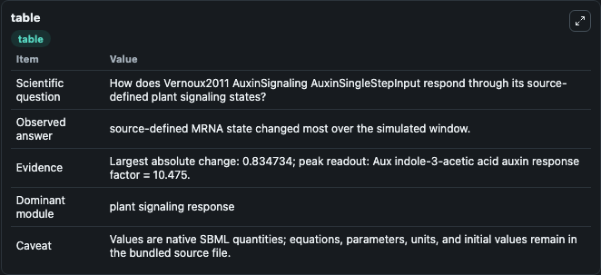
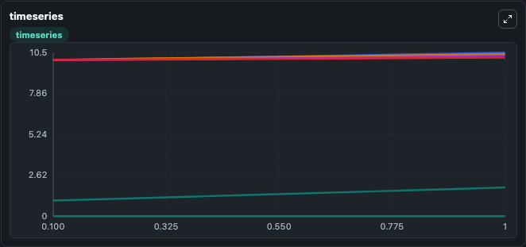
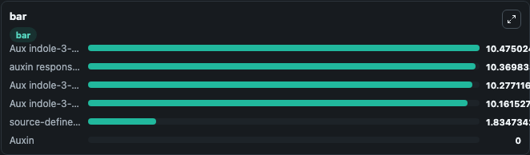

# Vernoux2011_AuxinSignaling_AuxinSingleStepInput

This Biosimulant lab wraps `Vernoux2011_AuxinSignaling_AuxinSingleStepInput` as a runnable signaling model with a companion visualization module.
Clean Biosimulant lab for systems signaling model: Vernoux2011_AuxinSignaling_AuxinSingleStepInput. It can be used to explore second-messenger and pathway-signaling dynamics and compare scenario outcomes across configurations.

## What You'll See

The lab asks: How does Vernoux2011 AuxinSignaling AuxinSingleStepInput respond through its source-defined plant signaling states? It runs for 1.0 time units with a communication step of 0.1. The run uses the model defaults declared by the curated SBML wrapper. The generated visualizations focus on Aux indole-3-acetic acid, auxin response factor, Aux indole-3-acetic acid Aux indole-3-acetic acid, Aux indole-3-acetic acid auxin response factor, source-defined MRNA state, and Auxin, combining trajectory, endpoint-comparison, and summary-table views from one completed dark-mode run.

In this captured run, **source-defined MRNA state** moved from 1.000 to 1.835 across 1.0 simulation windows.

<!-- BIOSIMULANT_VISUALS_START -->
### Output Visualizations



*Summary table for Vernoux2011_AuxinSignaling_AuxinSingleStepInput, reporting the scientific question, observed answer, dominant module, and caveat.*



*Trajectories of source-defined MRNA state, Aux indole-3-acetic acid auxin response factor, auxin response factor, Aux indole-3-acetic acid Aux indole-3-acetic acid, Aux indole-3-acetic acid, and Auxin across the 1.0 simulation. In this run **source-defined MRNA state** climbed from 1.000 to 1.835 — the largest movements among the focused observables.*



*Largest-excursion ranking of the focused observables — the absolute movement magnitude during the run. Top 3: **Aux indole-3-acetic acid auxin response factor** = 10.475, **auxin response factor** = 10.370, **Aux indole-3-acetic acid Aux indole-3-acetic acid** = 10.277, with 3 more observables below.*

<!-- BIOSIMULANT_VISUALS_END -->

## Model Context

- Core model: `models/core`
- Visualization model: `models/visualisation`
- Standard: `other`
- Upstream source: `biomodels_ebi:BIOMD0000000351`
- License: `CC0`
- Visual scope: plant signaling response
- Caveat: Values are native SBML quantities; equations, parameters, units, and initial values remain in the bundled source file.

## Inputs

| Input | Maps To | Default | Notes |
|---|---|---|---|
| Initial Auxin | `signaling_sbml_vernoux2011_auxinsignaling_auxinsinglestepinput_biomd0000000351_model.initial_auxin` |  | Initial level of Auxin. Maps to SBML symbol `aux`; exposed as a traceable initial-condition perturbation. |

## Outputs

| Output | Maps To | Role |
|---|---|---|
| `aux_indole_3_acetic_acid` | `signaling_sbml_vernoux2011_auxinsignaling_auxinsinglestepinput_biomd0000000351_model.aux_indole_3_acetic_acid` | Aux indole-3-acetic acid. |
| `auxin_response_factor` | `signaling_sbml_vernoux2011_auxinsignaling_auxinsinglestepinput_biomd0000000351_model.auxin_response_factor` | auxin response factor. |
| `aux_indole_3_acetic_acid_aux_indole_3_acetic_acid` | `signaling_sbml_vernoux2011_auxinsignaling_auxinsinglestepinput_biomd0000000351_model.aux_indole_3_acetic_acid_aux_indole_3_acetic_acid` | Aux indole-3-acetic acid Aux indole-3-acetic acid. |
| `state` | `signaling_sbml_vernoux2011_auxinsignaling_auxinsinglestepinput_biomd0000000351_model.state` | Available to the visualization model and downstream workflows. |
| `summary` | `signaling_sbml_vernoux2011_auxinsignaling_auxinsinglestepinput_biomd0000000351_model.summary` | Available to the visualization model and downstream workflows. |
| `species_labels` | `signaling_sbml_vernoux2011_auxinsignaling_auxinsinglestepinput_biomd0000000351_model.species_labels` | Available to the visualization model and downstream workflows. |

## Runtime

- Duration: `1.0`
- Communication step: `0.1`

## Running Locally

```bash
biosimulant labs serve .
```
