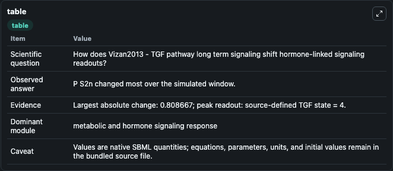
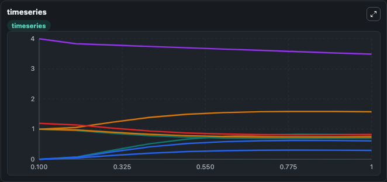
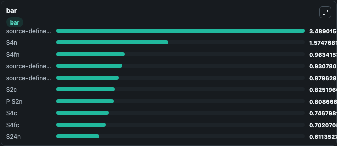

# Vizan2013 - TGF pathway long term signaling

This Biosimulant lab wraps `Vizan2013 - TGF pathway long term signaling` as a runnable signaling model with a companion visualization module.
Clean Biosimulant lab for systems signaling model: Vizan2013 - TGF pathway long term signaling. It can be used to explore second-messenger and pathway-signaling dynamics and compare scenario outcomes across configurations.

## What You'll See

The lab asks: How does Vizan2013 - TGF pathway long term signaling shift hormone-linked signaling readouts? It runs for 1.0 time units with a communication step of 0.1. The run uses the model defaults declared by the curated SBML wrapper. The generated visualizations focus on Abstract source state S22, Abstract source state S24, P S2tot, source-defined TGF state, source-defined R state, and S2c, and related outputs, combining trajectory, endpoint-comparison, and summary-table views from one completed dark-mode run.

In this captured run, **P S2n** moved from 0 to 0.8087 across 1.0 simulation windows.

<!-- BIOSIMULANT_VISUALS_START -->
### Output Visualizations



*Summary table for Vizan2013 - TGF pathway long term signaling, reporting the scientific question, observed answer, dominant module, and caveat.*



*Trajectories of P S2n, S24n, S4n, source-defined TGF state, S2c, and S4fc across the 1.0 simulation. In this run **P S2n** climbed from 0 to 0.8087 and **source-defined TGF state** fell from 4.000 to 3.489 — the largest movements among the focused observables.*



*Largest-excursion ranking of the focused observables — the absolute movement magnitude during the run. Top 3: **source-defined TGF state** = 3.489, **S4n** = 1.575, **S4fn** = 0.9634, with 7 more observables below.*

<!-- BIOSIMULANT_VISUALS_END -->

## Model Context

- Core model: `models/core`
- Visualization model: `models/visualisation`
- Standard: `other`
- Upstream source: `biomodels_ebi:BIOMD0000000499`
- License: `CC0`
- Visual scope: metabolic and hormone signaling response
- Caveat: Values are native SBML quantities; equations, parameters, units, and initial values remain in the bundled source file.

## Inputs

| Input | Maps To | Default | Notes |
|---|---|---|---|
| Initial source-defined RT state | `signaling_sbml_vizan2013_tgf_pathway_long_term_signaling_biomd0000000499_model.initial_source_defined_rt_state` |  | Initial level of source-defined RT state. Maps to SBML symbol `species_24`; exposed as a traceable initial-condition perturbation. |
| Initial source-defined R state | `signaling_sbml_vizan2013_tgf_pathway_long_term_signaling_biomd0000000499_model.initial_source_defined_r_state` |  | Initial level of source-defined R state. Maps to SBML symbol `species_5`; exposed as a traceable initial-condition perturbation. |
| Initial P S2c | `signaling_sbml_vizan2013_tgf_pathway_long_term_signaling_biomd0000000499_model.initial_p_s2c` |  | Initial level of P S2c. Maps to SBML symbol `species_8`; exposed as a traceable initial-condition perturbation. |

## Outputs

| Output | Maps To | Role |
|---|---|---|
| `abstract_source_state_s22` | `signaling_sbml_vizan2013_tgf_pathway_long_term_signaling_biomd0000000499_model.abstract_source_state_s22` | Abstract source state S22. |
| `abstract_source_state_s24` | `signaling_sbml_vizan2013_tgf_pathway_long_term_signaling_biomd0000000499_model.abstract_source_state_s24` | Abstract source state S24. |
| `p_s2tot` | `signaling_sbml_vizan2013_tgf_pathway_long_term_signaling_biomd0000000499_model.p_s2tot` | P S2tot. |
| `state` | `signaling_sbml_vizan2013_tgf_pathway_long_term_signaling_biomd0000000499_model.state` | Available to the visualization model and downstream workflows. |
| `summary` | `signaling_sbml_vizan2013_tgf_pathway_long_term_signaling_biomd0000000499_model.summary` | Available to the visualization model and downstream workflows. |
| `species_labels` | `signaling_sbml_vizan2013_tgf_pathway_long_term_signaling_biomd0000000499_model.species_labels` | Available to the visualization model and downstream workflows. |

## Runtime

- Duration: `1.0`
- Communication step: `0.1`

## Running Locally

```bash
biosimulant labs serve .
```
