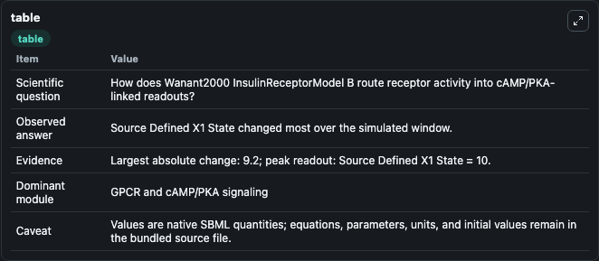
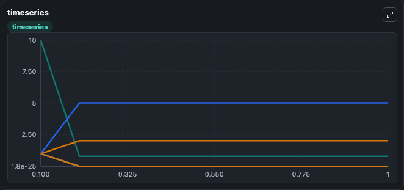
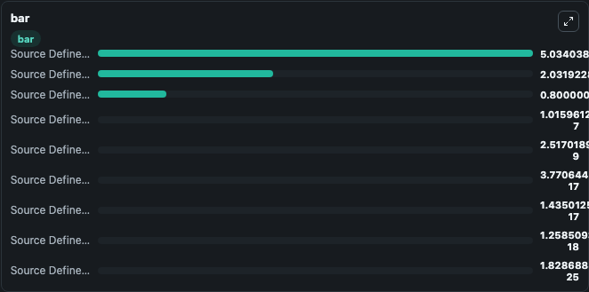

# Wanant2000_InsulinReceptorModel_B

This Biosimulant lab wraps `Wanant2000_InsulinReceptorModel_B` as a runnable signaling model with a companion visualization module.
Clean Biosimulant lab for metabolic and hormone-linked signaling. It can be used to explore second-messenger and pathway-signaling dynamics and compare scenario outcomes across configurations.

## What You'll See

The lab asks: How does Wanant2000 InsulinReceptorModel B route receptor activity into cAMP/PKA-linked readouts? It runs for 1.0 time units with a communication step of 0.1. The run uses the model defaults declared by the curated SBML wrapper. The generated visualizations focus on Source Defined X1 State, Source Defined X2 State, Source Defined X3 State, Source Defined X4 State, Source Defined X5 State, and Source Defined X6 State, and related outputs, combining trajectory, endpoint-comparison, and summary-table views from one completed dark-mode run.

In this captured run, **Source Defined X1 State** moved from 10.000 to 0.8000 across 1.0 simulation windows.

<!-- BIOSIMULANT_VISUALS_START -->
### Output Visualizations



*Summary table for Wanant2000_InsulinReceptorModel_B, reporting the scientific question, observed answer, dominant module, and caveat.*



*Trajectories of Source Defined X1 State, Source Defined X8 State, Source Defined X4 State, Source Defined X5 State, Source Defined X6 State, and Source Defined X9 State across the 1.0 simulation. In this run **Source Defined X8 State** climbed from 1.000 to 5.034 and **Source Defined X1 State** fell from 10.000 to 0.8000 — the largest movements among the focused observables.*



*Largest-excursion ranking of the focused observables — the absolute movement magnitude during the run. Top 3: **Source Defined X8 State** = 5.034, **Source Defined X4 State** = 2.032, **Source Defined X1 State** = 0.8000, with 6 more observables below.*

<!-- BIOSIMULANT_VISUALS_END -->

## Model Context

- Core model: `models/core`
- Visualization model: `models/visualisation`
- Standard: `other`
- Upstream source: `biomodels_ebi:MODEL1201140006`
- License: `CC0`
- Visual scope: GPCR and cAMP/PKA signaling
- Caveat: Values are native SBML quantities; equations, parameters, units, and initial values remain in the bundled source file.

## Inputs

| Input | Maps To | Default | Notes |
|---|---|---|---|
| Initial source-defined X1 state | `signaling_sbml_wanant2000_insulinreceptormodel_b_model1201140006_model.initial_source_defined_x1_state` |  | Initial level of source-defined X1 state. Maps to SBML symbol `x1`; exposed as a traceable initial-condition perturbation. |

## Outputs

| Output | Maps To | Role |
|---|---|---|
| `source_defined_x1_state` | `signaling_sbml_wanant2000_insulinreceptormodel_b_model1201140006_model.source_defined_x1_state` | source-defined X1 state. |
| `source_defined_x2_state` | `signaling_sbml_wanant2000_insulinreceptormodel_b_model1201140006_model.source_defined_x2_state` | source-defined X2 state. |
| `source_defined_x3_state` | `signaling_sbml_wanant2000_insulinreceptormodel_b_model1201140006_model.source_defined_x3_state` | source-defined X3 state. |
| `state` | `signaling_sbml_wanant2000_insulinreceptormodel_b_model1201140006_model.state` | Available to the visualization model and downstream workflows. |
| `summary` | `signaling_sbml_wanant2000_insulinreceptormodel_b_model1201140006_model.summary` | Available to the visualization model and downstream workflows. |
| `species_labels` | `signaling_sbml_wanant2000_insulinreceptormodel_b_model1201140006_model.species_labels` | Available to the visualization model and downstream workflows. |

## Runtime

- Duration: `1.0`
- Communication step: `0.1`

## Running Locally

```bash
biosimulant labs serve .
```
