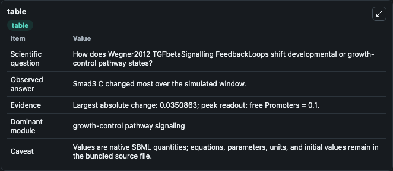
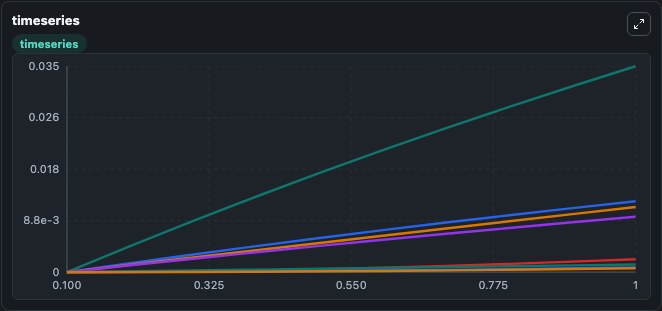
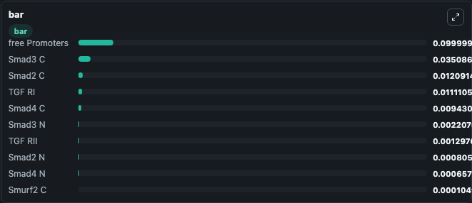

# Wegner2012_TGFbetaSignalling_FeedbackLoops

This Biosimulant lab wraps `Wegner2012_TGFbetaSignalling_FeedbackLoops` as a runnable signaling model with a companion visualization module.
Clean Biosimulant lab for developmental and growth-control signaling. It can be used to explore second-messenger and pathway-signaling dynamics and compare scenario outcomes across configurations.

## What You'll See

The lab asks: How does Wegner2012 TGFbetaSignalling FeedbackLoops shift developmental or growth-control pathway states? It runs for 1.0 time units with a communication step of 0.1. The run uses the model defaults declared by the curated SBML wrapper. The generated visualizations focus on TGF RII, Tgfbeta TGF RII, TGF RI, Rec active, Smad2 C, and source-defined SARA state, and related outputs, combining trajectory, endpoint-comparison, and summary-table views from one completed dark-mode run.

In this captured run, **Smad3 C** moved from 0 to 0.0351 across 1.0 simulation windows.

<!-- BIOSIMULANT_VISUALS_START -->
### Output Visualizations



*Summary table for Wegner2012_TGFbetaSignalling_FeedbackLoops, reporting the scientific question, observed answer, dominant module, and caveat.*



*Trajectories of Smad3 C, Smad2 C, TGF RI, Smad4 C, Smad3 N, and TGF RII across the 1.0 simulation. In this run **Smad3 C** climbed from 0 to 0.0351 — the largest movements among the focused observables.*



*Largest-excursion ranking of the focused observables — the absolute movement magnitude during the run. Top 3: **free Promoters** = 0.1000, **Smad3 C** = 0.0351, **Smad2 C** = 0.0121, with 7 more observables below.*

<!-- BIOSIMULANT_VISUALS_END -->

## Model Context

- Core model: `models/core`
- Visualization model: `models/visualisation`
- Standard: `other`
- Upstream source: `biomodels_ebi:BIOMD0000000410`
- License: `CC0`
- Visual scope: growth-control pathway signaling
- Caveat: Values are native SBML quantities; equations, parameters, units, and initial values remain in the bundled source file.

## Inputs

| Input | Maps To | Default | Notes |
|---|---|---|---|
| Tgfbeta | `signaling_sbml_wegner2012_tgfbetasignalling_feedbackloops_biomd0000000410_model.initial_tgfbeta_level` |  | Tgfbeta source parameter. Maps to SBML symbol `parameter_1` and preserves the bundled default. |
| Initial TGF RI | `signaling_sbml_wegner2012_tgfbetasignalling_feedbackloops_biomd0000000410_model.initial_tgf_ri` |  | Initial level of TGF RI. Maps to SBML symbol `_84`; exposed as a traceable initial-condition perturbation. |
| Initial TGF RII | `signaling_sbml_wegner2012_tgfbetasignalling_feedbackloops_biomd0000000410_model.initial_tgf_rii` |  | Initial level of TGF RII. Maps to SBML symbol `_75`; exposed as a traceable initial-condition perturbation. |

## Outputs

| Output | Maps To | Role |
|---|---|---|
| `rec_active` | `signaling_sbml_wegner2012_tgfbetasignalling_feedbackloops_biomd0000000410_model.rec_active` | Rec active. |
| `smad2_c` | `signaling_sbml_wegner2012_tgfbetasignalling_feedbackloops_biomd0000000410_model.smad2_c` | Smad2 C. |
| `smad2_sara` | `signaling_sbml_wegner2012_tgfbetasignalling_feedbackloops_biomd0000000410_model.smad2_sara` | Smad2 SARA. |
| `state` | `signaling_sbml_wegner2012_tgfbetasignalling_feedbackloops_biomd0000000410_model.state` | Available to the visualization model and downstream workflows. |
| `summary` | `signaling_sbml_wegner2012_tgfbetasignalling_feedbackloops_biomd0000000410_model.summary` | Available to the visualization model and downstream workflows. |
| `species_labels` | `signaling_sbml_wegner2012_tgfbetasignalling_feedbackloops_biomd0000000410_model.species_labels` | Available to the visualization model and downstream workflows. |

## Runtime

- Duration: `1.0`
- Communication step: `0.1`

## Running Locally

```bash
biosimulant labs serve .
```
