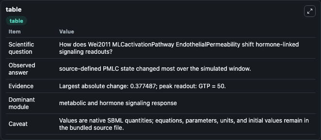
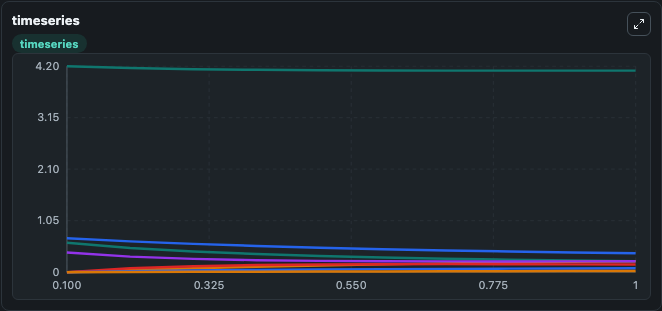
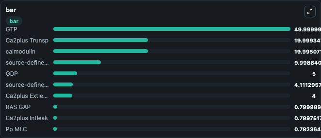

# Wei2011_MLCactivationPathway_EndothelialPermeability

This Biosimulant lab wraps `Wei2011_MLCactivationPathway_EndothelialPermeability` as a runnable signaling model with a companion visualization module.
Clean Biosimulant lab for systems signaling model: Wei2011_MLCactivationPathway_EndothelialPermeability. It can be used to explore second-messenger and pathway-signaling dynamics and compare scenario outcomes across configurations.

## What You'll See

The lab asks: How does Wei2011 MLCactivationPathway EndothelialPermeability shift hormone-linked signaling readouts? It runs for 1.0 time units with a communication step of 0.1. The run uses the model defaults declared by the curated SBML wrapper. The generated visualizations focus on Thrombin, Ca2plus 1, Hisatamine, Ca2plus 2, Ca2plus 3, and Ca2plus 4, and related outputs, combining trajectory, endpoint-comparison, and summary-table views from one completed dark-mode run.

In this captured run, **source-defined PMLC state** moved from 0.6000 to 0.2225 across 1.0 simulation windows.

<!-- BIOSIMULANT_VISUALS_START -->
### Output Visualizations



*Summary table for Wei2011_MLCactivationPathway_EndothelialPermeability, reporting the scientific question, observed answer, dominant module, and caveat.*



*Trajectories of source-defined PMLC state, source-defined MLCK state, MLCK MLC, MYPT1 Ppase, MYPT1 Ppase P MLC, and source-defined MLC state across the 1.0 simulation. In this run **MLCK MLC** climbed from 0 to 0.2233 and **source-defined PMLC state** fell from 0.6000 to 0.2225 — the largest movements among the focused observables.*



*Largest-excursion ranking of the focused observables — the absolute movement magnitude during the run. Top 3: **GTP** = 50.000, **Ca2plus Trunsp** = 19.999, **calmodulin** = 19.995, with 7 more observables below.*

<!-- BIOSIMULANT_VISUALS_END -->

## Model Context

- Core model: `models/core`
- Visualization model: `models/visualisation`
- Standard: `other`
- Upstream source: `biomodels_ebi:MODEL1102210000`
- License: `CC0`
- Visual scope: metabolic and hormone signaling response
- Caveat: Values are native SBML quantities; equations, parameters, units, and initial values remain in the bundled source file.

## Inputs

| Input | Maps To | Default | Notes |
|---|---|---|---|
| Initial Ca2plus 1 | `signaling_sbml_wei2011_mlcactivationpathway_endothelialpermeabi_model1102210000_model.initial_ca2plus_1` |  | Initial level of Ca2plus 1. Maps to SBML symbol `Ca2plus_1`; exposed as a traceable initial-condition perturbation. |
| Initial Thrombin | `signaling_sbml_wei2011_mlcactivationpathway_endothelialpermeabi_model1102210000_model.initial_thrombin` |  | Initial level of Thrombin. Maps to SBML symbol `thrombin`; exposed as a traceable initial-condition perturbation. |
| Initial Ca2plus | `signaling_sbml_wei2011_mlcactivationpathway_endothelialpermeabi_model1102210000_model.initial_ca2plus` |  | Initial level of Ca2plus. Maps to SBML symbol `Ca2plus`; exposed as a traceable initial-condition perturbation. |

## Outputs

| Output | Maps To | Role |
|---|---|---|
| `ca2plus_1` | `signaling_sbml_wei2011_mlcactivationpathway_endothelialpermeabi_model1102210000_model.ca2plus_1` | Ca2plus 1. |
| `ca2plus_2` | `signaling_sbml_wei2011_mlcactivationpathway_endothelialpermeabi_model1102210000_model.ca2plus_2` | Ca2plus 2. |
| `ca2plus_3` | `signaling_sbml_wei2011_mlcactivationpathway_endothelialpermeabi_model1102210000_model.ca2plus_3` | Ca2plus 3. |
| `state` | `signaling_sbml_wei2011_mlcactivationpathway_endothelialpermeabi_model1102210000_model.state` | Available to the visualization model and downstream workflows. |
| `summary` | `signaling_sbml_wei2011_mlcactivationpathway_endothelialpermeabi_model1102210000_model.summary` | Available to the visualization model and downstream workflows. |
| `species_labels` | `signaling_sbml_wei2011_mlcactivationpathway_endothelialpermeabi_model1102210000_model.species_labels` | Available to the visualization model and downstream workflows. |

## Runtime

- Duration: `1.0`
- Communication step: `0.1`

## Running Locally

```bash
biosimulant labs serve .
```
