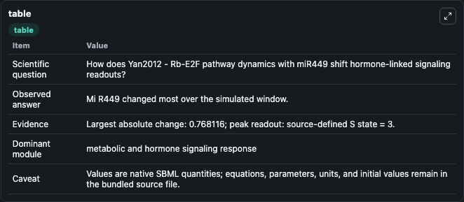
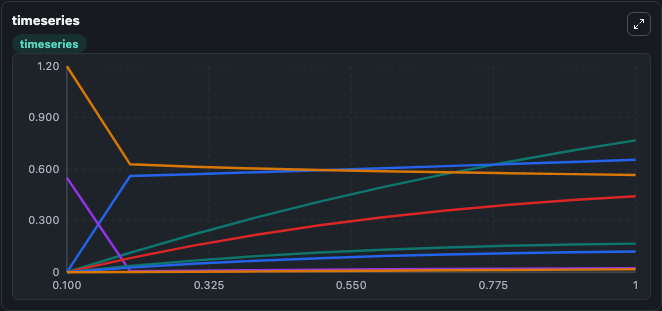
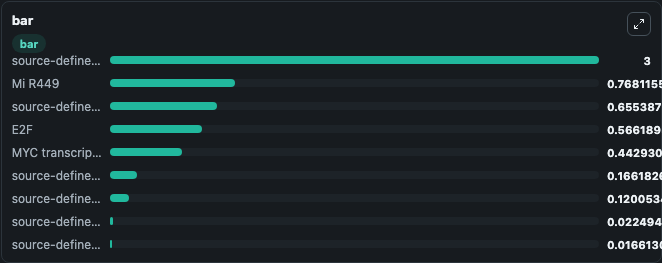

# Yan2012 - Rb-E2F pathway dynamics with miR449

This Biosimulant lab wraps `Yan2012 - Rb-E2F pathway dynamics with miR449` as a runnable signaling model with a companion visualization module.
Clean Biosimulant lab for systems signaling model: Yan2012 - Rb-E2F pathway dynamics with miR449. It can be used to explore second-messenger and pathway-signaling dynamics and compare scenario outcomes across configurations.

## What You'll See

The lab asks: How does Yan2012 - Rb-E2F pathway dynamics with miR449 shift hormone-linked signaling readouts? It runs for 1.0 time units with a communication step of 0.1. The run uses the model defaults declared by the curated SBML wrapper. The generated visualizations focus on E2F, MYC transcription factor, source-defined CYCD state, source-defined RE state, source-defined CYCE state, and source-defined RB state, and related outputs, combining trajectory, endpoint-comparison, and summary-table views from one completed dark-mode run.

In this captured run, **Mi R449** moved from 0 to 0.7681 across 1.0 simulation windows.

<!-- BIOSIMULANT_VISUALS_START -->
### Output Visualizations



*Summary table for Yan2012 - Rb-E2F pathway dynamics with miR449, reporting the scientific question, observed answer, dominant module, and caveat.*



*Trajectories of Mi R449, source-defined RE state, E2F, source-defined RB state, MYC transcription factor, and source-defined CYCD state across the 1.0 simulation. In this run **Mi R449** climbed from 0 to 0.7681 and **E2F** fell from 1.200 to 0.5662 — the largest movements among the focused observables.*



*Largest-excursion ranking of the focused observables — the absolute movement magnitude during the run. Top 3: **source-defined S state** = 3.000, **Mi R449** = 0.7681, **source-defined RE state** = 0.6554, with 6 more observables below.*

<!-- BIOSIMULANT_VISUALS_END -->

## Model Context

- Core model: `models/core`
- Visualization model: `models/visualisation`
- Standard: `other`
- Upstream source: `biomodels_ebi:BIOMD0000000720`
- License: `CC0`
- Visual scope: metabolic and hormone signaling response
- Caveat: Values are native SBML quantities; equations, parameters, units, and initial values remain in the bundled source file.

## Inputs

| Input | Maps To | Default | Notes |
|---|---|---|---|
| Initial source-defined S state | `signaling_sbml_yan2012_rb_e2f_pathway_dynamics_with_mir449_biomd0000000720_model.initial_source_defined_s_state` |  | Initial level of source-defined S state. Maps to SBML symbol `S`; exposed as a traceable initial-condition perturbation. |

## Outputs

| Output | Maps To | Role |
|---|---|---|
| `e2f` | `signaling_sbml_yan2012_rb_e2f_pathway_dynamics_with_mir449_biomd0000000720_model.e2f` | E2F. |
| `myc_transcription_factor` | `signaling_sbml_yan2012_rb_e2f_pathway_dynamics_with_mir449_biomd0000000720_model.myc_transcription_factor` | MYC transcription factor. |
| `source_defined_cycd_state` | `signaling_sbml_yan2012_rb_e2f_pathway_dynamics_with_mir449_biomd0000000720_model.source_defined_cycd_state` | source-defined CYCD state. |
| `state` | `signaling_sbml_yan2012_rb_e2f_pathway_dynamics_with_mir449_biomd0000000720_model.state` | Available to the visualization model and downstream workflows. |
| `summary` | `signaling_sbml_yan2012_rb_e2f_pathway_dynamics_with_mir449_biomd0000000720_model.summary` | Available to the visualization model and downstream workflows. |
| `species_labels` | `signaling_sbml_yan2012_rb_e2f_pathway_dynamics_with_mir449_biomd0000000720_model.species_labels` | Available to the visualization model and downstream workflows. |

## Runtime

- Duration: `1.0`
- Communication step: `0.1`

## Running Locally

```bash
biosimulant labs serve .
```
