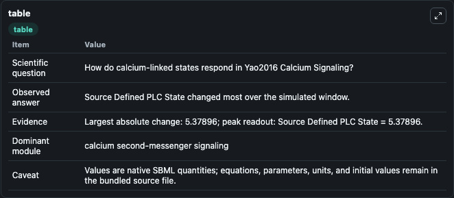
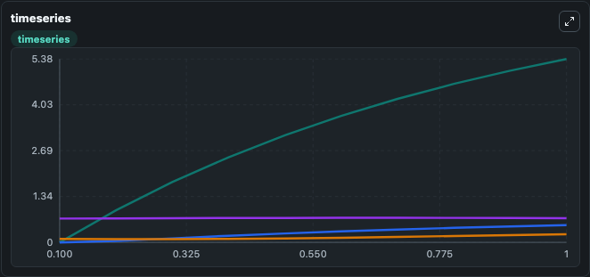
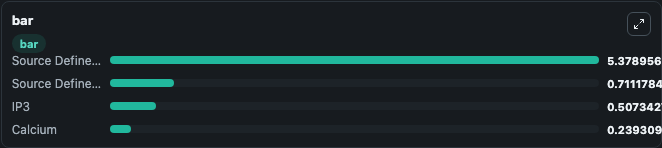

# Yao2016_Calcium_Signaling

This Biosimulant lab wraps `Yao2016_Calcium_Signaling` as a runnable signaling model with a companion visualization module.
Clean Biosimulant lab for calcium and second-messenger signaling. It can be used to explore second-messenger and pathway-signaling dynamics and compare scenario outcomes across configurations.

## What You'll See

The lab asks: How do calcium-linked states respond in Yao2016 Calcium Signaling? It runs for 1.0 time units with a communication step of 0.1. The run uses the model defaults declared by the curated SBML wrapper. The generated visualizations focus on Source Defined PLC State, IP3, Source Defined H State, and Calcium, combining trajectory, endpoint-comparison, and summary-table views from one completed dark-mode run.

In this captured run, **Source Defined PLC State** moved from 0 to 5.379 across 1.0 simulation windows.

<!-- BIOSIMULANT_VISUALS_START -->
### Output Visualizations



*Summary table for Yao2016_Calcium_Signaling, reporting the scientific question, observed answer, dominant module, and caveat.*



*Trajectories of Source Defined PLC State, IP3, Calcium, and Source Defined H State across the 1.0 simulation. In this run **Source Defined PLC State** climbed from 0 to 5.379 — the largest movements among the focused observables.*



*Largest-excursion ranking of the focused observables — the absolute movement magnitude during the run. Top 3: **Source Defined PLC State** = 5.379, **Source Defined H State** = 0.7112, **IP3** = 0.5073, with 1 more observable below.*

<!-- BIOSIMULANT_VISUALS_END -->

## Model Context

- Core model: `models/core`
- Visualization model: `models/visualisation`
- Standard: `other`
- Upstream source: `biomodels_ebi:MODEL1611150001`
- License: `CC0`
- Visual scope: calcium second-messenger signaling
- Caveat: Values are native SBML quantities; equations, parameters, units, and initial values remain in the bundled source file.

## Inputs

| Input | Maps To | Default | Notes |
|---|---|---|---|
| Initial source-defined PLC state | `signaling_sbml_yao2016_calcium_signaling_model1611150001_model.initial_source_defined_plc_state` |  | Initial level of source-defined PLC state. Maps to SBML symbol `PLC`; exposed as a traceable initial-condition perturbation. |

## Outputs

| Output | Maps To | Role |
|---|---|---|
| `calcium` | `signaling_sbml_yao2016_calcium_signaling_model1611150001_model.calcium` | Calcium. |
| `source_defined_plc_state` | `signaling_sbml_yao2016_calcium_signaling_model1611150001_model.source_defined_plc_state` | Source Defined PLC State. |
| `ip3` | `signaling_sbml_yao2016_calcium_signaling_model1611150001_model.ip3` | IP3. |
| `state` | `signaling_sbml_yao2016_calcium_signaling_model1611150001_model.state` | Available to the visualization model and downstream workflows. |
| `summary` | `signaling_sbml_yao2016_calcium_signaling_model1611150001_model.summary` | Available to the visualization model and downstream workflows. |
| `species_labels` | `signaling_sbml_yao2016_calcium_signaling_model1611150001_model.species_labels` | Available to the visualization model and downstream workflows. |

## Runtime

- Duration: `1.0`
- Communication step: `0.1`

## Running Locally

```bash
biosimulant labs serve .
```
