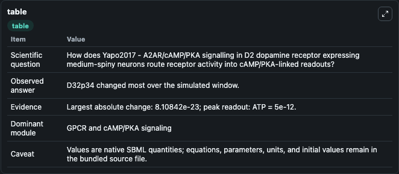
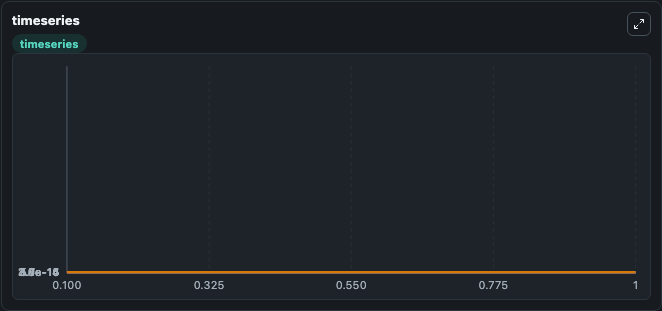
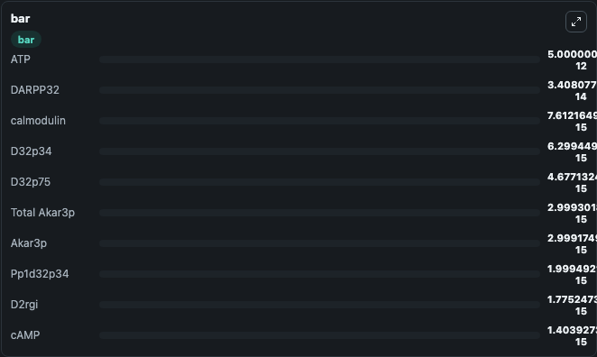

# Yapo2017 - A2AR/cAMP/PKA signalling in D2 dopamine receptor expressing medium-spiny neurons

This Biosimulant lab wraps `Yapo2017 - A2AR/cAMP/PKA signalling in D2 dopamine receptor expressing medium-spiny neurons` as a runnable signaling model with a companion visualization module.
Clean Biosimulant lab for systems signaling model: Yapo2017 - A2AR/cAMP/PKA signalling in D2 dopamine receptor expressing medium-spiny neurons. It can be used to explore second-messenger and pathway-signaling dynamics and compare scenario outcomes across configurations.

## What You'll See

The lab asks: How does Yapo2017 - A2AR/cAMP/PKA signalling in D2 dopamine receptor expressing medium-spiny neurons route receptor activity into cAMP/PKA-linked readouts? It runs for 1.0 time units with a communication step of 0.1. The run uses the model defaults declared by the curated SBML wrapper. The generated visualizations focus on source-defined DA state, D2R, D2RDA, D2rdagi, source-defined GI state, and D2rgi, and related outputs, combining trajectory, endpoint-comparison, and summary-table views from one completed dark-mode run.

In this captured run, **D32p34** moved from 6.3e-15 to 6.3e-15 across 1.0 simulation windows.

<!-- BIOSIMULANT_VISUALS_START -->
### Output Visualizations



*Summary table for Yapo2017 - A2AR/cAMP/PKA signalling in D2 dopamine receptor expressing medium-spiny neurons, reporting the scientific question, observed answer, dominant module, and caveat.*



*Trajectories of D32p34, DARPP32, D32p75, B56pp2ap, B56pp2ap D32p75, and source-defined CDK5 state across the 1.0 simulation. In this run **D32p34** climbed from 6.3e-15 to 6.3e-15 and **DARPP32** fell from 3.41e-14 to 3.41e-14 — the largest movements among the focused observables.*



*Largest-excursion ranking of the focused observables — the absolute movement magnitude during the run. Top 3: **ATP** = 5e-12, **DARPP32** = 3.41e-14, **calmodulin** = 7.61e-15, with 7 more observables below.*

<!-- BIOSIMULANT_VISUALS_END -->

## Model Context

- Core model: `models/core`
- Visualization model: `models/visualisation`
- Standard: `other`
- Upstream source: `biomodels_ebi:MODEL1701170001`
- License: `CC0`
- Visual scope: GPCR and cAMP/PKA signaling
- Caveat: Values are native SBML quantities; equations, parameters, units, and initial values remain in the bundled source file.

## Inputs

| Input | Maps To | Default | Notes |
|---|---|---|---|
| Initial adenosine | `signaling_sbml_yapo2017_a2ar_camp_pka_signalling_in_d2_dopamine_model1701170001_model.initial_adenosine` |  | Initial level of adenosine. Maps to SBML symbol `Adn`; exposed as a traceable initial-condition perturbation. |
| Initial AMP | `signaling_sbml_yapo2017_a2ar_camp_pka_signalling_in_d2_dopamine_model1701170001_model.initial_amp` |  | Initial level of AMP. Maps to SBML symbol `AMP`; exposed as a traceable initial-condition perturbation. |
| Initial ATP | `signaling_sbml_yapo2017_a2ar_camp_pka_signalling_in_d2_dopamine_model1701170001_model.initial_atp` |  | Initial level of ATP. Maps to SBML symbol `ATP`; exposed as a traceable initial-condition perturbation. |

## Outputs

| Output | Maps To | Role |
|---|---|---|
| `camp` | `signaling_sbml_yapo2017_a2ar_camp_pka_signalling_in_d2_dopamine_model1701170001_model.camp` | cAMP. |
| `pde10_c_amp` | `signaling_sbml_yapo2017_a2ar_camp_pka_signalling_in_d2_dopamine_model1701170001_model.pde10_c_amp` | PDE10 C AMP. |
| `pkac_amp2` | `signaling_sbml_yapo2017_a2ar_camp_pka_signalling_in_d2_dopamine_model1701170001_model.pkac_amp2` | Pkac AMP2. |
| `state` | `signaling_sbml_yapo2017_a2ar_camp_pka_signalling_in_d2_dopamine_model1701170001_model.state` | Available to the visualization model and downstream workflows. |
| `summary` | `signaling_sbml_yapo2017_a2ar_camp_pka_signalling_in_d2_dopamine_model1701170001_model.summary` | Available to the visualization model and downstream workflows. |
| `species_labels` | `signaling_sbml_yapo2017_a2ar_camp_pka_signalling_in_d2_dopamine_model1701170001_model.species_labels` | Available to the visualization model and downstream workflows. |

## Runtime

- Duration: `1.0`
- Communication step: `0.1`

## Running Locally

```bash
biosimulant labs serve .
```
