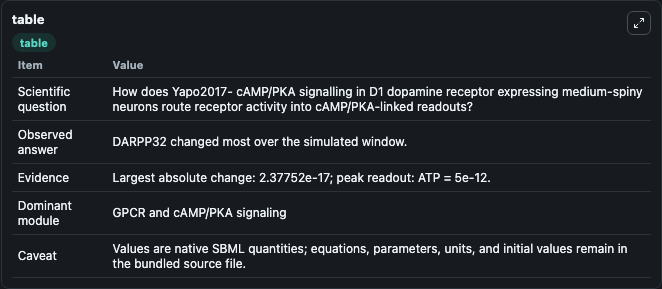
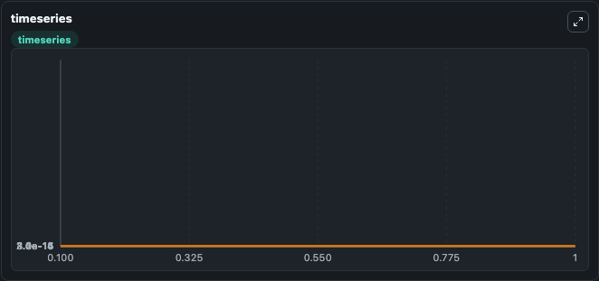
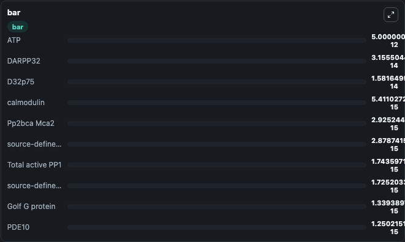

# Yapo2017- cAMP/PKA signalling in D1 dopamine receptor expressing medium-spiny neurons

This Biosimulant lab wraps `Yapo2017- cAMP/PKA signalling in D1 dopamine receptor expressing medium-spiny neurons` as a runnable signaling model with a companion visualization module.
Clean Biosimulant lab for systems signaling model: Yapo2017- cAMP/PKA signalling in D1 dopamine receptor expressing medium-spiny neurons. It can be used to explore second-messenger and pathway-signaling dynamics and compare scenario outcomes across configurations.

## What You'll See

The lab asks: How does Yapo2017- cAMP/PKA signalling in D1 dopamine receptor expressing medium-spiny neurons route receptor activity into cAMP/PKA-linked readouts? It runs for 1.0 time units with a communication step of 0.1. The run uses the model defaults declared by the curated SBML wrapper. The generated visualizations focus on Gaolf GDP, Gbgolf, Gaolf GTP, D1rdagolf, Golf G protein, and D1rgolf, and related outputs, combining trajectory, endpoint-comparison, and summary-table views from one completed dark-mode run.

In this captured run, **DARPP32** moved from 3.15e-14 to 3.16e-14 across 1.0 simulation windows.

<!-- BIOSIMULANT_VISUALS_START -->
### Output Visualizations



*Summary table for Yapo2017- cAMP/PKA signalling in D1 dopamine receptor expressing medium-spiny neurons, reporting the scientific question, observed answer, dominant module, and caveat.*



*Trajectories of DARPP32, D32p75, B56PP2A D32p75, B56pp2ap D32p75, B72PP2A, and B72PP2A D32p75 across the 1.0 simulation. In this run **DARPP32** climbed from 3.15e-14 to 3.16e-14 and **D32p75** fell from 1.58e-14 to 1.58e-14 — the largest movements among the focused observables.*



*Largest-excursion ranking of the focused observables — the absolute movement magnitude during the run. Top 3: **ATP** = 5e-12, **DARPP32** = 3.16e-14, **D32p75** = 1.58e-14, with 7 more observables below.*

<!-- BIOSIMULANT_VISUALS_END -->

## Model Context

- Core model: `models/core`
- Visualization model: `models/visualisation`
- Standard: `other`
- Upstream source: `biomodels_ebi:MODEL1701170000`
- License: `CC0`
- Visual scope: GPCR and cAMP/PKA signaling
- Caveat: Values are native SBML quantities; equations, parameters, units, and initial values remain in the bundled source file.

## Inputs

| Input | Maps To | Default | Notes |
|---|---|---|---|
| Initial AMP | `signaling_sbml_yapo2017_camp_pka_signalling_in_d1_dopamine_rece_model1701170000_model.initial_amp` |  | Initial level of AMP. Maps to SBML symbol `mw9710c658_a2a1_4f49_b494_af109853f251`; exposed as a traceable initial-condition perturbation. |
| Initial ATP | `signaling_sbml_yapo2017_camp_pka_signalling_in_d1_dopamine_rece_model1701170000_model.initial_atp` |  | Initial level of ATP. Maps to SBML symbol `mw46dccec6_6f0f_40f6_a10c_2f34ae7a005a`; exposed as a traceable initial-condition perturbation. |
| Initial calcium | `signaling_sbml_yapo2017_camp_pka_signalling_in_d1_dopamine_rece_model1701170000_model.initial_calcium` |  | Initial level of calcium. Maps to SBML symbol `mwccd3a17c_e207_4663_9b16_327b78882497`; exposed as a traceable initial-condition perturbation. |

## Outputs

| Output | Maps To | Role |
|---|---|---|
| `golf_g_protein` | `signaling_sbml_yapo2017_camp_pka_signalling_in_d1_dopamine_rece_model1701170000_model.golf_g_protein` | Golf G protein. |
| `camp` | `signaling_sbml_yapo2017_camp_pka_signalling_in_d1_dopamine_rece_model1701170000_model.camp` | cAMP. |
| `source_defined_ac5_state` | `signaling_sbml_yapo2017_camp_pka_signalling_in_d1_dopamine_rece_model1701170000_model.source_defined_ac5_state` | source-defined AC5 state. |
| `state` | `signaling_sbml_yapo2017_camp_pka_signalling_in_d1_dopamine_rece_model1701170000_model.state` | Available to the visualization model and downstream workflows. |
| `summary` | `signaling_sbml_yapo2017_camp_pka_signalling_in_d1_dopamine_rece_model1701170000_model.summary` | Available to the visualization model and downstream workflows. |
| `species_labels` | `signaling_sbml_yapo2017_camp_pka_signalling_in_d1_dopamine_rece_model1701170000_model.species_labels` | Available to the visualization model and downstream workflows. |

## Runtime

- Duration: `1.0`
- Communication step: `0.1`

## Running Locally

```bash
biosimulant labs serve .
```
