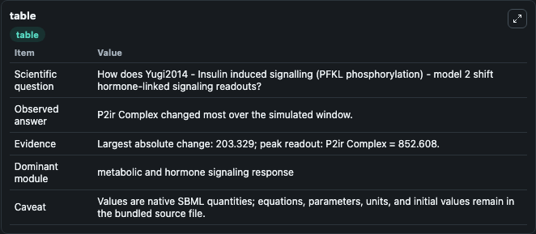
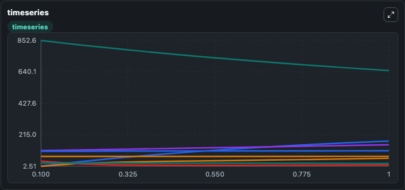
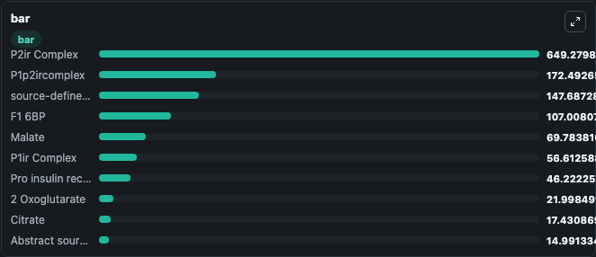

# Yugi2014 - Insulin induced signalling (PFKL phosphorylation) - model 2

This Biosimulant lab wraps `Yugi2014 - Insulin induced signalling (PFKL phosphorylation) - model 2` as a runnable signaling model with a companion visualization module.
Clean Biosimulant lab for metabolic and hormone-linked signaling. It can be used to explore second-messenger and pathway-signaling dynamics and compare scenario outcomes across configurations.

## What You'll See

The lab asks: How does Yugi2014 - Insulin induced signalling (PFKL phosphorylation) - model 2 shift hormone-linked signaling readouts? It runs for 1.0 time units with a communication step of 0.1. The run uses the model defaults declared by the curated SBML wrapper. The generated visualizations focus on source-defined PFKL state, Fbpase, F6P, F1 6BP, source-defined PEP state, and Isocitrate, and related outputs, combining trajectory, endpoint-comparison, and summary-table views from one completed dark-mode run.

In this captured run, **P2ir Complex** moved from 852.6 to 649.3 across 1.0 simulation windows.

<!-- BIOSIMULANT_VISUALS_START -->
### Output Visualizations



*Summary table for Yugi2014 - Insulin induced signalling (PFKL phosphorylation) - model 2, reporting the scientific question, observed answer, dominant module, and caveat.*



*Trajectories of P2ir Complex, P1p2ircomplex, P1ir Complex, source-defined PEP state, insulin receptor Complex, and 2 Oxoglutarate across the 1.0 simulation. In this run **P1p2ircomplex** climbed from 3.931 to 172.5 and **P2ir Complex** fell from 852.6 to 649.3 — the largest movements among the focused observables.*



*Largest-excursion ranking of the focused observables — the absolute movement magnitude during the run. Top 3: **P2ir Complex** = 649.3, **P1p2ircomplex** = 172.5, **source-defined PEP state** = 147.7, with 7 more observables below.*

<!-- BIOSIMULANT_VISUALS_END -->

## Model Context

- Core model: `models/core`
- Visualization model: `models/visualisation`
- Standard: `other`
- Upstream source: `biomodels_ebi:BIOMD0000000541`
- License: `CC0`
- Visual scope: metabolic and hormone signaling response
- Caveat: Values are native SBML quantities; equations, parameters, units, and initial values remain in the bundled source file.

## Inputs

| Input | Maps To | Default | Notes |
|---|---|---|---|
| Initial AKT | `signaling_sbml_yugi2014_insulin_induced_signalling_pfkl_phospho_biomd0000000541_model.initial_akt` |  | Initial level of AKT. Maps to SBML symbol `s28`; exposed as a traceable initial-condition perturbation. |
| Initial F6P Proxy | `signaling_sbml_yugi2014_insulin_induced_signalling_pfkl_phospho_biomd0000000541_model.initial_f6p_proxy` |  | Initial level of F6P Proxy. Maps to SBML symbol `s22`; exposed as a traceable initial-condition perturbation. |
| Initial Abstract source state S34 | `signaling_sbml_yugi2014_insulin_induced_signalling_pfkl_phospho_biomd0000000541_model.initial_abstract_source_state_s34` |  | Initial level of Abstract source state S34. Maps to SBML symbol `s34`; exposed as a traceable initial-condition perturbation. |

## Outputs

| Output | Maps To | Role |
|---|---|---|
| `insulin_receptor_complex` | `signaling_sbml_yugi2014_insulin_induced_signalling_pfkl_phospho_biomd0000000541_model.insulin_receptor_complex` | insulin receptor Complex. |
| `pro_insulin_receptor_complex` | `signaling_sbml_yugi2014_insulin_induced_signalling_pfkl_phospho_biomd0000000541_model.pro_insulin_receptor_complex` | Pro insulin receptor Complex. |
| `p1ir_complex` | `signaling_sbml_yugi2014_insulin_induced_signalling_pfkl_phospho_biomd0000000541_model.p1ir_complex` | P1ir Complex. |
| `state` | `signaling_sbml_yugi2014_insulin_induced_signalling_pfkl_phospho_biomd0000000541_model.state` | Available to the visualization model and downstream workflows. |
| `summary` | `signaling_sbml_yugi2014_insulin_induced_signalling_pfkl_phospho_biomd0000000541_model.summary` | Available to the visualization model and downstream workflows. |
| `species_labels` | `signaling_sbml_yugi2014_insulin_induced_signalling_pfkl_phospho_biomd0000000541_model.species_labels` | Available to the visualization model and downstream workflows. |

## Runtime

- Duration: `1.0`
- Communication step: `0.1`

## Running Locally

```bash
biosimulant labs serve .
```
