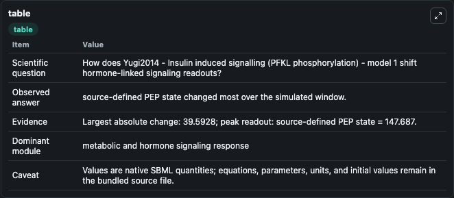
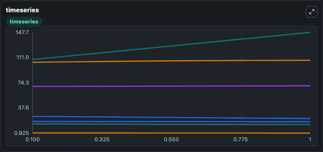
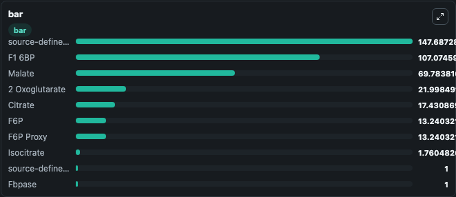

# Yugi2014 - Insulin induced signalling (PFKL phosphorylation) - model 1

This Biosimulant lab wraps `Yugi2014 - Insulin induced signalling (PFKL phosphorylation) - model 1` as a runnable signaling model with a companion visualization module.
Clean Biosimulant lab for metabolic and hormone-linked signaling. It can be used to explore second-messenger and pathway-signaling dynamics and compare scenario outcomes across configurations.

## What You'll See

The lab asks: How does Yugi2014 - Insulin induced signalling (PFKL phosphorylation) - model 1 shift hormone-linked signaling readouts? It runs for 1.0 time units with a communication step of 0.1. The run uses the model defaults declared by the curated SBML wrapper. The generated visualizations focus on source-defined PFKL state, Fbpase, F6P, F1 6BP, source-defined PEP state, and Isocitrate, and related outputs, combining trajectory, endpoint-comparison, and summary-table views from one completed dark-mode run.

In this captured run, **source-defined PEP state** moved from 108.1 to 147.7 across 1.0 simulation windows.

<!-- BIOSIMULANT_VISUALS_START -->
### Output Visualizations



*Summary table for Yugi2014 - Insulin induced signalling (PFKL phosphorylation) - model 1, reporting the scientific question, observed answer, dominant module, and caveat.*



*Trajectories of source-defined PEP state, 2 Oxoglutarate, F1 6BP, Malate, F6P, and F6P Proxy across the 1.0 simulation. In this run **source-defined PEP state** climbed from 108.1 to 147.7 and **2 Oxoglutarate** fell from 25.189 to 21.998 — the largest movements among the focused observables.*



*Largest-excursion ranking of the focused observables — the absolute movement magnitude during the run. Top 3: **source-defined PEP state** = 147.7, **F1 6BP** = 107.1, **Malate** = 69.784, with 7 more observables below.*

<!-- BIOSIMULANT_VISUALS_END -->

## Model Context

- Core model: `models/core`
- Visualization model: `models/visualisation`
- Standard: `other`
- Upstream source: `biomodels_ebi:BIOMD0000000540`
- License: `CC0`
- Visual scope: metabolic and hormone signaling response
- Caveat: Values are native SBML quantities; equations, parameters, units, and initial values remain in the bundled source file.

## Inputs

| Input | Maps To | Default | Notes |
|---|---|---|---|
| Initial F6P Proxy | `signaling_sbml_yugi2014_insulin_induced_signalling_pfkl_phospho_biomd0000000540_model.initial_f6p_proxy` |  | Initial level of F6P Proxy. Maps to SBML symbol `s22`; exposed as a traceable initial-condition perturbation. |

## Outputs

| Output | Maps To | Role |
|---|---|---|
| `source_defined_pfkl_state` | `signaling_sbml_yugi2014_insulin_induced_signalling_pfkl_phospho_biomd0000000540_model.source_defined_pfkl_state` | source-defined PFKL state. |
| `fbpase` | `signaling_sbml_yugi2014_insulin_induced_signalling_pfkl_phospho_biomd0000000540_model.fbpase` | Fbpase. |
| `f6p` | `signaling_sbml_yugi2014_insulin_induced_signalling_pfkl_phospho_biomd0000000540_model.f6p` | F6P. |
| `state` | `signaling_sbml_yugi2014_insulin_induced_signalling_pfkl_phospho_biomd0000000540_model.state` | Available to the visualization model and downstream workflows. |
| `summary` | `signaling_sbml_yugi2014_insulin_induced_signalling_pfkl_phospho_biomd0000000540_model.summary` | Available to the visualization model and downstream workflows. |
| `species_labels` | `signaling_sbml_yugi2014_insulin_induced_signalling_pfkl_phospho_biomd0000000540_model.species_labels` | Available to the visualization model and downstream workflows. |

## Runtime

- Duration: `1.0`
- Communication step: `0.1`

## Running Locally

```bash
biosimulant labs serve .
```
