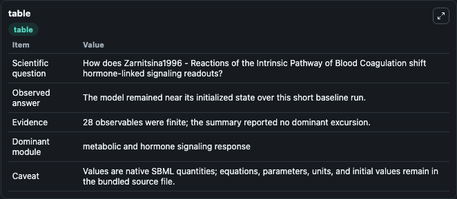
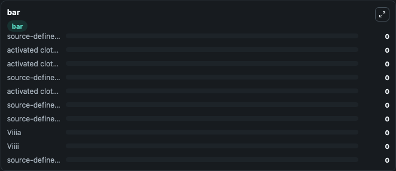

# Zarnitsina1996 - Reactions of the Intrinsic Pathway of Blood Coagulation

This Biosimulant lab wraps `Zarnitsina1996 - Reactions of the Intrinsic Pathway of Blood Coagulation` as a runnable signaling model with a companion visualization module.
Clean Biosimulant lab for systems signaling model: Zarnitsina1996 - Reactions of the Intrinsic Pathway of Blood Coagulation. It can be used to explore second-messenger and pathway-signaling dynamics and compare scenario outcomes across configurations.

## What You'll See

The lab asks: How does Zarnitsina1996 - Reactions of the Intrinsic Pathway of Blood Coagulation shift hormone-linked signaling readouts? It runs for 1.0 time units with a communication step of 0.1. The run uses the model defaults declared by the curated SBML wrapper. The generated visualizations focus on source-defined IX state, activated clotting factor IX, activated clotting factor XI, source-defined AT state, activated clotting factor IX AT, and source-defined IIA state, and related outputs, combining trajectory, endpoint-comparison, and summary-table views from one completed dark-mode run.

In this captured run, **source-defined IX state** moved from 0 to 0 across 1.0 simulation windows.

<!-- BIOSIMULANT_VISUALS_START -->
### Output Visualizations



*Summary table for Zarnitsina1996 - Reactions of the Intrinsic Pathway of Blood Coagulation, reporting the scientific question, observed answer, dominant module, and caveat.*


*Trajectories of source-defined IX state, activated clotting factor IX, activated clotting factor XI, source-defined AT state, activated clotting factor IX AT, and source-defined IIA state across the 1.0 simulation. In this run source-defined IX state, activated clotting factor IX, activated clotting factor XI, source-defined AT state stayed near their initial values — no observable moved appreciably.*



*Largest-excursion ranking of the focused observables — the absolute movement magnitude during the run. Top 3: **source-defined IX state** = 0, **activated clotting factor IX** = 0, **activated clotting factor XI** = 0, with 7 more observables below.*

<!-- BIOSIMULANT_VISUALS_END -->

## Model Context

- Core model: `models/core`
- Visualization model: `models/visualisation`
- Standard: `other`
- Upstream source: `biomodels_ebi:MODEL1806140001`
- License: `CC0`
- Visual scope: metabolic and hormone signaling response
- Caveat: Values are native SBML quantities; equations, parameters, units, and initial values remain in the bundled source file.

## Inputs

| Input | Maps To | Default | Notes |
|---|---|---|---|
| Initial source-defined IX state | `signaling_sbml_zarnitsina1996_reactions_of_the_intrinsic_pathwa_model1806140001_model.initial_source_defined_ix_state` |  | Initial level of source-defined IX state. Maps to SBML symbol `IX`; exposed as a traceable initial-condition perturbation. |

## Outputs

| Output | Maps To | Role |
|---|---|---|
| `activated_clotting_factor_ix` | `signaling_sbml_zarnitsina1996_reactions_of_the_intrinsic_pathwa_model1806140001_model.activated_clotting_factor_ix` | activated clotting factor IX. |
| `activated_clotting_factor_xi` | `signaling_sbml_zarnitsina1996_reactions_of_the_intrinsic_pathwa_model1806140001_model.activated_clotting_factor_xi` | activated clotting factor XI. |
| `activated_clotting_factor_ix_at` | `signaling_sbml_zarnitsina1996_reactions_of_the_intrinsic_pathwa_model1806140001_model.activated_clotting_factor_ix_at` | activated clotting factor IX AT. |
| `state` | `signaling_sbml_zarnitsina1996_reactions_of_the_intrinsic_pathwa_model1806140001_model.state` | Available to the visualization model and downstream workflows. |
| `summary` | `signaling_sbml_zarnitsina1996_reactions_of_the_intrinsic_pathwa_model1806140001_model.summary` | Available to the visualization model and downstream workflows. |
| `species_labels` | `signaling_sbml_zarnitsina1996_reactions_of_the_intrinsic_pathwa_model1806140001_model.species_labels` | Available to the visualization model and downstream workflows. |

## Runtime

- Duration: `1.0`
- Communication step: `0.1`

## Running Locally

```bash
biosimulant labs serve .
```
