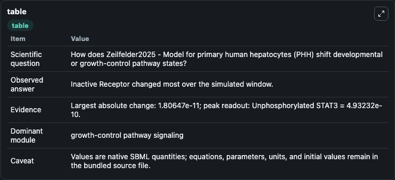
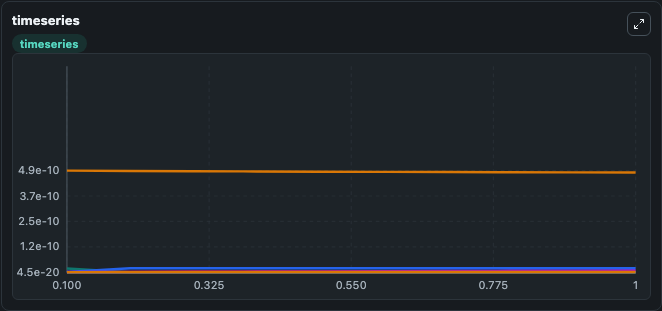
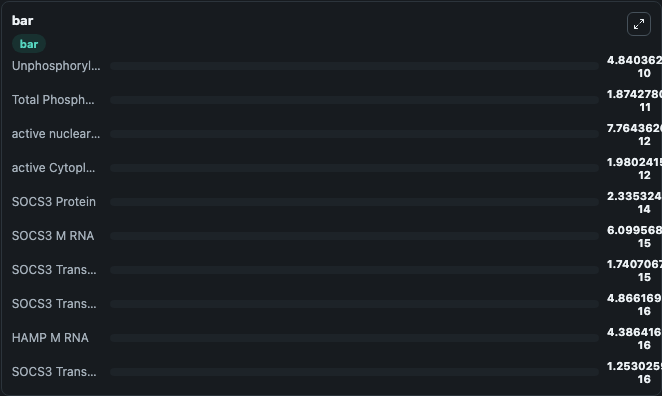

# Zeilfelder2025 - Model for primary human hepatocytes (PHH)

This Biosimulant lab wraps `Zeilfelder2025 - Model for primary human hepatocytes (PHH)` as a runnable signaling model with a companion visualization module.
Clean Biosimulant lab for systems signaling model: Zeilfelder2025 - Model for primary human hepatocytes (PHH). It can be used to explore second-messenger and pathway-signaling dynamics and compare scenario outcomes across configurations.

## What You'll See

The lab asks: How does Zeilfelder2025 - Model for primary human hepatocytes (PHH) shift developmental or growth-control pathway states? It runs for 1.0 time units with a communication step of 0.1. The run uses the model defaults declared by the curated SBML wrapper. The generated visualizations focus on Inactive Receptor, Total Phosphorylated Receptor, Unphosphorylated STAT3, active Cytoplasmic STAT3, active nuclear STAT3, and SOCS3 Transcriptional Delay, and related outputs, combining trajectory, endpoint-comparison, and summary-table views from one completed dark-mode run.

In this captured run, **Inactive Receptor** moved from 1.81e-11 to 4.47e-20 across 1.0 simulation windows.

<!-- BIOSIMULANT_VISUALS_START -->
### Output Visualizations



*Summary table for Zeilfelder2025 - Model for primary human hepatocytes (PHH), reporting the scientific question, observed answer, dominant module, and caveat.*



*Trajectories of Inactive Receptor, Total Phosphorylated Receptor, Unphosphorylated STAT3, active nuclear STAT3, active Cytoplasmic STAT3, and SOCS3 Transcriptional Delay across the 1.0 simulation. In this run **Total Phosphorylated Receptor** climbed from 6.84e-13 to 1.87e-11 and **Inactive Receptor** fell from 1.81e-11 to 4.47e-20 — the largest movements among the focused observables.*



*Largest-excursion ranking of the focused observables — the absolute movement magnitude during the run. Top 3: **Unphosphorylated STAT3** = 4.84e-10, **Total Phosphorylated Receptor** = 1.87e-11, **active nuclear STAT3** = 7.76e-12, with 7 more observables below.*

<!-- BIOSIMULANT_VISUALS_END -->

## Model Context

- Core model: `models/core`
- Visualization model: `models/visualisation`
- Standard: `other`
- Upstream source: `biomodels_ebi:MODEL2503270002`
- License: `CC0`
- Visual scope: growth-control pathway signaling
- Caveat: Values are native SBML quantities; equations, parameters, units, and initial values remain in the bundled source file.

## Inputs

| Input | Maps To | Default | Notes |
|---|---|---|---|
| Input Apap | `signaling_sbml_zeilfelder2025_model_for_primary_human_hepatocyt_model2503270002_model.initial_input_apap_level` |  | Input Apap source parameter. Maps to SBML symbol `input_apap` and preserves the bundled default. |
| Input Cyclo | `signaling_sbml_zeilfelder2025_model_for_primary_human_hepatocyt_model2503270002_model.initial_input_cyclo_level` |  | Input Cyclo source parameter. Maps to SBML symbol `input_cyclo` and preserves the bundled default. |
| Input Dcf | `signaling_sbml_zeilfelder2025_model_for_primary_human_hepatocyt_model2503270002_model.initial_input_dcf_level` |  | Input Dcf source parameter. Maps to SBML symbol `input_dcf` and preserves the bundled default. |

## Outputs

| Output | Maps To | Role |
|---|---|---|
| `inactive_receptor` | `signaling_sbml_zeilfelder2025_model_for_primary_human_hepatocyt_model2503270002_model.inactive_receptor` | Inactive Receptor. |
| `total_phosphorylated_receptor` | `signaling_sbml_zeilfelder2025_model_for_primary_human_hepatocyt_model2503270002_model.total_phosphorylated_receptor` | Total Phosphorylated Receptor. |
| `unphosphorylated_stat3` | `signaling_sbml_zeilfelder2025_model_for_primary_human_hepatocyt_model2503270002_model.unphosphorylated_stat3` | Unphosphorylated STAT3. |
| `state` | `signaling_sbml_zeilfelder2025_model_for_primary_human_hepatocyt_model2503270002_model.state` | Available to the visualization model and downstream workflows. |
| `summary` | `signaling_sbml_zeilfelder2025_model_for_primary_human_hepatocyt_model2503270002_model.summary` | Available to the visualization model and downstream workflows. |
| `species_labels` | `signaling_sbml_zeilfelder2025_model_for_primary_human_hepatocyt_model2503270002_model.species_labels` | Available to the visualization model and downstream workflows. |

## Runtime

- Duration: `1.0`
- Communication step: `0.1`

## Running Locally

```bash
biosimulant labs serve .
```
