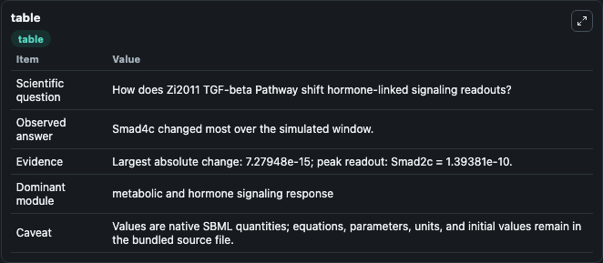
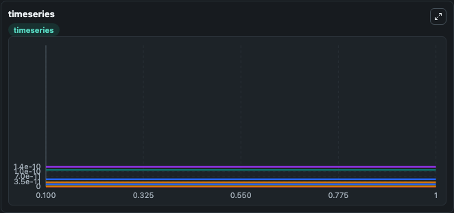
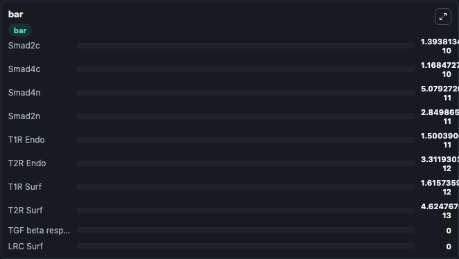

# Zi2011_TGF-beta_Pathway

This Biosimulant lab wraps `Zi2011_TGF-beta_Pathway` as a runnable signaling model with a companion visualization module.
Clean Biosimulant lab for developmental and growth-control signaling. It can be used to explore second-messenger and pathway-signaling dynamics and compare scenario outcomes across configurations.

## What You'll See

The lab asks: How does Zi2011 TGF-beta Pathway shift hormone-linked signaling readouts? It runs for 1.0 time units with a communication step of 0.1. The run uses the model defaults declared by the curated SBML wrapper. The generated visualizations focus on TGF beta response parameter Ex, T1R Surf, T1R Endo, T2R Surf, T2R Endo, and LRC Surf, and related outputs, combining trajectory, endpoint-comparison, and summary-table views from one completed dark-mode run.

In this captured run, **Smad4c** moved from 1.17e-10 to 1.17e-10 across 1.0 simulation windows.

<!-- BIOSIMULANT_VISUALS_START -->
### Output Visualizations



*Summary table for Zi2011_TGF-beta_Pathway, reporting the scientific question, observed answer, dominant module, and caveat.*



*Trajectories of Smad4c, Smad4n, Smad2n, Smad2c, TGF beta response parameter Ex, and T1R Surf across the 1.0 simulation. In this run **Smad4c** climbed from 1.17e-10 to 1.17e-10 and **Smad4n** fell from 5.08e-11 to 5.08e-11 — the largest movements among the focused observables.*



*Largest-excursion ranking of the focused observables — the absolute movement magnitude during the run. Top 3: **Smad2c** = 1.39e-10, **Smad4c** = 1.17e-10, **Smad4n** = 5.08e-11, with 7 more observables below.*

<!-- BIOSIMULANT_VISUALS_END -->

## Model Context

- Core model: `models/core`
- Visualization model: `models/visualisation`
- Standard: `other`
- Upstream source: `biomodels_ebi:BIOMD0000000342`
- License: `CC0`
- Visual scope: metabolic and hormone signaling response
- Caveat: Values are native SBML quantities; equations, parameters, units, and initial values remain in the bundled source file.

## Inputs

| Input | Maps To | Default | Notes |
|---|---|---|---|
| Kdeg TGF beta response parameter | `signaling_sbml_zi2011_tgf_beta_pathway_biomd0000000342_model.initial_kdeg_tgf_beta_response_parameter_level` |  | Kdeg TGF beta response parameter source parameter. Maps to SBML symbol `kdeg_TGF_beta` and preserves the bundled default. |
| Initial Empty Degraded | `signaling_sbml_zi2011_tgf_beta_pathway_biomd0000000342_model.initial_empty_degraded` |  | Initial level of Empty Degraded. Maps to SBML symbol `empty_degraded`; exposed as a traceable initial-condition perturbation. |
| Initial source-defined AA state | `signaling_sbml_zi2011_tgf_beta_pathway_biomd0000000342_model.initial_source_defined_aa_state` |  | Initial level of source-defined AA state. Maps to SBML symbol `AA`; exposed as a traceable initial-condition perturbation. |

## Outputs

| Output | Maps To | Role |
|---|---|---|
| `smad2c` | `signaling_sbml_zi2011_tgf_beta_pathway_biomd0000000342_model.smad2c` | Smad2c. |
| `smad2n` | `signaling_sbml_zi2011_tgf_beta_pathway_biomd0000000342_model.smad2n` | Smad2n. |
| `smad4c` | `signaling_sbml_zi2011_tgf_beta_pathway_biomd0000000342_model.smad4c` | Smad4c. |
| `state` | `signaling_sbml_zi2011_tgf_beta_pathway_biomd0000000342_model.state` | Available to the visualization model and downstream workflows. |
| `summary` | `signaling_sbml_zi2011_tgf_beta_pathway_biomd0000000342_model.summary` | Available to the visualization model and downstream workflows. |
| `species_labels` | `signaling_sbml_zi2011_tgf_beta_pathway_biomd0000000342_model.species_labels` | Available to the visualization model and downstream workflows. |

## Runtime

- Duration: `1.0`
- Communication step: `0.1`

## Running Locally

```bash
biosimulant labs serve .
```
