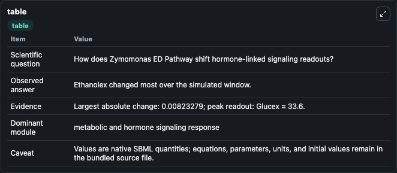
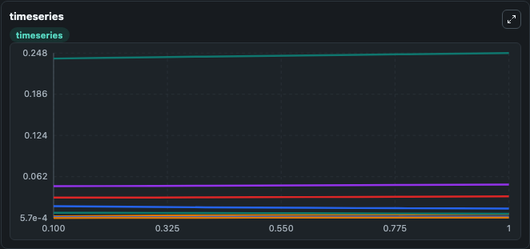
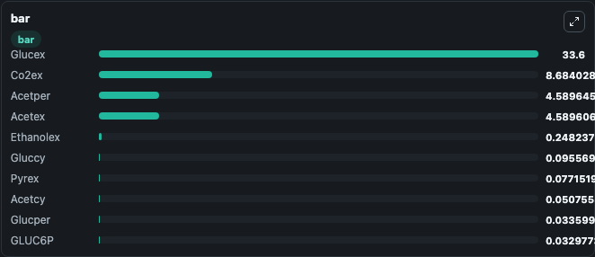

# Zymomonas ED Pathway

This Biosimulant lab wraps `Zymomonas ED Pathway` as a runnable signaling model with a companion visualization module.
Clean Biosimulant lab for systems signaling model: Zymomonas ED Pathway. It can be used to explore second-messenger and pathway-signaling dynamics and compare scenario outcomes across configurations.

## What You'll See

The lab asks: How does Zymomonas ED Pathway shift hormone-linked signaling readouts? It runs for 1.0 time units with a communication step of 0.1. The run uses the model defaults declared by the curated SBML wrapper. The generated visualizations focus on Ethanolex, Glucex, Pyrex, Acetper, Acetex, and Co2per, and related outputs, combining trajectory, endpoint-comparison, and summary-table views from one completed dark-mode run.

In this captured run, **Ethanolex** moved from 0.2400 to 0.2482 across 1.0 simulation windows.

<!-- BIOSIMULANT_VISUALS_START -->
### Output Visualizations



*Summary table for Zymomonas ED Pathway, reporting the scientific question, observed answer, dominant module, and caveat.*



*Trajectories of Ethanolex, Co2per, Pyrcy, Acetcy, GLUC6P, and PGLACTON across the 1.0 simulation. In this run **Ethanolex** climbed from 0.2400 to 0.2482 and **Co2per** fell from 0.0182 to 0.0146 — the largest movements among the focused observables.*



*Largest-excursion ranking of the focused observables — the absolute movement magnitude during the run. Top 3: **Glucex** = 33.600, **Co2ex** = 8.684, **Acetper** = 4.590, with 7 more observables below.*

<!-- BIOSIMULANT_VISUALS_END -->

## Model Context

- Core model: `models/core`
- Visualization model: `models/visualisation`
- Standard: `other`
- Upstream source: `biomodels_ebi:MODEL2008060001`
- License: `CC0`
- Visual scope: metabolic and hormone signaling response
- Caveat: Values are native SBML quantities; equations, parameters, units, and initial values remain in the bundled source file.

## Inputs

| Input | Maps To | Default | Notes |
|---|---|---|---|
| Initial Co2ex | `signaling_sbml_zymomonas_ed_pathway_model2008060001_model.initial_co2ex` |  | Initial level of Co2ex. Maps to SBML symbol `CO2ex`; exposed as a traceable initial-condition perturbation. |
| Initial Glucex | `signaling_sbml_zymomonas_ed_pathway_model2008060001_model.initial_glucex` |  | Initial level of Glucex. Maps to SBML symbol `GLUCex`; exposed as a traceable initial-condition perturbation. |

## Outputs

| Output | Maps To | Role |
|---|---|---|
| `ethanolex` | `signaling_sbml_zymomonas_ed_pathway_model2008060001_model.ethanolex` | Ethanolex. |
| `glucex` | `signaling_sbml_zymomonas_ed_pathway_model2008060001_model.glucex` | Glucex. |
| `pyrex` | `signaling_sbml_zymomonas_ed_pathway_model2008060001_model.pyrex` | Pyrex. |
| `state` | `signaling_sbml_zymomonas_ed_pathway_model2008060001_model.state` | Available to the visualization model and downstream workflows. |
| `summary` | `signaling_sbml_zymomonas_ed_pathway_model2008060001_model.summary` | Available to the visualization model and downstream workflows. |
| `species_labels` | `signaling_sbml_zymomonas_ed_pathway_model2008060001_model.species_labels` | Available to the visualization model and downstream workflows. |

## Runtime

- Duration: `1.0`
- Communication step: `0.1`

## Running Locally

```bash
biosimulant labs serve .
```
